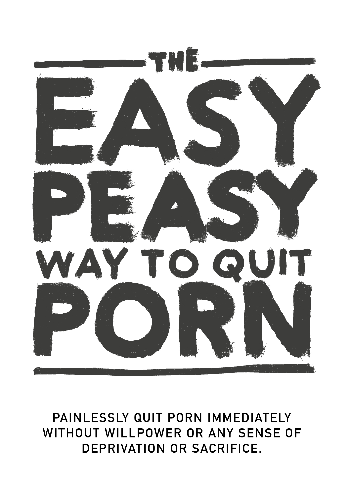

--- 
title: "EasyPeasy"
author: "Hackauteur Anonyme²"
date: "`r Sys.Date()`"
site: bookdown::bookdown_site
output:
  bookdown::gitbook:
    config:
      fontsettings:
        theme: night
        family: sans
        size: 2
      edit : https://gitlab.com/snuggy/easypeasy/%s
    includes:
      in_header: header.html
  pdf_document:
    includes:
      in_header: preamble.tex  

documentclass: book
bibliography: [book.bib, packages.bib]
biblio-style: apalike
link-citations: yes
url: 'https\://easypeasybook.org/'
cover-image: "images/easypeasy.jpg"
apple-touch-icon: "touch-icon.png"
apple-touch-icon-size: 120
favicon: "favicon.ico"
description: "Quittez la pornographie immediatement, sans volonté, sentiment de privation, ou sacrifice."
---

# Préface {-}

<!---[FR 🇫🇷](fr/index.html) --->

**DO NOT JUMP CHAPTERS**

Ceci est une version réécrite d'un livre [réécrit](https://sites.google.com/site/hackbookeasypeasy) adaptant *La méthode simple pour en finir avec la cigarette d'Allen Carr* pour la pornographie. Il est aussi **complétement gratuit** et [open source](https://gitlab.com/snuggy/easypeasy). Je ne suis pas l'auteur d'un de ces deux livres, je suis le Hackauteur Anonyme².

C'est une méthode très efficace, mais il est essentiel de suivre cette indication :

**NE SAUTEZ AUCUN CHAPITRE**

Quand on dévérouille une serrure à code, il faut entrer les nombres dans le bon ordre. C'est pareil pour l'addiction.

Personellement, la [version Google Sites originale](https://sites.google.com/site/hackbookeasypeasy) (qui n'a pas été écrite par moi) a changé ma vie. Si vous êtes comme la plupart, vous avez découvert la pornographie relativement jeune et vous l'avez utilisée depuis. Jusqu'à les écrasants -- mais quand même assez censurés -- avertissements sur les dangers. Tout comme moi, vous avez peut-être eu des périodes de succès éphémères, mais en succombant toujours à la fin aux envies illusoires. Je suis ravi d'annoncer que cette méthode marche complétement différement, et que c'est aussi la seule qui a fonctionné.

Ou peut-être, vous êtes ici parce que un proche ou un ami concerné vous à envoyé ce livre, et que vous êtes sceptique. Premièrement, merci d'avoir au moins pris le temps de le regarder. Nous en parlerons plus très bientôt, mais essayez de vous rappeler briévement la première fois que vous avez consulté de la pornographie. Est-ce que vous vous attendiez à y retourner pour le restant de votre vie ? Selon mes recherches informelles sur le sujet (harceler mes amis pour qu'ils lisent le livre), EasyPeasy est tout aussi efficace pour l'utilsateur occasionnel de pornographie que pour le grand utilsateur. Il n'est pas horriblement long, avec de hautes chances de gains, donc je vous prie de bien vouloir continuer à lire.

a méthode décrite dans ce hackbook :

-   Est instantanée.

-   Est tout aussi efficace pour l'utilisateur occasionnel que régulier.

-   Ne cause aucun symptôme de retrait grave.

-   Ne demande aucune volontée.

-   Ne demande pas de traitement de choc, d'aides, ou de sortilèges.

-   Ne va pas vous faire remplacer cette addiction par une autre, comme la consommation d'alcool, de tabac, etc. 

-   Est permanante.

Vous trouvez sûrement ça impossible, mais ces sentiments sont partagés par beaucoup.

> *"Il s'agit d'un travail fondamental sur la dépendance au porno"*
>
> --- un gars sur reddit que je n'arrive plus à retrouver

> "*Ce livre est de l'or. C'est incroyable que je puisse accéder à ce contenu gratuitement, ce simple livre avec moins de 100 pages. C'est aussi incroyable de voir combien d'argent j'ai dépensé sur des cours et combien de temps j'ai gaspillé à naviguer sur /nofap, avec 0 résultats au final*"
>
> --- u/OyaPunpun (bon manga btw)

> "*J'ai été addict pendant 10 ans. Ces 10 ans j'ai été torturé par la dépression, le doute, l'anxiété, et la peur que mon secret ne se sache. Après chaque session, je me détestais, et après chaque "régime porno", j'étais reparti pour un autre tour dans le toboggan. Cependant, ce livre m'a aidé à arrêter. J'étais toujours sur la défensive concernant le porno auparavant. Maintenant, après avoir lu ce livre deux fois, je suis sur l'offensive. Le porno n'a aucun contrôle sur moi et paraît comme une triste blague maintenant.*"
>
> --- u/DeepNewt

> "*based*" (ce mot veut dire qu'une chose est bien dite)
>
> --- anon, /fit/

Allen Carr est une personne incroyable dont la vie est extrêmement intéressante : fumeur à la chaîne à raison de cent par jour pendant plus de trente ans, Carr a arrêté immédiatement après avoir découvert *EasyWay*, ce qui, comme le dit son livre, *"lui a permis de suivre un désir ardant d'expliquer sa méthode au plus grand nombre de fumeurs possible"*. Ses méthodes pour l'alcool, les autres drogues, et de nombreuses autres addictions sont des best-sellers mondiaux et je vous encourage à les consulter.

L'idée de son livre est de dissiper la peur causée par les idées fausses et la confusion concernant les processus biologiques et l'abandon de la cigarette. La majorité du livre est donc consacrée à la déconstruction logique des angoisses et des phobies liées à l'abandon du tabac, qui conduisent généralement à la chute inévitable de ceux qui tentent, puis finissent par échouer. Les cliniques de Carr ont des taux de réussite dépassant les 95%, avec une politique de satisfait ou remboursé. Plus important encore, elles ont permis à leurs patients de vivre une vie épanouie, sans dépendance.

Pourquoi ce hackbook? Parce que Allen Carr est depuis bien longtemps décédé et que les institutions qu'il a formé ne listent pas la pornographie sur Internet comme l'une des addictions qu'ils prennent en charge. Je n'y gagne pas d'argent ou autre chose.

**Hackbook:** Un livre basé et hacké sur un autre livre. L'auteur original est pleinement crédité.   

Au travers la lecture de ce livre, moi-même, l'Hackauteur Anonyme original, et Allen Carr vont apparaître de manière transparente afin de vous fournir une méthode unique et convaincante pour vous permettre de quitter facilement et sans douleur.

**Astuces pour la lecture :**

**Ne lisez pas ce livre comme un livre normal.**, il est très court, et vous devriez pouvoir le finir en quelques heures. Beaucoup de gens gagneront à *surligner ou prendre des notes*, et nous recommandons de le **relire** quelques fois afin de pleinement solidifier les leçons.

De nombreuses communautés (anglophones hélas) existent pour ce hackbook, mais il est recommandé de les regarder seulement après avoir fini le livre.

[urbit](https://urbit.org) - ~mislyr-midnyt/easypeasy | [coomer.org imageboard (new!)](https://coomer.org) | [public analytics](https://plausible.io/easypeasymethod.org) | [matrix](https://matrix.to/#/!xmJZznbJXuwzEGSEti:matrix.org?via=matrix.org) | [discord](https://discord.com/invite/bCXEnf9) | [reddit](https://reddit.com/r/pmohackbook)

Petit rappel:

**NE SAUTEZ AUCUN CHAPITRE**

Je vous souhaite bonne chance, mais comme vous allez le voir, vous n'en avez pas besoin.

Bon courage,

Hackauthor Anonyme²

<!--chapter:end:index.Rmd-->

# Introduction

Ce manuel vous permettra d'arrêter de consommer de la pornographie immédiatement, sans douleur et de façon permanente, sans volonté ni sentiment de privation ou de sacrifice. Il ne vous imposera aucun jugement, aucune gêne ni aucune pression pour vous soumettre à des mesures douloureuses.
En fait, il n'est absolument pas nécessaire de réduire votre consommation pendant la lecture ; cela serait même préjudiciable.

Cela va peut-être à l'encontre de tout ce que l'on vous a dit, mais demandez-vous si ce que l'on vous a dit a fonctionné. Si c'était le cas, vous ne seriez pas en train de lire ce livre.

La dépendance à la pornographie se manifeste de diverses manières et a des effets sociétaux considérables. De nombreuses personnes utilisent la pornographie parce qu'Internet permet un accès instantané à des *stimuli supranormal*. Demandez-vous, est-ce que les questions suivantes s'appliquent à vous?

- Passez-vous beaucoup plus de temps à regarder du porno que vous ne le souhaitiez au départ ?

- Vos efforts pour arrêter ou limiter votre consommation de pornographie, sont-ils en vain ?

- Est-ce que le temps passé à regarder de la pornographie a-t-il interféré ou pris le pas sur des engagements personnels ou professionnels, des passe-temps ou des relations dans votre vie ?

- Faites-vous tout votre possible pour garder secrète votre consommation de pornographie (par exemple, en effaçant l'historique de votre navigateur, en mentant sur votre consommation de pornographie) ?

- La consommation de pornographie a-t-elle causé des problèmes importants dans vos relations intimes ?

- Connaissez-vous un cycle d'excitation et de plaisir avant et pendant la consommation de pornographie, suivi de sentiments de honte, de culpabilité et de remords après ?

- Passez-vous beaucoup de temps à penser à la pornographie, même lorsque vous ne la regardez pas ?

- La consommation de pornographie a-t-elle entraîné d'autres conséquences négatives dans votre vie personnelle ou professionnelle (par exemple, travail manqué, mauvais résultats, relations négligées, problèmes financiers) ?

Si vous êtes un utilisateur de porno qui en dépend pour se masturber ou avoir des rapports sexuels, la seule chose que vous devez faire est de continuer à lire ce livre.  
Si vous êtes ici pour un être cher ou un tiers, tout ce que vous avez à faire est de le persuader de lire ce livre.  
Si vous ne parvenez pas à presuader la personne, lisez-le vous-même. Comprendre la méthode permet de faire passer le message et d'empêcher vos enfants de commencer. Ne vous laissez pas tromper par le fait qu'ils n'y ont pas accès maintenant - tous y ont accès avant de devenir accros.

## Avertissement {-}
Vous avez peut-être une certaine appréhension à l'idée de lire ce livre. Peut-être que, comme beaucoup d'utilisateurs de pornographie, la simple pensée d'arrêter vous fait paniquer et que, bien que vous ayez l'intention d'arrêter un jour, ce n'est pas aujourd'hui.

Si vous vous attendez à ce que ce livre vous "effraie" pour vous inciter à arrêter de fumer en vous présentant les divers problèmes de santé auxquels les utilisateurs s'exposent, tels que les dysfonctionnements sexuels (y compris les dysfonctionnements érectiles induits par le porno), une exctation sexuelle aléatoire, la perte d'intérêt pour des partenaires sexuels réels, l'hypofrontalité cérébrale et la pensée aveuglante selon laquelle il s'agit d'une habitude sale et dégoûtante et que vous êtes une méduse stupide, veule et sans volonté, vous serez cruellement déçu. Ces tactiques ne m'ont jamais aidé à arrêter ma dépendance et si elles devaient vous aider, vous auriez déjà arrêté.

Les méthodes conventionnelles d'arrêt de la dependance préconisent l'utilisation de la volonté ou de méthodes de substitution telles que les régimes pornographiques (une fois tous les X jours) et la réduction de la consommation, qui sont tout aussi inefficaces car elles ne suppriment pas réellement les raisons de consommer du porno. En définitive, ce n'est pas en transformant quelque chose en fruit du pêcher que l'on traite la dépendance.

De nombreux sites décrivent en détail les effets sur le cerveau, étayés par des recherches évaluées par des pairs sur les neurotransmetteurs et la neuroplasticité. Bien que ces sites soient informatifs, beaucoup sont conscients des dangers du porno, mais choisissent de ne rien faire. Les utilisateurs, jeunes et moins jeunes, ont tendance à éviter ce type de contenu, sachant qu'un seul regard sur un site pornographique ne les tuera pas.

Cette méthode, appelée EasyPeasy, fonctionne différemment. Certaines des choses qui vont être dites peuvent être difficiles à croire, mais lorsque vous aurez terminé ce livre, vous ne ferez pas que les croire, vous vous demanderez comment on a pu vous laver le cerveau pour vous faire croire le contraire.

On croit souvent, à tort, que nous choisissons de regarder du porno. Les personnes dépendantes du porno (oui, dépendantes) ne choisissent pas plus de regarder du porno que les alcooliques ne choisissent de devenir alcooliques ou que les héroïnomanes ne choisissent de devenir héroïnomanes. Il est vrai que nous choisissons d'allumer l'ordinateur portable ou le smartphone, de lancer le navigateur et de visiter notre "harem en ligne" préféré. De temps en temps, je choisis d'aller au cinéma, mais je n'ai certainement pas choisi de passer toute ma vie dans une salle de cinéma. Au départ, la curiosité et la nature humaine m'y ont conduit, mais je n'aurais pas commencé si j'avais su que je deviendrais dépendant, provoquant le déclin de ma santé, de mon bonheur et de mes relations. *Si seulement j'avais entendu parler de dysfonctionnement sexuel lors de ma première visite sur ce site pornographique!*

Prenez un moment pour réfléchir, avez-vous déjà pris la décision "positive" que vous devez/avez besoin de porno pour vous masturber ? Ou que vous devriez/devez/avez besoin de fantasmes induits par le porno pour pimenter vos rapports sexuels avec votre partenaire ? Ou que, à certains moments de votre vie, vous ne pouviez pas profiter d'une bonne nuit de sommeil ou peut-être même passer une soirée après une dure journée de travail sans surfer sur du porno ? Ou que vous ne pouviez pas vous concentrer ou gérer votre stress sans cela ? À quel moment avez-vous décidé que vous aviez *besoin* de porno, que vous en aviez *besoin* en permanence dans votre vie, que vous vous sentiez en insécurité, voire en panique, sans porno, sans votre harem en ligne ?

Comme tous les autres utilisateurs de porno, vous avez été attiré dans le piège le plus sinistre et le plus subtil que l'homme et la nature aient jamais conçu ensemble. Aucune personne vivante, qu'elle soit elle-même utilisatrice ou non, n'aime l'idée que ses enfants utilisent du porno pour s'en sortir ou pour le plaisir. Cela signifie que tous les toxicomanes souhaitent n'avoir jamais commencé. Ce n'est pas surprenant : personne n'a besoin de porno pour profiter de la vie ou gérer le stress avant de devenir dépendant.

En même temps, tous les utilisateurs souhaitent continuer à utiliser. Après tout, personne ne nous oblige à lancer le mode incognito de notre navigateur. Qu'ils en comprennent ou non la raison, ce sont les utilisateurs qui décident de frapper aux portes de leurs *harems en ligne*.

S'il existait un bouton magique sur lequel l'utilisateur pourrait appuyer pour se réveiller le lendemain matin comme s'il n'avait jamais accédé à son premier site porno, les seuls accros demain seraient les jeunes qui "expérimentent" encore.

La seule chose qui nous empêche d'arrêter notre dépendance, c'est la **PEUR!** La peur causée par la croyance que nous devrons survivre à une période indéterminée de misère, de privation et d'envie insatisfaite pour nous libérer du porno. Ces croyances découlent de croyances irrationnelles, apprises ou acquises, telles que :

- La masturbation ou le sexe menant à l'orgasme est la *seule* et la *plus importante* chose dans la vie.

- Le porno est plus "sûr" que le sexe dans la vie réelle parce que le porno ne peut pas me rejeter.

- Le porno est éducatif et utile.

- Le droit à une expérience sexuelle "supérieure".

- Plus, c'est toujours mieux.

Ces croyances irrationnelles entraînent des conséquences irrationnelles lorsqu'elles sont mises en pratique, notamment :

- Adorer et être obsédé par la découverte d'un "10/10 parfait".

- Se percevoir comme un perdant si l'on manque de sexe, comme si c'était la chose la plus importante de l'expérience humaine.

- Attendre un 10 parfait.

- Juger et critiquer excessivement les partenaires potentiels.

- Se forcer à avoir des rapports sexuels, que vous en ayez envie ou non.

C'est la peur qu'une nuit pasée en solitude soit misérable, passée à lutter contre des pulsions incontrôlables. La peur que la nuit précédant les examens soit une nuit d'enfer sans porno. La peur de ne jamais pouvoir se concentrer, gérer le stress ou être aussi confiant sans notre petite béquille et de voir notre personnalité et notre caractère changer.

Mais surtout, nous avons peur que "drogué un jour, drogué toujours" : nous ne serons jamais complètement libérés, passant le reste de notre vie à avoir envie d'un orgasme occasionnel induit par le porno à des moments bizarres. Si, comme moi, vous avez déjà essayé toutes les méthodes conventionnelles pour arrêter de fumer et que vous êtes passé par la misère et la torture de la "méthode de la volonté", vous ne serez pas seulement affecté par cette peur, vous serez convaincu que vous ne pourrez jamais arrêter.

Si vous avez de l'appréhension, de la panique ou l'impression que le moment n'est pas venu pour arrêter votre dépendance, laissez-moi vous assurer que votre appréhension et votre panique ne sont pas soulagées par le porno - elles en sont la cause. Vous n'avez pas décidé de tomber dans le piège de la pornographie, mais comme tous les pièges, il est conçu pour que vous restiez piégé. Demandez-vous, lorsque vous avez regardé ces premières photos et vidéos pornographiques, si vous avez décidé de revenir les regarder aussi longtemps que vous vivrez. Alors, quand arrêteras-tu ? Demain ? L'année prochaine ? Arrête de te faire des illusions ! Le piège est conçu pour te retenir à vie. Sinon, pourquoi pensez-tu que tous les autres toxicomanes n'arrêtent pas avant que cela ne "tue" leur vie ?

J'ai parlé d'un bouton magique ; EasyPeasy fonctionne exactement comme ce bouton magique. Je tiens à préciser qu'EasyPeasy n'est pas magique, mais pour moi et pour d'autres qui ont trouvé qu'il était si facile et agréable d'arrêter la dépendance au porno, c'est ce qu'il semble être !

L'avertissement est le suivant :  
Il s'agit de la situation de la poule et de l'œuf : tous les toxicomanes veulent arrêter et tous les toxicomanes peuvent trouver facile et agréable d'arrêter. C'est seulement la **peur** qui empêche les utilisateurs d'essayer d'arrêter. Le gain le plus important est de se débarrasser de cette peur, mais vous ne serez pas libéré de cette peur tant que vous n'aurez pas terminé le livre. Au contraire, votre peur peut augmenter au fur et à mesure de votre lecture, ce qui peut vous empêcher de le terminer. 
Prenez ce commentaire d'une femme.

***"Je viens de terminer la lecture de EasyPeasy. Je sais que cela ne fait que quatre jours, mais je me sens tellement bien que je sais que je n'aurai plus jamais besoin de consommer du porno. J'ai commencé à lire votre livre il y a cinq mois, j'en étais à la moitié et j'ai paniqué. Je savais que si je continuais à lire, je devais m'arrêter. N'ai-je pas été stupide ?" ***

Vous n'avez pas décidé de tomber dans le piège, mais soyez clair dans votre esprit : vous n'y échapperez pas à moins de prendre la décision affirmative de le faire. Vous êtes peut-être déjà en train de tirer sur la laisse pour arrêter, ou vous appréhendez peut-être cette idée, mais dans tous les cas, gardez à l'esprit que **vous n'avez rien à perdre ! **VOUS N'AVEZ RIEN À PERDRE!**

Si, à la fin du livre, vous décidez que vous souhaitez continuer à utiliser le porno pour la masturbation ou le sexe, rien ne vous en empêche. Vous n'êtes même pas obligé de réduire ou d'arrêter votre consommation de porno pendant que vous lisez le livre, et n'oubliez pas qu'il n'y a pas de traitement de choc. Au contraire, je n'ai que de bonnes nouvelles pour vous. Pouvez-vous imaginer ce qu'a ressenti Andy Dufresne lorsqu'il s'est enfin échappé de la prison de Shawshank Redemption? C'est ce que j'ai ressenti lorsque je me suis échappé du piège de la pornographie, et c'est ce que ressentent les ex-utilisateurs qui ont utilisé EasyPeasy. À la fin du livre, c'est ce que vous ressentirez ! Allez-y !

## Enfin... {-}

Tout le monde peut trouver facile et agréable d'arrêter le porno, y compris vous ! Tout ce que vous avez à faire est de lire le reste de ce livre avec un esprit ouvert ; plus vous comprendrez, plus ce sera facile. Même si vous ne comprenez pas un mot, à condition de suivre les instructions, vous trouverez cela facile. Plus important encore, vous ne passerez pas votre vie à vous morfondre sur le porno ou à vous sentir privé, et à la fin du livre, le seul mystère sera de savoir pourquoi vous l'avez fait pendant si longtemps.

Avec EasyPeasy, il n'y a que deux raisons d'échouer.

**L'incapacité à suivre les instructions.**
Certains trouveront agaçant que le livre soit si dogmatique sur certaines recommandations, comme celle de ne pas essayer de réduire sa consommation ou d'utiliser des substituts. Je ne nie pas qu'il y a beaucoup de gens qui ont réussi à arrêter d'utiliser de telles ruses, mais ils ont réussi en dépit de celles-ci et non grâce à elles. Certaines personnes peuvent faire l'amour debout sur un hamac, mais ce n'est pas le moyen le plus facile. Les chiffres pour ouvrir la serrure de ce piège se trouvent dans ce livre, mais il faut les utiliser dans le bon ordre : aller d'un chapitre à l'autre et ne pas sauter de chapitres.

**Manque de compréhension.**
Ne prenez rien pour acquis, remettez en question non seulement ce que l'on vous dit, mais aussi vos propres opinions et ce que la société vous a dit sur le sexe, la pornographie sur Internet et la dépendance. Par exemple, ceux qui croient que ce n'est qu'une habitude, demandez-vous pourquoi d'autres habitudes - dont certaines sont agréables - sont faciles à abandonner, alors qu'une habitude qui procure une sensation horrible, coûte de l'énergie, du temps et de la virilité est si difficile à abandonner. Ceux qui croient que vous aimez le porno, demandez-vous pourquoi d'autres choses infiniment plus agréables sont à prendre ou à laisser. Pourquoi devez-vous *vous* avoir du porno, la panique s'installant si vous n'en avez pas ?

EasyPeasy est sur le point de vous donner la connaissance de la façon dont il est facile et agréable d'arrêter le porno. Comme beaucoup d'autres, l'un de mes plus grands triomphes dans la vie a été d'échapper au piège du porno. Il n'y a pas lieu de se sentir déprimé, au contraire, vous êtes sur le point d'accomplir quelque chose que tous les utilisateurs de la planète aimeraient réaliser : **LA LIBERTÉ!**

**ON RÉPÉTE, N'OUBLIEZ PAS, NE SAUTEZ PAS DE CHAPITRES.**

Quelques termes avant de commencer, **je vous en prie de vous en souvenir car ils seront utilisés très souvent par la suite** :  
***PMO*** : Le cycle du porno, de la masturbation et de l'orgasme. Ce terme est originaire de l'anglais, **Pornography, Masturbation and Orgamse**.
***Harem en ligne*** : Sites web hébergeant du porno sur Internet à haut débit.

<!--chapter:end:01-l-introduction.Rmd-->

# La Méthode Facile

L'objectif de ce livre est de vous orienter vers un nouvel état d'esprit. Contrairement à la méthode habituelle d'arrêt - où vous commencez par avoir l'impression d'escalader le Mont Everest et passez les semaines suivantes à avoir des envies et à vous sentir privé - vous commencez tout de suite avec un sentiment d'allégresse, comme si vous étiez guéri d'une terrible maladie. À partir de ce moment-là, plus vous avancerez dans la vie, plus vous regarderez cette période et vous vous demanderez comment vous avez pu consommer du porno au départ. Vous regarderez les autres utilisateurs de porno avec pitié, plutôt qu'avec envie.

À condition que vous ne soyez pas quelqu'un qui n'est jamais devenu dépendant (en lisant pour votre conjoint) ou qui a arrêté (ou qui est dans les jours de jeûne d'un "régime porno"), il est essentiel de continuer à consommer jusqu'à ce que vous ayez complètement terminé le livre. Cela peut sembler une contradiction, et cette instruction de continuer à se masturber au porno suscite plus d'objections que toute autre, mais au fur et à mesure que vous lirez la suite, votre désir d'utiliser du porno diminuera progressivement. **Prenez cette instruction au sérieux : Tenter d'arrêter prématurément ne vous sera d'aucune utilité.**

Beaucoup ne terminent pas le livre parce qu'ils sentent qu'ils doivent renoncer à quelque chose, certains vont même jusqu'à ne lire délibérément qu'une ligne par jour afin de repousser l'événement maléfique. Voyez les choses ainsi : qu'avez-vous à perdre ? Si vous ne vous arrêtez pas à la fin du livre, vous ne serez pas plus mal que maintenant. Il s'agit par définition d'un pari de Pascal, c'est-à-dire un pari pris lorsque vous n'avez rien à perdre et de grandes chances de gains importants.

Par ailleurs, si vous n'avez pas regardé de porno depuis quelques jours ou quelques semaines, mais que vous n'êtes pas sûr d'être un utilisateur, un ex-utilisateur ou un non-utilisateur de porno, n'utilisez pas le porno pour vous masturber en lisant. En fait, vous êtes déjà un non-utilisateur, mais il faut laisser votre cerveau rattraper votre corps. À la fin du livre, vous serez un heureux non-utilisateur. EasyPeasy est tout le contraire de la méthode normale, qui consiste à énumérer les inconvénients considérables du porno et à dire :  
*"Si seulement je peux rester assez longtemps sans porno, le désir finira par disparaître et je pourrai à nouveau profiter de la vie, libéré de l'esclavage "*.  
C'est la façon logique de procéder, et des milliers de personnes arrêtent chaque jour en utilisant cette méthode. Cependant, il est très difficile de réussir pour les raisons suivantes :

**Arrêter le PMO n'est pas le vrai problème.**
Chaque fois que vous terminez votre session, vous avez cessé de l'utiliser. Vous avez peut-être de bonnes raisons, le premier jour de votre régime porno "une fois sur quatre", de dire "Je ne veux plus utiliser de porno, ni même me masturber "*. Tous les utilisateurs le font, et leurs raisons sont plus puissantes que vous ne pouvez l'imaginer. Le vrai problème, c'est le deuxième, le dixième ou le dix-millième jour où, dans un moment de faiblesse, vous aurez "juste un coup d'œil", vous en voudrez un autre et, soudain, vous serez à nouveau dépendant.

**La prise de conscience des risques pour la santé génère davantage de peur, ce qui rend l'arrêt plus difficile.**
Dites à un utilisateur que cela détruit sa virilité et la première chose qu'il fera sera de chercher quelque chose pour augmenter sa dopamine : une cigarette, de l'alcool ou même un navigateur pour chercher du porno.

**Toutes les raisons d'arrêter rendent en fait la chose plus difficile.**
Cela est dû à deux raisons. Premièrement, nous sommes continuellement obligés de renoncer à notre "petit ami" ou à un accessoire, un vice ou un plaisir (quelle que soit la façon dont l'utilisateur le perçoit). Deuxièmement, ils créent un "aveuglement". Nous ne nous masturbons pas pour les raisons que nous devrions arrêter. La vraie question est de savoir pourquoi nous voulons ou devons le faire.

Avec EasyPeasy, nous oublions (initialement) les raisons pour lesquelles nous aimerions arrêter, nous faisons face au problème du porno et nous nous posons les questions suivantes :

1.  Que fait le porno pour moi ?

2.  Est-ce que je l'apprécie vraiment ?

3.  Ai-je vraiment besoin de passer ma vie à saboter mon esprit et mon corps ?

La belle vérité est que *tout le porno* ne vous apporte absolument rien. Soyons clairs, ce n'est pas que les inconvénients d'être un consommateur l'emportent sur les avantages, c'est qu'il n'y a ***zéro*** avantages à regarder de la pornographie.

La plupart des utilisateurs trouvent nécessaire de rationaliser les raisons pour lesquelles ils utilisent du porno, mais les raisons qu'ils trouvent sont toutes des sophismes et des illusions.

Tout d'abord, nous allons supprimer ces sophismes et ces illusions. En fait, vous vous rendrez vite compte qu'il n'y a rien à abandonner. Non seulement cela, mais il y a des gains merveilleux et positifs à être un non-PMO (non utilisateur de la PMO), le bien-être et le bonheur n'étant que deux de ces gains. Une fois que les illusions selon lesquelles la vie ne sera jamais aussi agréable sans le porno auront disparu - en réalisant que non seulement la vie est tout aussi agréable sans lui, mais qu'elle l'est infiniment plus - et une fois que le sentiment d'être privé ou de manquer quelque chose aura été éradiqué, nous reviendrons sur l'augmentation du bien-être et du bonheur - et sur les dizaines d'autres raisons d'arrêter le porno. Ces prises de conscience deviendront des aides supplémentaires positives pour vous aider à réaliser ce que vous désirez vraiment : profiter de votre vie sans l'esclavage de la dépendance au porno !

<!--chapter:end:02-la-méthode-facile.Rmd-->

# Pourquoi Est-Il Difficile d'Arrêter ?

Tous les utilisateurs ont l'impression que quelque chose de maléfique les a possédés. Au début, il s'agit simplement de se dire "Je vais arrêter, mais pas aujourd'hui", mais on finit par croire qu'on n'a pas assez de volonté pour arrêter ou qu'il y a quelque chose d'inhérent au porno qu'il faut avoir pour profiter de la vie. La dépendance au porno peut être comparée au fait de se frayer un chemin hors d'une fosse glissante : lorsque vous vous approchez du sommet, vous voyez le soleil - mais vous vous retrouvez à redescendre lorsque votre humeur baisse. Finalement, vous ouvrez votre navigateur et, en vous masturbant, vous vous sentez mal et vous essayez de comprendre pourquoi vous devez le faire.

Demandez à un utilisateur : *"Si vous pouviez revenir au moment où vous êtes devenu accro, avec les connaissances que vous avez maintenant, auriez-vous commencé à utiliser du porno ?"*.

*"PAS QUESTION !"* serait la réponse.

Demandez à l'utilisateur confirmé, quelqu'un qui défend le porno sur Internet et ne croit pas qu'il cause des lésions au cerveau ou une régulation négative des récepteurs de dopamine : *"Encouragez-vous vos enfants à utiliser du porno ? "*

*"PAS QUESTION !"* est encore la réponse.

Le porno est une énigme extraordinaire. Comme dit précédemment, le problème n'est pas d'expliquer pourquoi il est facile d'arrêter, mais pourquoi c'est difficile. Le vrai problème est d'expliquer pourquoi quelqu'un s'y adonne *après* avoir compris les dommages neurologiques. Si nous nous y mettons, c'est en partie parce que des dizaines de millions de personnes s'y sont déjà mises, mais toutes ces personnes regrettent de ne pas avoir commencé et nous disent que c'est comme vivre en seconde vitesse. Nous n'arrivons pas à croire qu'ils n'en profitent pas. Nous l'associons à la liberté ou à une "éducation sexuelle" et nous travaillons dur pour devenir nous-mêmes accros. Nous passons ensuite le reste de notre vie à dire aux autres de ne pas le faire et à essayer de nous défaire de cette habitude.

Nous passons également une grande partie de notre temps à nous sentir désespérés et misérables. L'éducation auvec du surnaturel nous fait préférer et désirer ces images froides, même lorsque des versions chaudes et réelles sont disponibles ! En raison de la montée et de la descente constantes de dopamine induites par le PMO, nous nous condamnons à une vie d'irritabilité, de colère, de stress, de fatigue et de dysfonctionnement sexuel. En utilisant le porno, qui n'offre pas les meilleurs aspects du sexe et de la connexion, nous finissons par nous sentir malheureux et coupables.

En fait, la lecture des capacités addictives et destructrices de la pornographie sur Internet, ici et sur d'autres sites, nous rend encore plus nerveux et désespérés ! Quel est ce genre de passe-temps pour lequel, lorsque vous le pratiquez, vous souhaitez ne pas le faire, et lorsque vous ne le faites pas, vous en avez envie ? Les utilisateurs se méprisent chaque fois qu'ils lisent des articles sur l'hypofrontalité et la désensibilisation, chaque fois qu'ils consomment dans le dos de leur partenaire, brisant leur confiance, chaque fois qu'ils ne peuvent pas se résoudre à faire de l'exercice après une séance de jour. Un être humain, normalement intelligent et rationnel, passant ses journées dans le mépris. Mais le pire de tout, c'est ce que les utilisateurs gagnent à devoir supporter la vie avec ces horribles ombres noires au fond de leur esprit ? **Absolument rien!**

Vous vous dites peut-être : **"C'est très bien, je le sais, mais une fois qu'on est accro à ces choses, il est très difficile d'arrêter "** Mais pourquoi est-ce si difficile ? Certains disent que c'est à cause des puissants symptômes de sevrage, mais comme vous l'apprendrez bientôt, les symptômes de sevrage réels sont si légers que vous devriez connaître les PMOiens qui ont vécu et sont morts sans se rendre compte qu'ils étaient des toxicomanes.

Certains disent que le porno sur Internet est gratuit et que l'humanité devrait donc s'approprier cette cadeau biologique, mais c'est faux : il crée une dépendance et agit comme n'importe quelle drogue. Demandez à un utilisateur qui jure qu'il n'apprécie que les "érotiques" comme les magazines Playboy s'il a déjà franchi la limite du "porno dangereux" et, s'il est tout à fait honnête, il vous avouera les fois où il a inconsciemment rationalisé son acte, plutôt que de ne rien consommer du tout.

Le plaisir n'a rien à voir non plus : J'aime les écrevisses, mais je ne suis jamais arrivé au point où je devais en manger tous les jours. Pour les autres choses de la vie, nous en profitons pendant que nous les faisons, mais nous ne restons pas assis à nous sentir privés quand nous ne les faisons pas.

Certains disent :  
*"C'est éducatif !"* Alors, c'est quand que tu reçois ton diplôme ?  
*"C'est une satisfaction sexuelle !"* Alors pourquoi le faire seul au lieu de trouver un partenaire et de le garder pour ce partenaire?  
*"C'est un sentiment de libération !" Une libération du stress de la vie réelle ? Le porno ne supprime pas la source du stress, mais il l'augmente.

Beaucoup croient que le porno soulage l'ennui, ce qui est également une erreur. L'ennui est un état d'esprit. Le porno vous habitue à rechercher la nouveauté en un rien de temps, ce qui fait que vous vous ennuyez de plus en plus jusqu'à ce que vous vous lanciez dans une chasse effrénée pour trouver le bon clip, ce qui vous pousse à rechercher tout ce qui évoque la nouveauté, une émotion forte et, finalement, une valeur de choc scandaleuse.

Certains disent qu'ils ne le font que parce que leurs amis et tous ceux qu'ils connaissent le font. Si c'est le cas, priez pour que vos amis ne commencent pas à se couper la tête pour soigner un mal de tête ! La plupart des utilisateurs qui réfléchissent à la question en viennent à conclure qu'il s'agit simplement d'une habitude. Ce n'est pas vraiment une explication, mais après avoir écarté toutes les explications habituelles et rationnelles, cela semble être la seule excuse restante. Malheureusement, elle est tout aussi illogique. Chaque jour de notre vie, nous changeons nos habitudes, dont certaines sont très agréables. On nous a fait un lavage de cerveau pour nous faire croire que le PMO est une habitude et que les habitudes sont difficiles à briser.

Les habitudes sont-elles difficiles à briser ? En France, les conducteurs ont l'habitude de rouler à droite, mais lorsqu'ils voyagent à l'étranger, ils perdent cette habitude sans que cela ne leur pose le moindre problème. Il est clairement faux de dire que les habitudes sont difficiles à briser. Nous créons et détruisons des habitudes chaque jour de notre vie. Alors pourquoi avons-nous du mal à nous défaire d'une habitude qui nous prive quand nous ne l'avons pas, nous fait culpabiliser quand nous l'avons, une habitude dont nous aimerions nous défaire de toute façon, alors qu'il suffit de *cesser de la faire* ?

La réponse est que le porno n'est pas une habitude, **c'est une dépendance**. C'est pourquoi il semble si difficile d'y renoncer. La plupart des utilisateurs ne comprennent pas ce qu'est la dépendance et croient que le porno leur procure un plaisir authentique ou une béquille. Ils pensent qu'ils font un véritable sacrifice s'ils arrêtent.

La belle vérité, c'est qu'une fois que vous aurez compris la vraie nature de la dépendance au porno et les raisons pour lesquelles vous en consommez, vous cesserez de le faire, juste comme ça. En l'espace de trois semaines, le seul mystère sera de savoir pourquoi vous avez trouvé nécessaire d'utiliser du porno aussi longtemps et pourquoi vous n'arrivez pas à persuader les autres utilisateurs *de l'intérêt de ne pas être un PMOien!*.

## Le Piège Sinistre

Le porno sur Internet est le piège le plus subtil et le plus sinistre que l'homme et la nature aient pu concevoir ensemble ; c'est le seul piège dans la nature dont la mise en place ne nécessite pas un travail difficile. Certains d'entre nous sont même avertis des dangers, mais nous n'arrivons pas à croire qu'ils n'en profitent pas. Mais qu'est-ce qui nous y pousse en premier lieu ? Généralement, des échantillons gratuits offerts par des amateurs et des professionnels qui partagent. C'est ainsi que le piège se referme, votre premier "coup d'œil" est taché et troué, la plupart des vignettes sur une page porno étant des clips amateurs et artisanaux de modèles inconnus. Si le regard du premier spectateur n'était rempli que de beautés angéliques et de modèles professionnels, la sonnette d'alarme serait tirée.

En raison de ce décalage entre les clips, nos jeunes esprits sont rassurés et pensent que nous ne deviendrons jamais accros, que parce que nous ne les apprécions pas, nous pouvons arrêter quand nous le voulons. En tant qu'êtres humains intelligents, nous comprendrions alors pourquoi la moitié de la population adulte est systématiquement dépendante de quelque chose qui réduit son potentiel même à réaliser ce qu'elle regarde. La curiosité nous rapproche de leurs portes, mais sans oser cliquer sur certaines vignettes, de peur qu'elles ne vous rendent malade. Si vous avez accidentellement cliqué sur l'une d'elles, votre seul désir étant de vous éloigner de la page au plus vite.

Nous passons alors le reste de notre vie à essayer de comprendre pourquoi nous le faisons, à dire aux enfants de ne pas commencer, et à des moments bizarres à essayer de nous échapper nous-mêmes. Le piège est conçu de telle sorte que nous n'essayons d'arrêter qu'en raison d'un "incident", qu'il s'agisse d'une performance sexuelle, de la perte d'une carrière ou d'une relation, d'un manque de libido ou tout simplement du sentiment d'être un lépreux. Dès que nous arrêtons, le stress augmente en raison de la sensation de manque, alors que la méthode sur laquelle nous comptions pour éliminer ce stress n'est plus disponible.

Après quelques jours de torture, nous décidons que nous n'avons pas choisi le bon moment pour arrêter, et que nous attendrons des périodes sans stress, ce qui, en arrivant, éliminera la raison pour laquelle nous avons arrêté. Bien sûr, cette période n'arrivera jamais car nous pensons intérieurement que nos vies ont tendance à devenir de plus en plus stressantes. En quittant la protection de nos parents, les stress tels que le travail, le ménage, les hypothèques, les bébés, les maisons plus grandes et encore plus de bébés envahissent nos vies. C'est une illusion, la vérité étant que les périodes les plus stressantes de la vie de toute créature sont la petite enfance et l'adolescence.

Nous avons tendance à confondre responsabilité et stress. La vie d'un consommateur - comme celle d'un toxicomane - devient automatiquement plus stressante parce que le porno ne vous détend pas et ne soulage pas le stress, comme certains essaient de vous le faire croire. C'est plutôt l'inverse : vous devenez de plus en plus stressé à mesure que vous continuez à consommer, ce qui ne fait qu'ajouter de la paille sur le dos du chameau. Même les consommateurs qui se débarrassent de l'habitude (la plupart le font une ou plusieurs fois au cours de leur vie) peuvent mener une vie parfaitement heureuse et redevenir soudainement accros. En s'égarant dans le labyrinthe pornographique, notre esprit s'embrouille et nous passons le reste de notre vie à essayer de nous échapper. Beaucoup y parviennent, mais retombent dans le sinistre piège plus tard.

La dépendance au porno est une énigme complexe et fascinante, et un peu comme un Rubik's Cube, pratiquement impossible à résoudre. Mais si vous avez la solution, c'est simple et amusant ! EasyPeasy contient la solution à cette énigme, vous permettant de sortir du labyrinthe pour ne plus jamais y entrer. Tout ce que vous avez à faire est de suivre les instructions. Cependant, si vous prenez un mauvais virage, le reste des instructions est inutile.

Tout le monde peut s'arrêter facilement, mais nous devons d'abord établir les faits. Non, pas des faits destinés à vous effrayer, il y a déjà plus qu'assez d'informations disponibles. Si cela devait vous arrêter, vous vous seriez déjà arrêté. Mais pourquoi avons-nous du mal à nous arrêter ? Pour répondre à cette question, nous devons connaître la véritable raison pour laquelle nous continuons à consommer du porno, qui se résume à deux facteurs. Ce sont :

- La nature et le porno sur Internet.

- Le lavage de cerveau.

Les utilisateurs de porno sont des êtres humains intelligents et rationnels. Ils savent qu'ils prennent d'énormes risques pour l'avenir et passent beaucoup de temps à rationaliser leur "habitude". Mais les utilisateurs de porno savent au fond d'eux-mêmes qu'ils sont des idiots, car ils savent qu'ils n'avaient pas besoin de consommer du porno avant de devenir accros. La plupart se souviennent que leur premier "coup d'œil" était un mélange de dégoût et de curiosité nouvelle. Ils se spécialisent ensuite dans la localisation, le filtrage et la mise en signet de sites, travaillant dur pour devenir accros.

Le plus ennuyeux, c'est que les non-accros - la plupart des femmes, des hommes plus âgés et des personnes vivant dans des pays où le porno sur Internet à haut débit n'est pas disponible - ont l'impression de ne rien manquer et trouvent la situation ridicule. En démontant ces facteurs dans les chapitres suivants, vous comprendrez vous aussi le sinistre piège !

<!--chapter:end:03-pourquoi-est-il-difficile-d-arreter.Rmd-->

# La Nature

Le porno sur Internet fonctionne en détournant les mécanismes naturels de récompense conçus pour vous permettre de vous reproduire le plus longtemps possible. La forme instantanée et hautement accessible du porno sur Internet fait que le mécanisme de récompense du cerveau produit de la dopamine pendant une période beaucoup plus longue que celle normalement prévue. Scientifiquement, cela s'appelle l'effet Coolidge, que vous connaissez peut-être déjà.

La dopamine est un neurotransmetteur associé aux sentiments de désir, le plaisir réel étant produit par les opioïdes. Plus de dopamine, plus d'opioïdes et plus d'action. Sans dopamine, les actions telles que manger ne sont pas agréables et ne sont pas menées à terme, les aliments riches en graisses et en sucre produisant la plus forte libération chimique.

La dopamine est également libérée en réponse à la nouveauté. La quantité apparemment infinie de pornographie disponible inonde le système limbique (circuit de la récompense), de sorte que la première fois que vous voyez du porno, vous agissez, vous jouissez et vous déclenchez un autre flux d'opioïdes. Incité à obtenir autant de dopamine que possible, le cerveau stocke ce scénario pour s'en souvenir facilement et renforce les voies neuronales par la libération d'une substance chimique appelée DeltaFosB. Le cerveau fait appel à ces voies en réponse à des signaux tels que des publicités sexy, des moments de solitude, le stress ou même un sentiment de déprime, et vous êtes soudain prêt à faire un tour sur le "toboggan". Chaque fois que cela se répète, davantage de DeltaFosB est libéré, de sorte que le toboggan est graissé, vivant et plus facile à descendre la fois suivante.

Le système limbique dispose d'un système d'autocorrection pour réduire le nombre de récepteurs de dopamine et d'opioïdes lorsqu'une inondation fréquente et quotidienne de dopamine est détectée. Malheureusement, ces récepteurs sont également nécessaires pour nous garder motivés à gérer les stress de la vie quotidienne. Les quantités nominales de dopamine produites par les récompenses naturelles ne sont tout simplement pas comparables à celles de la pornographie et ne sont pas absorbées aussi efficacement par les récepteurs diminués, ce qui vous amène à vous sentir plus stressé et irrité que la normale. Ce processus est connu sous le nom de désensibilisation.

Dans ce cycle, vous avez franchi la "ligne rouge" et déclenché des émotions telles que la culpabilité, le dégoût, l'embarras, l'anxiété et la peur, qui à leur tour augmentent les niveaux de dopamine et amènent le cerveau à interpréter ces sentiments comme une excitation sexuelle.

Au fil du temps, le cerveau se désensibilise non seulement aux clips précédents qu'il a vus, mais aussi aux genres similaires et au niveau de choc. Cette baisse de motivation déclenche des sentiments de moindre satisfaction car notre cerveau s'engage dans une évaluation constante, vous poussant à trouver des clips pour satisfaire votre faim. Vous recherchez donc plus de nouveauté, en cliquant sur le clip amateur et choquant de la page d'accueil, alors que vous étiez sûr de ne pas le faire lors de votre première visite.

(NB- changement de l'arrière-plan, sozzle. visualisez l'image manuellement ou changez l'arrière-plan en version claire dans le menu 'A' en haut.)

> "C'est dans la rosée des petites choses que le coeur trouve son matin et se rafraîchit.".
>
> --- Kahlil Gibran

Un sentiment fugace de sécurité est tout ce dont on a besoin pour traverser une période difficile de la vie, mais votre cerveau désensibilisé sera-t-il capable de capter cette goutte de déstressant que le cerveau d'un non-utilisateur est capable d'utiliser ?

L'inondation de dopamine agit comme une drogue à action rapide, tombant rapidement et provoquant une sensation de manque. De nombreux consommateurs ont l'illusion que ces douleurs sont le terrible traumatisme qu'ils subissent lorsqu'ils essaient ou sont forcés d'arrêter. En fait, elles sont surtout d'ordre mental, puisque l'utilisateur se sent privé de son plaisir ou de son accessoire.

## Le Petit Monstre

Le sevrage chimique réel du porno est si subtil que la plupart des utilisateurs ont vécu et sont morts sans se rendre compte qu'ils étaient des toxicomanes. De nombreux utilisateurs ont peur des drogues, alors que c'est exactement ce qu'ils sont, des toxicomanes. Heureusement, il est facile de se débarrasser de cette drogue, mais vous devez d'abord accepter que vous êtes, en fait, dépendant. Le sevrage du porno ne provoque aucune douleur physique et n'est qu'une sensation de vide, d'agitation et de manque, ce qui explique pourquoi beaucoup pensent que cela a un rapport avec le désir sexuel. Prolongé, ce sentiment se transforme en nervosité, insécurité, agitation, manque de confiance et irritabilité. C'est comme la faim, pour un poison.

Dans les secondes qui suivent une séance, la dopamine est fournie et le besoin disparaît, ce qui donne un sentiment de plénitude lorsque vous dévalez le toboggan aquatique. Les premiers jours, la sensation de manque et le soulagement qui s'ensuit sont si légers que nous n'en sommes pas conscients. Lorsque nous devenons des consommateurs réguliers, nous pensons que c'est parce que nous avons pris goût à la drogue ou que nous en avons pris l'habitude. En réalité, nous sommes déjà accros mais nous ne nous en rendons pas compte. Le petit monstre est déjà dans notre cerveau, alors de temps en temps, nous descendons le toboggan pour le nourrir.

Tous les utilisateurs commencent à rechercher du porno pour des raisons irrationnelles. La *seule* raison pour laquelle quelqu'un continue à utiliser du porno, qu'il s'agisse d'un utilisateur occasionnel ou intensif, est de nourrir ce petit monstre. Toute cette énigme est une série de punitions cruelles et déroutantes, mais l'aspect le plus pathétique est peut-être le sentiment de plaisir qu'un utilisateur retire d'une session, en essayant de retrouver le sentiment de paix, de tranquillité et de confiance que son corps avait avant de devenir accro.

## L'Alarme Ennuyeuse

Vous savez ce que vous ressentez lorsque l'alarme du voisin a sonné toute la journée - ou lorsque vous êtes confronté à un autre problème mineur et persistant - et que le bruit s'arrête soudainement et qu'un merveilleux sentiment de paix et de tranquillité vous envahit ? Ce n'est pas vraiment la paix, mais la fin d'une aggravation. Avant de commencer la session suivante, notre corps est complet, mais nous commençons à forcer notre cerveau à pomper de la dopamine et lorsque nous avons terminé et qu'elle commence à partir, nous souffrons d'une sensation de manque. Ce n'est pas une douleur physique, simplement un sentiment de vide. Nous ne sommes même pas conscients de son existence, mais c'est comme un robinet qui coule à l'intérieur de notre corps.

Notre esprit rationnel ne le comprend pas, mais il n'en a pas besoin. Tout ce que nous savons, c'est que nous voulons du porno et que lorsque nous nous masturbons, l'envie disparaît. Cependant, la satisfaction est éphémère car, pour soulager l'envie, il faut encore plus de porno. Dès que vous avez un orgasme, l'envie reprend et le piège continue de vous retenir. Une boucle de rétroaction, à moins que vous ne la rompiez !

Le piège du porno est semblable au fait de porter des chaussures serrées juste pour obtenir le plaisir de les enlever. Il y a trois raisons principales pour lesquelles les utilisateurs ne peuvent pas le voir de cette façon.

1.  Dès la naissance, nous avons été soumis à un lavage de cerveau massif nous disant que le porno sur Internet n'est qu'un autre développement moderne qui a remplacé la version imprimée du porno. Ce mensonge est accompagné de la vérité selon laquelle la masturbation n'est pas dangereuse, alors pourquoi ne devrions-nous pas les croire ?

2.  Parce que le manque de dopamine physique n'implique aucune douleur réelle, mais simplement un sentiment d'insécurité inséparable de la faim et du stress normal, ce sentiment se manifeste par une séance de porno, car ce sont précisément les moments où nous avons tendance à rechercher du porno sur Internet. Nous avons tendance à considérer ce sentiment comme normal.

3.  Cependant, la principale raison pour laquelle les utilisateurs ne voient pas le porno sur Internet sous son vrai jour est qu'il fonctionne à l'envers. C'est lorsque vous *ne* le consommez pas que vous souffrez du sentiment de vide. Comme le processus d'accoutumance est incroyablement subtil et progressif au début, la sensation de vide est considérée comme normale et n'est donc pas imputée à la session précédente. Dès que le navigateur est lancé et que vous commencez votre session, vous êtes immédiatement stimulé et vous devenez moins nerveux ou plus détendu.

Ce processus inverse "d'avant en arrière" rend toutes les drogues difficiles à éliminer. Imaginez l'état de panique d'un héroïnomane sans héroïne ; imaginez maintenant la joie totale qu'il éprouve lorsqu'il peut enfin plonger une aiguille dans sa veine. Les non-héroïnomanes ne souffrent pas de ce sentiment de panique.

L'héroïne ne soulage pas ce sentiment, elle le provoque. De même, les non-utilisateurs ne souffrent pas du sentiment de vide lié au besoin de pornographie sur Internet, ni de la panique lorsqu'ils sont hors ligne. Les non-utilisateurs ne peuvent pas comprendre comment les utilisateurs peuvent obtenir du plaisir à partir de vidéos en deux dimensions avec des sons muets et des proportions corporelles anormales. Les utilisateurs finissent par ne plus comprendre non plus.

Nous disons que le porno sur Internet est relaxant ou satisfaisant, mais comment être satisfait si l'on n'a pas été insatisfait au départ ? Un non-utilisateur ne souffre pas de cet état d'insatisfaction, complètement détendu après un rendez-vous sans sexe, alors que l'utilisateur ne l'est pas tant qu'il n'a pas satisfait son "petit monstre".

## Un Plaisir ou une Béquille ?

Un rappel important - la principale raison pour laquelle les utilisateurs ont du mal à arrêter de fumer est qu'ils croient qu'ils abandonnent un véritable plaisir ou une béquille. Il est essentiel de comprendre que vous n'abandonnez *absolument rien* du tout. La meilleure façon de comprendre les subtilités du piège de la pornographie est de le comparer à l'alimentation. L'habitude de repas réguliers fait que nous ne ressentons pas la faim entre les repas, mais seulement si le repas est retardé. Il n'y a pas de douleur physique, juste un sentiment vide et d'insécurité reconnu comme la faim. Le processus de satisfaction de notre faim est une expérience très agréable.

La pornographie semble être presque identique, mais elle ne l'est pas. Comme la faim, il n'y a pas de douleur physique et le mécanisme de récompense se comporte de la même manière, mais c'est cette similitude avec l'alimentation qui trompe l'utilisateur en lui faisant croire qu'il y a un véritable plaisir ou une béquille. Bien que l'alimentation et le porno semblent très similaires, ce sont en réalité deux choses exactement opposées.

- Vous mangez pour survivre et donner de l'énergie à votre vie, alors que le porno assombrit et réduit votre joie de vivre.

- La nourriture a vraiment bon goût et manger est une expérience agréable que nous apprécions tout au long de notre vie. Le porno implique l'auto-sabotage des récepteurs du bonheur et détruit donc vos chances de faire face et de vous sentir heureux.

- Manger ne crée pas la faim et la soulage véritablement, alors que la première séance de porno déclenche le besoin de dopamine et chaque séance suivante. Loin de la soulager, elle assure la souffrance pour le reste de votre vie.

Est-ce que manger est-il une habitude ? Si vous le pensez, essayez de vous en défaire complètement ! Décrire l'alimentation comme une habitude reviendrait à décrire la respiration comme une habitude, les deux étant essentielles à la survie. Il est vrai que les gens ont l'habitude de satisfaire leur faim à différents moments avec différents types d'aliments, mais manger en soi n'est pas une habitude. Le porno non plus. La seule raison pour laquelle un utilisateur ouvre son navigateur est d'essayer de mettre fin aux sentiments de vide créés par la session précédente, à différents moments et avec des genres différents.

Sur Internet, on parle souvent du porno comme d'une habitude et, pour des raisons de commodité, EasyPeasy fait également référence à cette "habitude". Cependant, soyez constamment conscient que le porno n'est pas une habitude, c'est une **dépendance à la drogue!** Lorsque nous commençons à consommer du porno, nous devons nous forcer à y faire face. Avant même de s'en rendre compte, on se met à consommer du porno de plus en plus bizarre et choquant. L'excitation est dans la chasse, pas dans la mise à mort, la dopamine quittant rapidement le corps après l'orgasme, ce qui explique pourquoi les utilisateurs veulent faire du "edging" (retarder l'orgasme afin de le rendre plus plaisant) en passant d'une fenêtre de navigateur à l'autre et d'un onglet à l'autre.

## Franchir la Ligne Rouge

Comme pour toute autre drogue, le corps a tendance à développer une immunité aux effets des mêmes vieux clips, notre cerveau en voulant plus ou autre chose. Après de courtes périodes de visionnage d'un même clip, celui-ci cesse de soulager complètement la sensation de manque créée par la session précédente. Il y a une lutte acharnée dans ce paradis du porno, vous voulez rester du côté sûr de votre "ligne rouge" mais votre cerveau vous demande de cliquer sur le clip du fruit défendu.

Vous vous sentez mieux après avoir participé à cette session porno, mais vous êtes plus nerveux et moins détendu que quelqu'un qui n'a jamais commencé, même si vous vivez dans un supposé paradis du porno. Cette position est encore plus ridicule que de porter des chaussures serrées, car au fur et à mesure que l'on avance dans la vie, une gêne toujours plus grande subsiste après avoir enlevé les chaussures. Comme l'utilisateur sait que le petit monstre doit être nourri, il décide lui-même de l'heure, qui tend à se situer dans quatre types d'occasions ou une combinaison de celles-ci.
Ennui / Concentration - Deux situations totalement opposées !  
Stress / Détente - Deux situations totalement opposées !

Quelle drogue magique peut soudainement inverser l'effet même qu'elle avait quelques minutes auparavant ? La vérité est que le porno ne soulage pas l'ennui et le stress et ne favorise pas la concentration et la relaxation. Si vous y réfléchissez, quels autres types d'occasions existent-t-ils dans nos vies, à part le sommeil ? Si vous avez l'intention de vous tourner vers d'autres types de porno "réaliste" ou "soft", sachez que le contenu de ce livre s'applique à tous les types de porno, qu'il s'agisse de porno imprimé, de webcams, de films à la carte, de chats, de spectacles en direct, du hentai etc. Le corps humain est l'objet le plus sophistiqué de la planète, mais aucune espèce, même l'amibe ou le ver le plus bas, ne survit sans savoir faire la différence entre nourriture et poison.

Grâce à la sélection naturelle, nos esprits et nos corps ont développé des techniques pour récompenser les actions qui multiplient et maintiennent l'humanité. Ils ne sont pas préparés aux stimuli supranormaux qui sont plus grands, plus brillants et plus audacieux que tout ce que l'on trouve dans la nature, même l'image bidimensionnelle la plus terne nous excite. Mais si vous regardez plusieurs fois la même image, vous ne le serez plus. Dans la vie réelle, des freins et des contrepoids garantissent que vous ferez autre chose, mais le porno sur Internet n'a pas de limite de ce genre, vous amenant à passer votre vie dans un harem virtuel !

Il est faux de croire que les personnes physiquement et mentalement faibles deviennent des utilisateurs, les plus chanceux étant ceux qui ont trouvé leur première expérience répugnante et sont guéris à vie. Ou alors, ils ne sont pas mentalement préparés à passer par le processus d'apprentissage difficile de la lutte pour se rendre accro, par peur de se faire "attraper" ou par manque de connaissances techniques pour utiliser les paramètres de confidentialité du navigateur. La partie la plus tragique de toute cette affaire concerne peut-être les adolescents - habiles à trouver du matériel et à brouiller les pistes - qui commencent en nombre croissant.

Le plaisir de la pornographie sur Internet est une illusion. Sauter d'un genre à l'autre, simplement en gardant notre "singe" de la nouveauté à l'intérieur de la "ligne rouge" des genres pornographiques "sûrs" afin d'obtenir notre dose de dopamine. Comme les héroïnomanes, tout ce qu'ils apprécient vraiment, c'est le rituel qui permet de soulager leur soif.

## La Défonce de la Danse autour de la Ligne Rouge

Même avec le seul clip qui traîne, les utilisateurs apprennent constamment à filtrer les parties les plus mauvaises des clips pornographiques. Même s'il s'agit d'un solo, ils filtrent toujours les parties du corps qui les attirent le plus. En fait, certains se complaisent dans cette danse autour de la ligne rouge, trouvant des excuses pour déclarer qu'ils aiment les "choses douces" et ne sont pas dépendants des stimuli anormaux. Mais demandez à un utilisateur qui croit s'en tenir à un certain acteur ou à un certain genre, *"Si vous ne pouvez pas obtenir votre marque normale de porno et ne pouvez obtenir qu'un genre dangereux, arrêtez-vous de vous masturber ? "*.

Pas du tout ! Un utilisateur se masturbera devant n'importe quoi, des genres qui s'intensifient, des différences d'orientation sexuelle, des interprètes qui se ressemblent, des décors dangereux, des relations choquantes, tout ce qui peut rassasier le petit monstre. Au début, ils ont un goût affreux, mais avec le temps, vous apprendrez à les apprécier. Les utilisateurs chercheront à se rassasier après une vraie relation sexuelle, après une longue journée de travail, une fièvre, un rhume, une grippe, des maux de gorge et même lors d'une admission dans un hôpital.

Le plaisir n'a rien à voir avec cela, si le sexe est recherché, cela n'a aucun sens d'être avec son ordinateur portable. Certains utilisateurs trouvent alarmant de réaliser qu'ils sont des toxicomanes et pensent que cela rendra l'arrêt encore plus difficile. En fait, c'est une bonne nouvelle pour deux raisons importantes.

1.  La raison pour laquelle la plupart des personnes continuent de consommer est que, bien que nous sachions que les inconvénients l'emportent largement sur les avantages, nous croyons qu'il y a quelque chose dans le porno qui nous plaît vraiment ou qu'il agit comme une sorte d'accessoire. Nous avons l'illusion qu'après avoir arrêté de consommer, il y aura un vide, que certaines situations de notre vie ne seront plus jamais tout à fait les mêmes. En fait, non seulement le porno n'apporte rien, mais il ne fait que soustraire.

2.  Bien que le porno sur Internet soit l'élément déclencheur le plus puissant de l'inondation de dopamine liée à la nouveauté et au sexe, la vitesse à laquelle on devient accro est telle qu'on ne l'est jamais vraiment. Les symptômes de manque sont si légers que la plupart des utilisateurs ont vécu et sont morts sans s'en rendre compte.

Comment se fait-il alors que de nombreux usagers trouvent qu'il est si difficile d'arrêter, qu'ils traversent des mois de torture et qu'ils passent le reste de leur vie à s'en languir à certains moments ? La réponse est la deuxième raison, le lavage de cerveau. La dépendance aux neurotransmetteurs est facile à gérer, la plupart des utilisateurs peuvent se passer de porno en ligne pendant des jours lors de voyages d'affaires ou de voyages, sans être affectés par les symptômes de manque. Leur petit monstre est en sécurité, sachant que vous ouvrirez votre ordinateur portable dès votre retour dans votre chambre d'hôtel. Vous pouvez survivre à votre client odieux et à votre directeur mégalomane, en sachant que la solution est là pour vous.

## L'Analogie du Fumeur

Une bonne analogie est celle du fumeur de cigarettes. S'il passait dix heures par jour sans fumer, il s'arracherait les cheveux, mais de nombreux fumeurs achètent une nouvelle voiture et s'abstiennent d'y fumer. Beaucoup vont au théâtre, au supermarché, à l'église et le fait de ne pas pouvoir fumer ne leur pose aucun problème. Même dans les trains et les avions, il n'y a pas eu d'émeutes. Les fumeurs sont presque ravis que quelqu'un ou quelque chose les empêche de fumer.

Les utilisateurs s'abstiennent automatiquement de consommer du porno sur Internet dans la maison de leurs parents pendant les réunions de famille et d'autres événements, sans que cela ne les incommode outre mesure. En fait, la plupart des utilisateurs ont des périodes prolongées pendant lesquelles ils s'abstiennent sans effort. Il est facile de faire face à ce petit monstre neurologique, même si l'on est toujours dépendant. Il existe des millions d'utilisateurs qui restent des consommateurs occasionnels toute leur vie et qui sont tout aussi dépendants que les gros consommateurs. Il y a même des utilisateurs invétérés qui se sont débarrassés de leur dépendance, mais qui y jettent un coup d'œil de temps en temps, graissant ainsi le toboggan qui sera descendu à la prochaine baisse d'humeur.

Comme nous l'avons dit précédemment, la dépendance au porno n'est pas le problème principal, elle sert simplement de catalyseur pour maintenir la confusion dans nos esprits face au vrai problème - le lavage de cerveau. Ne croyez pas que les effets néfastes de la pornographie sur Internet soient exagérés, au contraire, ils sont malheureusement sous-estimés. De temps en temps, des rumeurs circulent selon lesquelles les voies neuronales créées sont là pour la vie, avec le bon mélange de chance et de stimulus vous envoyant à nouveau sur le toboggan qui ruine la vie, mais elles sont fausses. Notre cerveau et notre corps sont des machines miraculeuses qui se rétablissent en quelques semaines.

Il n'est jamais trop tard pour arrêter ! Un rapide survol des communautés en ligne vous montrera des personnes de tous âges qui redémarrent leur vie (et celle de leur partenaire). Comme pour tout ce que font les humains, certains passent au niveau supérieur, pratiquent la rétention du sperme, le [Karezza](https://duckduckgo.com/?q=karezza&ia=web) et, en différenciant les aspects sensoriels et propagatifs du sexe, rendent leurs partenaires plus heureux que jamais.

Les utilisateurs permanents et les gros consommateurs peuvent se consoler en se disant qu'il leur est aussi facile d'arrêter que les utilisateurs occasionnels, et d'une certaine manière, c'est plus facile. Plus il vous entraîne vers le bas, plus le soulagement est grand. Quand j'ai arrêté, je suis passé directement à *zéro* et je n'ai pas eu une seule mauvaise sensation. En fait, le processus était agréable, même pendant la période de sevrage.

Mais d'abord, nous devons supprimer le lavage de cerveau.

<!--chapter:end:04-la-nature.Rmd-->

# Le Lavage de Cerveau

C'est la deuxième raison pour laquelle nous commençons à consommer. Pour comprendre pleinement ce lavage de cerveau, il faut d'abord examiner les puissants effets des stimuli supranormaux. Nos cerveaux ne sont tout simplement pas préparés à la création d'un "harem en ligne", qui nous permet de passer d'un partenaire potentiel à l'autre en quinze minutes, ce que nos ancêtres n'avaient jamais fait en plusieurs vies.

De nombreux conseils erronés ont été prodigués par le passé, par exemple celui selon lequel la masturbation rend aveugle. Cette affirmation, ainsi que d'autres tactiques d'épouvante, était clairement exagérée. Les idées fausses de ce genre ont eu raison d'être renversées par la science. Mais le bébé a été jeté avec l'eau du bain; dès notre plus jeune âge, notre subconscient est bombardé de messages et d'images à caractère sexuel, de magazines et de publicités chargés de sous-entendus. Certaines vidéos pop sont extrêmement suggestives, mais ne désespérez pas, faites-en un jeu pour identifier les éléments qu'elles utilisent : valeur choc, nouveauté, couleur, taille, tabou, nostalgie, etc. Un tel jeu peut même être enseigné aux préadolescents afin de les éduquer.

Au fond, le message est le suivant : "La chose la plus précieuse sur cette terre, ma dernière pensée et ma dernière action, sera l'orgasme". Regardez n'importe quelle intrigue à la télévision ou au cinéma et vous verrez le mélange des parties sensorielles (toucher, odeur, voix) et propagatives (orgasme) du sexe. L'impact de ce mélange n'est pas perceptible dans notre conscience, mais le subconscient a le temps de l'absorber.

## Le Raisonnement Scientifique

Il y a la publicité dans l'autre sens, les craintes de dysfonctionnement sexuel, la perte de motivation, le fait de préférer le porno virtuel aux vraies filles, [YourBrainOnPorn](https://www.yourbrainonporn.com/) et diverses sous-cultures Internet, mais ces mouvements n'empêchent pas réellement les gens de consommer. En toute logique, ils devraient, mais le fait est qu'ils ne le font pas. Même les risques pour la santé énumérés dans des études évaluées par des pairs sur YourBrainOnPorn ne suffisent pas à empêcher un adolescent de commencer.

Ironiquement, la force la plus puissante dans cette confusion est l'utilisateur lui-même. Il est faux de croire que les utilisateurs sont des personnes de faible volonté ou physiquement faibles. Il faut être physiquement fort pour faire face à une dépendance après avoir appris son existence. L'aspect le plus douloureux est peut-être le fait qu'ils se considèrent comme des perdants sans succès et des introvertis insupportables. Il est probable qu'un ami pourrait être plus intéressant en personne s'il ne s'était pas rabaissé pour chercher à se faire plaisir.

## Les Problèmes liés à l'Utilisation de la Méthode de la Volonté  

Les utilisateurs qui arrêtent le porno en utilisant la méthode de la volonté blâment leur propre manque de volonté et ruinent leur paix et leur bonheur. C'est une chose d'échouer dans l'autodiscipline et une autre de se détester. Après tout, il n'y a pas de loi qui vous oblige à être dur tout le temps avant le sexe, correctement excité et capable de satisfaire votre partenaire. Nous travaillons sur une dépendance, pas sur une habitude et à aucun moment vous ne vous disputez avec vous-même pour arrêter une habitude comme le golf, mais faire de même avec la dépendance au porno est normalisé, pourquoi ?

L'exposition constante à un stimulus supranormal remodèle votre cerveau, il est donc essentiel de construire une résistance à ce lavage de cerveau, comme si vous achetiez une voiture à un vendeur de voitures d'occasion - en acquiesçant poliment mais en ne croyant pas un mot de ce que l'homme dit. Ne croyez pas que vous devez avoir autant de relations sexuelles que possible, toutes exceptionnellement bonnes, en utilisant le porno en son absence.

Ne jouez pas non plus au jeu du porno sans risque, votre petit monstre a inventé ce jeu pour vous attirer. Le porno amateur est-il certifié par une autorité quelconque ? Les sites pornographiques recueillent des données auprès de leurs utilisateurs et les utilisent pour répondre à leurs besoins. S'ils constatent une hausse dans une certaine catégorie, ils se concentreront sur celle-ci et publieront du contenu dès que possible. Ne vous laissez pas tromper par les intentions éducatives ou les clips "sûrs" destinés aux femmes. Commencez à vous demander : *"Pourquoi est-ce que je le fais ? En ai-je vraiment besoin ?

**Non, bien sûr que non!**

La plupart des utilisateurs jurent qu'ils ne regardent que du porno statique et soft et que tout va bien, alors qu'en réalité, ils tirent sur la laisse, luttant avec leur volonté pour résister aux tentations. S'ils le font trop souvent et trop longtemps, leur volonté s'épuise considérablement et ils commencent à échouer dans d'autres projets de vie où la volonté a une grande valeur, comme l'exercice, les régimes, etc. Les échecs dans ces domaines les font se sentir malheureux et coupables, ce qui les ramène en cascade vers la pornographie. Si elles n'y parviennent pas, elles déverseront leur colère et leur dépression sur leurs proches.

Une fois que vous êtes devenu dépendant du porno sur Internet, le lavage de cerveau s'intensifie. Votre subconscient sait que le petit monstre doit être nourri, bloquant tout le reste. C'est la peur qui empêche les gens d'arrêter, la peur de ce sentiment de vide et d'insécurité qu'ils ressentent lorsqu'ils cessent d'inonder leur cerveau de dopamine. Ce n'est pas parce que vous n'en êtes pas conscient qu'elle n'est pas là. Vous n'avez pas besoin de la comprendre, pas plus qu'un chat n'a besoin de savoir où se trouvent les tuyaux d'eau chaude, le chat sait simplement que s'il s'assoit à un certain endroit, il a chaud.

## La Passivité

La passivité de notre esprit et la dépendance à l'égard de l'autorité, qui conduit au lavage de cerveau, constituent la principale difficulté de l'abandon du porno. Notre éducation dans la société, renforcée par le lavage de cerveau de notre propre dépendance et combinée avec les plus puissants - nos amis, parents et collègues. L'expression "renoncer" est un exemple classique de lavage de cerveau, qui implique un véritable sacrifice. La belle vérité est qu'il n'y a rien à abandonner ; au contraire, vous vous libérerez d'une terrible maladie et obtiendrez de merveilleux résultats positifs. Nous allons commencer à éliminer ce lavage de cerveau dès maintenant, en commençant par ne plus parler "d'abandon", mais d'arrêt, de démission ou, peut-être, de la vraie position, de **sortie**.

La seule chose qui nous persuade de consommer au départ, c'est que d'autres personnes le font et que nous avons l'impression de manquer quelque chose. Nous travaillons dur pour devenir accros, mais nous ne trouvons jamais ce qu'ils ont manqué. Chaque fois que nous voyons un autre clip, cela nous rassure : il doit y avoir quelque chose, sinon les gens ne le feraient pas et le marché ne serait pas si important. Même lorsqu'il a perdu l'habitude, l'ex-consommateur a l'impression d'être privé lorsqu'une discussion sur un artiste sexy, un chanteur ou même une star du porno est abordée lors de fêtes ou de réceptions. *"Ils doivent être bons si tous mes amis parlent d'eux, non ? Elles ont des photos gratuites en ligne ? "* Elles se sentent en sécurité, elles vont juste jeter un coup d'œil ce soir et avant de s'en rendre compte, elles sont à nouveau accros.

Le lavage de cerveau est extrêmement puissant et vous devez être conscient de ses effets. La technologie continue de se développer et l'avenir nous réserve des sites et des méthodes d'accès de plus en plus rapides. L'industrie pornographique investit des millions dans la réalité virtuelle pour qu'elle devienne la prochaine meilleure chose à faire. Nous ne savons pas où nous allons, nous ne sommes pas équipés pour faire face à la technologie actuelle ou à ce qui est à venir.

Nous sommes sur le point de supprimer ce lavage de cerveau, ce n'est pas le non-utilisateur qui est privé mais l'utilisateur qui renonce à une vie entière :

- de santé

- d'énergie

- de richesse

- de paix de l'esprit

- de confiance en soi

- de courage

- de respect de soi

- de bonheur

- de liberté.

Que gagnent-ils de ces sacrifices considérables ? **ABSOLUMENT RIEN**, si ce n'est l'illusion d'essayer de retrouver l'état de paix, de tranquillité et de confiance dont jouit toujours le non-consommateur.

## Les Perturbations liées au Sevrage

Comme nous l'avons expliqué précédemment, les utilisateurs pensent qu'ils utilisent le porno pour le plaisir, la détente ou une sorte d'éducation. La véritable raison est le soulagement de la sensation de manque. Notre subconscient commence à apprendre que le porno sur Internet et la masturbation à certains moments ont tendance à être agréables. À mesure que nous devenons de plus en plus dépendants de la drogue, le besoin de soulager la sensation de manque se fait de plus en plus sentir et le piège subtil nous entraîne de plus en plus loin. Ce processus se déroule si lentement que l'on n'en est même pas conscient. La plupart des jeunes consommateurs ne réalisent leur dépendance que lorsqu'ils tentent d'arrêter et, même dans ce cas, beaucoup ne l'admettent pas.

Prenez cette conversation qu'un thérapeute a eue avec des centaines d'adolescents :

>**Therapeute:** "*Vous réalisez que le porno sur Internet est une drogue et que la seule raison pour laquelle vous en consommez est que vous ne pouvez pas vous arrêter.*"
>
>**Patient:** "*N'importe quoi ! J'aime ça, si je n'aimais pas ça, j'arrêterais.*"
>
>**Thérapeute:** "*Arrêtez-vous juste pendant une semaine pour me prouver que vous le pouvez si vous le voulez.*"
>
>**Patient:** "*Pas besoin, j'aime ça. Si je voulais arrêter, je le ferais.*" 
>
>**Thérapeute:** "*Arrête-toi juste une semaine pour te prouver que tu n'es pas accroché.*"
>
>**Patient:** "*À quoi bon ? J'aime ça. "*

Comme nous l'avons déjà dit, les usagers ont tendance à soulager leur manque dans les moments de stress, d'ennui, de concentration ou de combinaison de ces éléments. Dans les chapitres suivants, nous allons cibler ces aspects du lavage de cerveau.

<!--chapter:end:05-lavage-de-cerveau.Rmd-->

# Les Aspects du Lavage de Cerveau

Le grand monstre du piège pornographique est le résultat de la combinaison de nombreux aspects, dont les pressions sociétales, les représentations dans les médias, les pairs et le récit interne de l'utilisateur. Si l'on ne parvient pas à déconstruire ces idées fausses tout en utilisant la méthode de la volonté, on finit par ressentir un sentiment de privation, ce qui fait retomber l'utilisateur dans le piège. La déconstruction de la valeur imaginaire du porno est cruciale pour le succès et vous permet de voir où vous vous faites voler !

Il est important de noter le lien entre le lavage de cerveau et la peur. C'est la peur de ressentir des douleurs de manque futures qui crée les douleurs. La peur est la douleur elle-même. Pensez à vos symptômes de sevrage tels que la transpiration des paumes, l'essoufflement, les problèmes de sommeil et l'incapacité à penser correctement. Pensez maintenant à des situations similaires dans lesquelles vous avez éprouvé ces sentiments : entretiens d'embauche, nervosité face à une personne attirante, prise de parole en public, etc. Ce sont les mêmes sentiments d'anxiété que la peur provoque. En clair, comment une drogue physique peut-elle encore accrocher les gens des mois après avoir été arrêtée ? Ce doit être mentalement, non ?

## Le Stress

Ce ne sont pas seulement les grandes tragédies de la vie, mais aussi les petits stress qui poussent les utilisateurs à entrer dans la zone interdite "non sûre" précédemment exclue. Le stress comprend les relations sociales, les appels téléphoniques, les angoisses de la femme au foyer avec des jeunes enfants, et bien d'autres encore. Prenons l'exemple des appels téléphoniques, en particulier pour un homme d'affaires. La plupart des appels ne proviennent pas de clients satisfaits ou de votre patron qui vous félicite, mais plutôt d'une certaine forme d'aggravation. En rentrant à la maison pour retrouver la vie de famille banale, les enfants qui crient et les exigences émotionnelles de leur partenaire, l'utilisateur - s'il ne le fait pas déjà - fantasme sur le soulagement que lui promet le porno ce soir-là. Il subit inconsciemment les affres du manque, les déstressants étant affaiblis et non préparés à une aggravation supplémentaire. En soulageant partiellement les symptômes en même temps que le stress normal, le total est réduit et l'utilisateur est temporairement stimulé. Ce coup de pouce n'est pas une illusion, l'utilisateur se sent réellement mieux qu'avant, mais il est plus tendu qu'il ne le serait en tant que non-utilisateur.

L'exemple suivant n'est pas conçu pour vous choquer, EasyPeasy ne promet pas un tel traitement, mais pour souligner que le porno détruit vos nerfs au lieu de les détendre.

Essayez d'imaginer que vous en arrivez au stade où vous ne pouvez plus être excité, même avec un partenaire très sexy et attirant. Pendant un instant, faites une pause et essayez de visualiser la vie d'une personne très belle et charmante qui doit rivaliser et échouer avec les stars du porno virtuel qui occupent votre "harem" pour attirer votre attention. Imaginez l'état d'esprit d'une personne qui, après avoir reçu cet avertissement, continue à consommer et meurt sans jamais avoir de rapports sexuels réels avec ce partenaire charmant et volontaire. Il est facile d'écarter ces personnes en les considérant comme bizarres, mais les histoires de ce genre ne sont pas fausses, c'est ce que l'horrible nouveauté de la drogue pornographique fait à votre cerveau. Plus on avance dans la vie, plus le courage est sapé et plus on se fait des illusions en croyant que le porno fait le contraire.

Avez-vous déjà été pris de panique lorsque, soudainement, le WiFi ne fonctionne plus ou est trop lent ? Les non-utilisateurs n'en souffrent pas, car le porno sur Internet *cause* ce sentiment. Au fil de votre vie, il détruit systématiquement vos nerfs et votre courage, laissant le DeltaFosB former de puissants toboggans neuronaux dans son sillage, détruisant progressivement votre capacité à dire non. Au stade où la virilité a été tuée, l'utilisateur croit que le porno est son nouveau partenaire et est incapable d'affronter la vie sans lui.

*Le porno sur Internet ne soulage pas vos nerfs, il les détruit lentement*. L'un des grands avantages de la rupture de la dépendance est le retour de votre confiance naturelle et de votre assurance.

Vous n'avez plus besoin de vous évaluer en fonction de votre capacité à satisfaire un partenaire, ce n'est pas la liberté. Mais cette liberté ne peut être obtenue en continuant à graisser le toboggan de la dopamine d'une manière qui sape votre bonheur et votre libido en répétant le même comportement destructeur.

## L'Ennui

Si vous êtes comme beaucoup de gens, dès que vous grimpez dans votre lit, vous êtes déjà sur votre site porno préféré, oubliant probablement jusqu'au rappel. C'est devenu une seconde nature. De même, l'idée que le porno soulage l'ennui est une autre erreur, car l'ennui est un état d'esprit, qui survient lorsque vous avez été privé pendant longtemps ou que vous essayez de réduire votre consommation.

La situation réelle est la suivante : lorsque vous êtes dépendant de l'attraction anormale du porno sur Internet et que vous essayez ensuite de vous abstenir, vous avez l'impression qu'il vous manque quelque chose. Si vous avez quelque chose qui vous occupe l'esprit et qui n'est pas stressant, vous pouvez passer de longues périodes sans être gêné par l'absence de la drogue. Cependant, lorsque vous vous ennuyez, il n'y a rien pour vous changer les idées, alors vous nourrissez le monstre. Lorsque vous vous faites plaisir et que vous n'essayez pas d'arrêter ou de réduire votre consommation, le simple fait d'activer la navigation privée devient inconscient. Ce rituel est automatique ; si l'utilisateur essaie de se souvenir des sessions de la dernière semaine, il n'est capable d'en retenir qu'une petite partie, comme la toute dernière ou la session qui suit une longue abstinence.

La vérité est que le porno augmente indirectement l'ennui car les orgasmes rendent léthargique et, au lieu d'entreprendre une activité énergique, les utilisateurs préfèrent se prélasser, s'ennuyer et soulager leur manque. Il est important de contrer ce lavage de cerveau car les utilisateurs ont tendance à regarder du porno lorsqu'ils s'ennuient, notre cerveau étant câblé pour interpréter le porno comme intéressant. De même, nous avons subi un lavage de cerveau qui nous a fait croire que le sexe - même le mauvais sexe - favorise la relaxation. C'est un fait que lorsqu'ils sont tristes ou stressés, les couples ont envie de faire l'amour. En l'absence de discrimination entre le sexe tantrique et le sexe propagatif, observez à quelle vitesse vous voulez vous éloigner l'un de l'autre une fois l'orgasme obligatoire atteint. Si le couple avait simplement décidé de s'embrasser, de parler ou de se câliner et de s'endormir, il se serait senti soulagé.

## La Concentration

La masturbation et le sexe n'aident pas à la concentration. Lorsque vous essayez de vous concentrer, vous essayez automatiquement d'éviter les distractions. Par conséquent, lorsqu'un utilisateur veut se concentrer, il ne pense même pas à ouvrir automatiquement le navigateur, à nourrir le petit monstre et à mettre partiellement fin à son envie. Il passe à autre chose, oubliant déjà qu'il a regardé du porno. Après des années d'inondation de dopamine, les changements neurologiques affectent des capacités telles que l'accès à l'information, la planification et le contrôle des impulsions.

Vous êtes également poussé à apporter de la nouveauté pour la session suivante, car la même chose ne génère plus assez de dopamine et d'opioïdes. Vous devrez donc parcourir les rues d'Internet à la recherche de nouveautés, en luttant contre la tentation de franchir la ligne vers des contenus choquants, ce qui génère à son tour plus de stress et vous laisse insatisfait après avoir terminé.

La concentration est également affectée de manière négative, car les récepteurs de dopamine sont éliminés en raison de la tolérance naturelle aux grandes poussées, ce qui réduit les avantages des petites poussées de dopamine provenant des déstressants naturels. Votre concentration et votre inspiration seront grandement stimulées lorsque ce processus sera réduit. Pour beaucoup, c'est l'aspect concentration qui les empêche de réussir avec la méthode de la volonté, ils pourraient supporter l'irritabilité et la mauvaise humeur, mais l'incapacité à se concentrer sur quelque chose de difficile une fois leur béquille enlevée en ruine beaucoup.

La perte de concentration dont souffrent les utilisateurs lorsqu'ils tentent de s'échapper n'est pas due à l'absence de sexe, et encore moins de porno. Quand on est dépendant de quelque chose, on a des blocages mentaux et quand on a un blocage mental, que fait-on ? Vous allumez le navigateur - ce qui ne résout pas le blocage - alors que faites-vous ? Vous faites ce que vous avez à faire, vous vous débrouillez comme les non-utilisateurs.

Quand vous êtes un utilisateur, rien n'est imputé à la cause, les utilisateurs n'ont jamais de *dysfonctionnement sexuel*, juste des temps morts occasionnels. Dès que vous arrêtez de consommer, tout ce qui va mal est attribué à la raison pour laquelle vous avez arrêté. Maintenant, quand vous avez un blocage mental, au lieu de continuer, vous commencez à dire "*Si seulement je pouvais vérifier mon harem maintenant, cela résoudrait tous mes problèmes*". Vous commencez alors à remettre en question votre décision d'arrêter et d'échapper à l'esclavage.

Si vous pensez que le porno est une véritable aide à la concentration, le fait de vous en inquiéter vous garantira l'impossibilité de vous concentrer. C'est le doute, et non la sensation physique de manque, qui crée le problème. Rappelez-vous toujours que c'est l'utilisateur qui souffre du sevrage, pas les non-utilisateurs.

## La Détente

La plupart des utilisateurs pensent que le porno les aide à se détendre. Ce n'est pas le cas. La recherche frénétique de la dose dans les "ruelles sombres d'Internet" et la lutte interne pour atteindre la laisse afin de franchir la ligne rouge ne semblent certainement pas être une activité très relaxante.

Lorsque la nuit tombe après un voyage dans un nouvel endroit ou une longue journée, nous nous asseyons et nous détendons, nous apaisons notre faim, notre soif et nous sommes complètement satisfaits. L'utilisateur ne l'est pas, car il a une autre faim à satisfaire. Les utilisateurs considèrent le porno comme la cerise sur le gâteau, mais en réalité c'est le "petit monstre" qui a besoin d'être nourri. La vérité, c'est que le toxicomane ne peut jamais être complètement détendu, et dans la vie, cela empire de façon exponentielle. Prenez le commentaire en ligne d'un ancien utilisateur :  

> "*Je pensais vraiment que j'avais un démon dans mon maquillage, je sais maintenant que c'était le cas, mais ce n'était pas un défaut inhérent à mon caractère mais le petit monstre de la pornographie sur Internet qui a créé le problème. Pendant ces périodes, je pensais avoir tous les problèmes du monde, mais quand je regarde ma vie, je me demande où était le grand stress. Dans tout le reste de ma vie, j'avais le contrôle, la seule chose qui me contrôlait était l'esclavage de la pornographie. Ce qui est triste, c'est qu'à ce jour, je n'arrive toujours pas à convaincre mes enfants que c'est l'esclavage qui me rendait si irritable.*"

Chaque fois que j'entends des personnes dépendantes de la pornographie essayer de justifier leur dépendance, le message est le suivant : "*Oh, ça m'aide à me détendre*". Prenez l'histoire en ligne d'un père célibataire dont le fils de six ans voulait partager son lit le soir après un film d'horreur, mais le père a refusé pour pouvoir avoir sa séance et se détendre pendant des heures.

Voici une autre analogie avec la cigarette : il y a quelques années, les services d'adoption ont menacé d'empêcher les fumeurs d'adopter des enfants. Un homme a appelé, furieux. "*Vous avez tout à fait tort*, a-t-il dit, "*Je me souviens que lorsque j'étais enfant, si j'avais un sujet litigieux à aborder avec ma mère, j'attendais qu'elle allume une cigarette car elle était alors plus détendue.*" Pourquoi cet homme ne pouvait-il pas parler à sa mère quand elle ne fumait pas une cigarette ?

Pourquoi certains utilisateurs sont-ils si stressés lorsqu'ils n'ont pas leur dose, même après du vrai sexe ? Une histoire en ligne raconte qu'un homme travaillant dans la publicité avait des 9 et des 10 ouverts pour des rendez-vous à tout moment, mais qu'il n'avait plus envie de les inviter à dîner parce que le porno sur Internet était tellement plus facile, n'impliquait pas de frais de restaurant et ne présentait aucune possibilité de rejet de la part de sa partenaire à la fin de la nuit. Pourquoi s'embêter quand son petit monstre lui donne envie d'accéder à un système à faible risque et à forte récompense une fois rentré chez lui ?

Pourquoi les non-utilisateurs sont-ils alors complètement détendus ? Pourquoi les utilisateurs ne peuvent-ils pas se détendre sans dose pendant un jour ou deux ? Lisez l'expérience d'un utilisateur qui prend l'engagement d'abstinence et arrête de fumer et vous remarquerez qu'il lutte contre les tentations, qu'il n'est manifestement pas du tout détendu lorsqu'il n'est plus autorisé à avoir le "seul plaisir" qu'il est "autorisé à apprécier". Ils ont oublié ce que c'est que d'être complètement détendu. Le porno peut être comparé à une mouche prise dans une sarracénie pourpre. Au début, la mouche mange le nectar, mais à un stade imperceptible, la plante commence à manger la mouche.

N'est-il pas temps de sortir de la plante ?

## L'Énergie

La plupart des utilisateurs sont conscients des effets progressifs de la recherche de nouveauté et d'escalade du porno sur les systèmes de récompense et sexuel de leur cerveau. Cependant, ils ne sont pas conscients de l'effet qu'ils ont sur leur niveau d'énergie.

L'une des subtilités du piège du porno est que les effets qu'il exerce sur nous, tant physiquement que mentalement, se produisent de manière si progressive et imperceptible que nous n'en sommes pas conscients et considérons le sevrage comme normal. L'effet est similaire à celui des mauvaises habitudes alimentaires. Nous regardons les personnes qui sont en surpoids et nous nous demandons comment elles ont pu se permettre d'atteindre cet état. Mais supposons que cela se produise du jour au lendemain - vous vous êtes couché en pleine forme, tout en muscles et sans une once de graisse sur le corps - et vous vous réveillez pour vous trouver gros, gonflé et bedonnant. Au lieu de vous réveiller en vous sentant pleinement reposé et plein d'énergie, vous vous sentez misérable, léthargique et à peine capable d'ouvrir les yeux.

Vous seriez pris de panique, vous demandant quelle horrible maladie vous avez contractée en une nuit, et pourtant la maladie est exactement la même. Le fait qu'il t'ait fallu vingt ans pour en arriver là n'a aucune importance. Le porno est la même chose, s'il était possible de transférer immédiatement votre esprit et votre corps pour vous donner une comparaison directe de ce que vous ressentiriez en ayant arrêté le porno pendant seulement trois semaines, c'est tout ce qu'il faudrait pour vous convaincre. Se demander si vous vous sentiriez vraiment aussi bien ou ce que cela revient à dire : "*Ai-je vraiment sombré aussi bas ?*" Vous ne vous sentiriez pas seulement en meilleure santé, avec plus d'énergie, mais vous auriez aussi beaucoup plus de confiance en vous et une plus grande capacité de concentration.

Le manque d'énergie, la fatigue et tout ce qui s'y rapporte sont gentiment balayés sous le tapis du "vieillissement". Les amis et les collègues qui mènent également un mode de vie sédentaire contribuent à la normalisation de ce comportement. La croyance que l'énergie est l'apanage exclusif des enfants et des adolescents et que la vieillesse commence dans la vingtaine est un autre symptôme du lavage de cerveau, tout comme l'ignorance des habitudes alimentaires et de l'exercice physique en raison des effets combinés de la désensibilisation à la dopamine.

Peu de temps après avoir arrêté le porno, la sensation de brouillard et de moiteur disparaîtra. Le fait est qu'avec le porno, vous débitez constamment votre énergie et, ce faisant, vous modifiez la chimie de votre système limbique. Contrairement à l'arrêt du tabac, où le retour de votre santé physique et mentale n'est que progressif, l'arrêt du porno vous donne d'excellents résultats dès le premier jour. Il faut un peu de temps pour tuer le "petit monstre" et fermer les toboggans aquatiques, mais le rétablissement de votre centre de récompense n'a rien à voir avec la lente descente dans le puits. Si vous passez par le traumatisme de la méthode de la volonté, tout gain de santé ou d'énergie sera oblitéré par la dépression que vous traverserez. Malheureusement, il n'est pas possible pour EasyPeasy de vous transférer immédiatement dans votre esprit en trois semaines, mais vous le pouvez ! Vous savez instinctivement que ce que l'on vous dit est correct, tout ce que vous avez à faire est **d'utiliser votre imagination!**.

## Les Sessions sociales de nuit

Il s'agit d'une information erronée qui semble avoir du sens, mais qui n'en a pas. Afin de contrôler votre appétit, mangez-vous à la maison avant de partir au restaurant ou à une fête ? C'est ce que vous faites avec les séances avant les soirées sociales, en ayant l'air fatigué et pas au mieux de votre forme. L'adoption généralisée des techniques de drague a introduit une pression pour performer, draguer et marquer des points. Tenter de noyer vos papillons dans le porno et les substances ne fera qu'aggraver le problème à long terme. Personnellement, j'aime bien avoir un peu d'anxiété pour rester concentré et engagé, et vous épuiser mentalement et physiquement avec un orgasme ne vous aidera pas.

La pornographie sociale nocturne est provoquée par deux ou plusieurs de nos raisons habituelles de recherche de plaisir/propagation, les fonctions sociales étant à la fois stressantes et relaxantes. Cela peut sembler être une contradiction mais toute forme de socialisation peut être stressante -- même avec des amis -- en voulant être soi-même et complètement détendu. Il existe de nombreuses occasions où de multiples facteurs sont présents à un moment donné. Prenez la conduite automobile par exemple, car après tout, votre vie est en jeu. Il s'agit d'une activité stressante, qui exige de la concentration pendant de longues périodes. Vous n'avez pas besoin d'être conscient de ces facteurs, votre subconscient recevant déjà le message. De même, lorsque vous vous retrouvez coincé dans les embouteillages ou que vous vous ennuyez sur de longs trajets sur autoroute, la promesse d'une séance en arrivant chez vous occupe votre esprit.

Un autre bon exemple est celui d'un premier rendez-vous, votre esprit lançant des questions sur la personne que vous êtes sur le point de rencontrer. Puis, si votre enthousiasme commence à s'estomper au moment de rencontrer la personne en chair et en os, vous vous sentirez trop détendu, puis coupable de vous sentir ainsi. Le bras de fer a commencé : "*Je veux du sexe ou que l'on me sorte d'ici au plus vite*", ce qui vous prépare au porno post rendez-vous.

Même si le rendez-vous s'est bien passé et que, quelques heures plus tard, vous êtes de retour chez la personne, quelle que soit l'issue, vous ne serez pas satisfait si votre seul objectif est de rechercher l'orgasme. D'autres fois, vous rentrez seul chez vous en voiture, votre seule pensée étant votre harem en ligne au lieu de vous féliciter de vos efforts. Il y a fort à parier que quelqu'un dans cette situation aura une séance en arrivant chez lui, et c'est souvent après des nuits comme celles-ci - se réveiller pour ressentir un vide inquiétant - que nous regretterons le plus lorsque nous envisagerons d'arrêter le porno. Nous pensons que la vie ne sera plus jamais aussi agréable. En fait, c'est le même principe qui est à l'œuvre : les séances ne font que soulager les symptômes de manque, les besoins étant parfois plus importants que d'autres, ce qui permet de préparer le terrain pour le prochain signal.

Que ce soit bien clair : ce ne sont pas le porno sur Internet et les habitants de harems qui sont spéciaux, c'est l'occasion. Une fois que le besoin de porno est supprimé, ces occasions deviendront plus agréables et les situations stressantes moins pénibles.

<!--chapter:end:06-aspects-lavage-de-cerveau.Rmd-->

# A Quoi Je Renonce ?

**Absolument rien!** Il est difficile d'abandonner le porno à cause de la peur d'être privé de son plaisir ou de son accessoire. La peur que certaines situations agréables ne soient plus jamais tout à fait les mêmes. La peur de se retrouver incapable de faire face à des situations stressantes. En d'autres termes, ce sont les effets du lavage de cerveau qui nous font croire que le sexe -- et par extension l'orgasme -- est une nécessité pour tous les êtres humains. Plus loin encore, c'est la croyance qu'il y a quelque chose d'inhérent au porno sur Internet dont nous avons besoin, et que si nous arrêtons d'en consommer, nous nous en priverons et créerons un vide.

Que ce soit clair dans votre esprit : **Le porno ne comble pas un vide,** ***il en crée un!***

Notre corps est l'objet le plus sophistiqué de la planète. Que vous croyiez au dessein intelligent, à la sélection naturelle ou à une combinaison des deux, nos corps sont des milliers de fois plus efficaces que n'importe quelle création humaine ! Nous sommes incapables de créer la plus petite cellule vivante ou les miracles de la vue, de la reproduction et des divers systèmes interconnectés présents dans nos corps ou nos cerveaux. Si ce créateur ou ce processus nous avait destiné à gérer des stimuli supranormaux, nous aurions été dotés de systèmes de récompense différents. Nos corps sont dotés de dispositifs d'avertissement à sécurité intégrée et nous les ignorons à nos risques et périls.

### Il n'y a rien à abandonner

Une fois que vous aurez éliminé le petit monstre de votre corps et le lavage de cerveau (le grand monstre) de votre esprit, vous n'aurez plus envie de vous masturber souvent ni d'utiliser du porno sur Internet pour le faire. Il y a beaucoup de choses connues et inconnues lorsqu'il s'agit de la dépendance à la pornographie, de nombreux membres de la communauté médicale n'ayant aucun concept pour interroger ou déterminer si quelqu'un est dépendant de la pornographie. Un grand nombre de symptômes signalés sont étiquetés à tort sous d'autres causes. Ce n'est pas que les utilisateurs soient généralement des gens stupides, c'est simplement qu'ils sont malheureux sans porno. Pris entre le marteau et l'enclume, ils s'abstiennent et sont malheureux parce qu'ils ne peuvent pas utiliser de porno ou malheureux parce qu'ils se sentent coupables et commencent à se mépriser à cause de cela. Lorsqu'ils présentent des symptômes tels que des douleurs lombaires ou des dysfonctionnements sexuels, leur esprit est partagé entre l'acceptation de la responsabilité et le fait de détourner le regard.

Une autre analogie avec les fumeurs, nous avons tous vu des fumeurs qui trouvent des excuses pour s'éclipser et prendre une petite bouffée et nous voyons la véritable dépendance en action. Les toxicomanes ne le font pas pour le plaisir, mais parce qu'ils sont malheureux sans cela.

Pour beaucoup, leur première expérience sexuelle s'est soldée par un orgasme, si bien qu'ils ont acquis la conviction qu'ils ne peuvent pas apprécier le sexe sans orgasme. Pour les hommes, le porno est commercialisé comme une aide au sexe, parfois même comme une éducation à la confiance pendant l'acte. C'est n'importe quoi, le conditionnement d'un stimulus supranormal ne réussit qu'à le faire baisser.

Non seulement il n'y a rien à abandonner, mais des gains positifs massifs peuvent être obtenus. Lorsque les utilisateurs envisagent d'arrêter de fumer, ils ont tendance à se concentrer sur la santé et la virilité. Ce sont des raisons valables et importantes, mais je crois personnellement que les plus grands gains sont psychologiques :

- Le retour de votre confiance et de votre courage.

- La libération de l'esclavage.

- Ne plus avoir d'horribles démons au fond de votre esprit et ne plus vous mépriser.

## Le vide, le vide, le beau vide !

Imaginez que vous ayez un bouton de fièvre sur le visage, vous allez chez le pharmacien et il vous donne une pommade gratuite à essayer. Vous mettez la pommade et le bouton disparaît immédiatement. Une semaine plus tard, il réapparaît, alors vous retournez chez le pharmacien et lui demandez s'il a encore de la pommade. Le pharmacien vous dit *"Bien sûr ; gardez le tube, vous en aurez peut-être besoin plus tard "*.

Vous appliquez la pommade et hop, la plaie disparaît à nouveau. Mais chaque fois que la plaie revient, elle devient plus grande et plus douloureuse, avec un intervalle de plus en plus court. Finalement, la plaie recouvre tout votre visage, elle est atrocement douloureuse et revient toutes les demi-heures. Vous savez que la pommade va la faire disparaître temporairement, mais vous êtes très inquiet. La plaie finira-t-elle par s'étendre à tout votre corps ? L'intervalle va-t-il disparaître complètement ? Vous allez chez votre médecin, qui ne peut pas vous soigner, et vous essayez d'autres choses, mais rien ne vous aide, à part la pommade.

Vous êtes maintenant complètement dépendant de la pommade et vous ne sortez jamais sans vous assurer d'avoir un tube avec vous. Si vous allez à l'étranger, vous vous assurez d'emporter plusieurs tubes avec vous. En plus de vos inquiétudes pour votre santé, le pharmacien vous demande cent dollars par tube. Vous n'avez pas d'autre choix que de payer.

Vous tombez par hasard sur un article traitant de ce problème et découvrez que cela ne vous arrive pas qu'à vous, beaucoup de gens souffrent du même problème. En fait, la communauté médicale a découvert que la pommade ne guérit pas vraiment la plaie, mais qu'elle ne fait que la faire disparaître sous la surface de la peau. C'est la pommade qui a provoqué la croissance de la plaie. Pour vous en débarrasser, il vous suffit donc d'arrêter d'utiliser la pommade et la plaie disparaîtra en temps voulu.

Continuerez-vous à utiliser la pommade ? Faudrait-il de la volonté pour ne pas utiliser la pommade ? Si vous ne croyiez pas à l'article, il pourrait y avoir quelques jours d'appréhension, mais dès que vous réaliserez que la plaie commence à s'améliorer, le besoin ou l'envie d'utiliser la pommade disparaîtra. Seriez-vous malheureux ? Bien sûr que non ! Vous aviez un problème terrible que vous pensiez incurable, mais vous avez trouvé la solution. Même s'il fallait un an pour que la plaie disparaisse, vous penseriez chaque jour, à mesure que votre état s'améliorerait, à quel point vous vous sentiriez merveilleusement bien. C'est la magie de l'arrêt du porno.

La douleur n'est pas due aux douleurs corporelles, à l'absence de désir normal, à la baisse de l'excitation, à l'affaiblissement de la pénétration, au temps perdu à regarder des images bidimensionnelles, au sentiment de violation des droits, au mépris des personnes qui vous ont surpris ou, pire encore, au mépris de vous-même. Tout cela s'ajoute à la douleur.

La douleur nous fait fermer les yeux sur toutes ces choses, c'est ce sentiment de panique de vouloir une dose. Les non-consommateurs ne souffrent pas de ce sentiment. La pire chose dont nous souffrons est la peur, le plus grand gain étant de se débarrasser de cette peur. Elle est causée par votre première séance, renforcée et causée par chaque séance suivante.

Certains utilisateurs sont "heureux", aveuglés par leurs petits monstres rusés et vivent donc ce même cauchemar, avançant des arguments bidons pour tenter de justifier leur stupidité.

**C'est si bon d'être libre !**

<!--chapter:end:07-a-quoi-je-renonce.Rmd-->

# Gagner le Temps Perdu

Habituellement, lorsque les utilisateurs essaient d'arrêter, les principales raisons invoquées sont la santé, la religion et la stigmatisation du partenaire. L'homme a lutté avec acharnement pour abolir l'esclavage dans de nombreuses régions du monde, mais l'utilisateur passe sa vie à souffrir d'un esclavage qu'il s'est lui-même imposé. Ils sont inconscients du fait que lorsqu'ils sont autorisés à utiliser du porno, ils souhaiteraient ne pas en utiliser. Le seul moment où le porno devient précieux est lorsque nous "essayons" de réduire notre consommation ou de nous abstenir, ou lorsque l'abstinence nous est imposée.

On ne répétera jamais assez que le lavage de cerveau rend difficile l'arrêt du porno. Plus on en dissipe avant de commencer, plus il vous sera facile d'atteindre votre objectif. Les utilisateurs confirmés, qui ne croient pas que le porno a un effet négatif sur leur santé (dysfonctionnement érectile induit par le porno, hypofrontalité, etc.) et qui ne se livrent pas à une lutte mentale sont généralement plus jeunes ou célibataires avec un partenaire sexuel occasionnel. Ainsi, la rétroaction interne est perdue en raison de la nature de leur jeunesse ou est trop peu fréquente pour être observée et enregistrée.

Un meilleur argument pour un jeune utilisateur est le temps passé, plutôt que de dire "*J'ai du mal à croire que tu ne t'inquiètes pas du temps que tu passes*". En général, leurs yeux s'illuminent, se sentant désavantagés s'ils sont attaqués pour des raisons de santé ou de stigmatisation sociale, mais pour le temps...  
> "*Oh, je peux me le permettre. C'est seulement x heures par semaine et je pense que ça vaut le coup, c'est mon seul vice de plaisir.*"
>
>"*J'ai toujours du mal à croire que tu ne sois pas inquiet. Supposons une moyenne d'une demi-heure par jour qui inclut le drainage physique des retraits de dopamine, tu passes environ une journée de travail complète tous les quinze jours. Je suis sûr que tu sera d'accord pour dire qu'une demi-heure par jour est une estimation très prudente. As-tu déjà pensé au temps que tu passes dans ta vie ? Que fais-tu pendant ce temps ? Tu développes de vraies relations ? Non, ta star du porno préférée n'a pas de sympathie pour toi, juste parce que tu as passé beaucoup de temps sur ses vidéos - tu gaspilles du temps ! En plus de cela, tu utilises ce temps pour ruiner ta santé physique, détruire tes nerfs et ta confiance en toi pour souffrir toute ta vie d'esclavage, de douleur, de mélancolie et de maussaderie. Cela doit sûrement t'inquiéter, non ?*"

Il est évident à ce stade - surtout avec les jeunes utilisateurs - qu'ils n'ont jamais considéré que c'était une dépendance à vie. De temps en temps, ils calculent le temps qu'ils perdent en une semaine et c'est assez alarmant. Très occasionnellement, et seulement lorsqu'ils pensent à arrêter, ils estiment ce qu'ils dépensent en un an, ce qui est effrayant - mais sur toute une vie, c'est impensable. Cependant, parce que nous sommes en train de nous disputer, l'utilisateur confirmé dira impulsivement : *"Je peux me le permettre, ce n'est que tant par semaine "*, se faisant passer pour un vendeur d'encyclopédies.

Refuseriez-vous une offre d'emploi qui vous paierait votre salaire annuel actuel et vous donnerait également un mois de congé chaque année ? N'importe quel utilisateur signerait en un clin d'œil et s'occuperait de trouver des offres de vacances dans des endroits exotiques. Trouver comment passer un mois complet sans travailler serait le plus gros problème à résoudre. Lors de chaque discussion avec un utilisateur confirmé (et n'oubliez pas qu'il ne s'agit pas de quelqu'un comme vous qui prévoit d'arrêter), personne n'a jamais accepté cette offre. Pourquoi pas ?

Souvent, à ce stade, un utilisateur confirmé dira : "*Écoutez, je ne suis pas vraiment préoccupé par l'aspect financier*". Si vous pensez de la sorte, demandez-vous pourquoi vous n'êtes pas inquiet. Pourquoi, dans d'autres aspects de votre vie, vous vous donnez beaucoup de mal pour économiser quelques dollars ici et là, mais vous en dépensez des milliers, tuant votre bonheur et accrochant la dépense ?

Toutes les autres décisions que vous prendrez dans votre vie seront le résultat d'un processus analytique consistant à peser les avantages et les inconvénients pour arriver à une décision rationnelle. Ce sera peut-être la mauvaise décision, mais ce sera le résultat d'une déduction rationnelle. Chaque fois qu'un utilisateur pèse le pour et le contre de l'utilisation du porno sur Internet, la réponse est une douzaine de fois, **"ARRÊTEZ D'UTILISER !** Par conséquent, tous les utilisateurs ne le font pas parce qu'ils le veulent ou le décident, mais parce qu'ils ne peuvent pas s'arrêter. Ils ***doivent*** utiliser du porno, et se font donc un lavage de cerveau, en gardant la tête dans le sable.

Les utilisateurs confirmés doivent garder à l'esprit que la situation ne fera qu'empirer de manière exponentielle, avec la publication de nouvelles études et l'augmentation du nombre de personnes parlant des effets néfastes du porno sur Internet. Aujourd'hui, ce sont des personnes non médicales qui discutent de ces effets, demain, ils seront sur la liste des tests de diagnostic de votre médecin. L'époque où l'utilisateur pouvait dissimuler ses "temps morts" derrière le stress du travail dans sa vie sexuelle est révolue ; votre partenaire va vous demander pourquoi vous êtes sur votre ordinateur portable tard le soir. Le pauvre utilisateur - qui se sent déjà malheureux - souhaite maintenant que le sol s'ouvre et l'avale.

Ce qui est étrange, c'est que de nombreuses personnes sont prêtes à payer cher des abonnements à des salles de sport et des entraîneurs personnels pour se muscler et avoir l'air sculpté, et que beaucoup, dans leur désespoir imaginaire (et réel), se tournent vers des traitements tels que l'augmentation de la testostérone, dont les effets secondaires sont douteux et dangereux. Pourtant, il y a beaucoup de personnes dans ce groupe qui bénéficieraient de l'arrêt d'une pratique détruisant systématiquement les systèmes de relaxation naturels de leur cerveau.

Ceci parce qu'elles pensent encore avec l'esprit de l'utilisateur qui a subi un lavage de cerveau. Essuyez le sable de vos yeux un instant. Le porno sur Internet est une réaction en chaîne et une chaîne pour la vie, et si vous ne brisez pas cette chaîne, vous resterez un utilisateur pour le reste de votre vie. Estimez combien de temps vous pensez passer sur le porno pour le reste de votre existence, évidemment la quantité variera d'une personne à l'autre, mais supposons que c'est un an et demi d'heures de travail. Imaginez qu'un chèque de la loterie correspondant à un an et demi de votre salaire se trouve demain sur votre tapis ? Vous danseriez de joie, alors commencez à danser ! Vous êtes sur le point de commencer à recevoir ces avantages !

Si vous pensez que c'est une façon délicate de voir les choses, vous vous faites encore des illusions. Calculez le temps que vous auriez gagné si vous n'aviez pas jeté votre premier coup d'œil dès le début.

Bientôt, vous prendrez la décision d'utiliser votre dernière session (pas encore, n'oubliez pas les instructions !), vous resterez un non-utilisateur en ne tombant pas à nouveau dans le piège. Tout ce que tu dois faire pour rester un non-utilisateur est de ne pas utiliser de porno et d'éviter de "jeter un coup d'œil". N'oubliez pas que si vous le faites, cela vous coûtera ce que vous avez estimé être votre gain salarial.

Si vous conseillez quelqu'un pour sa dépendance à la pornographie, dites-lui qu'il connaît quelqu'un qui a refusé une offre d'emploi lui permettant de toucher son salaire annuel actuel tout en bénéficiant d'un mois complet de congés payés. Lorsque vous lui demandez qui est cet idiot, dites-lui : "Vous !" C'est grossier, mais parfois vous devez faire passer le message d'une manière moins polie.

<!--chapter:end:08-gagner-le-temps-perdu.Rmd-->

# La Santé

C'est dans ce domaine que le lavage de cerveau est le plus important, avec des utilisateurs - en particulier les jeunes et les célibataires - qui pensent être conscients des risques pour la santé mais ne le sont pas. Beaucoup se font des illusions en disant qu'ils sont prêts à en accepter les conséquences. Si votre routeur Internet était doté d'une fonction qui émettait une alarme avec un avertissement lorsque vous visitez un site pornographique, disant : "*Jusqu'à présent, vous vous en êtes tiré à bon compte, mais si vous restez une minute de plus, votre tête va exploser*". Seriez-vous resté ? Si vous doutez de la réponse, essayez de marcher jusqu'à une falaise, de vous tenir au bord, les yeux fermés, et d'imaginer que vous avez le choix entre arrêter le porno ou remonter les yeux bandés.

Il n'y a aucun doute sur le choix que vous feriez, mais en faisant l'autruche et en espérant que vous vous réveillerez un matin et que vous n'aurez plus envie de regarder du porno, vous ne faites rien. Les utilisateurs ne peuvent pas se permettre de penser aux risques pour la santé, sinon le plaisir illusoire de la dépendance disparaît. Cela explique pourquoi les traitements de choc sont si inefficaces dans les premiers stades de l'arrêt du tabac (ou dans notre cas, la pronographie), seuls les non-consommateurs peuvent se résoudre à lire des articles sur les changements destructeurs du cerveau.

Prenez cette conversation courante avec les utilisateurs, généralement les plus jeunes.

> **Moi:** "Pourquoi voulez-vous arrêter ?"
>
> **Utilisateur:** "*J'ai lu sur le blog d'un dragueur qu'il est bon d'arrêter pendant quatre jours pour s'amplifier.*"
>
> **Me:** "Tu n'es pas inquiet des risques pour la santé ?"
>
> **Utilisateur:** "*Non, je pourrais passer sous un bus demain.*"
>
> **Moi:** "Mais est-ce que vous passeriez délibérément sous un bus ?"
>
> **Utilisateur:** "*Bien sûr que non.*"  
>
> **Moi:** "Vous ne prenez pas la peine de regarder à gauche et à droite quand vous traversez la route ?"
>
> **Utilisateur:** "*Bien sûr que je le fais.*"

Exactement, ils se donnent beaucoup de mal pour ne pas passer sous un bus et il y a des milliers de chances contre une que ça arrive. Pourtant, l'utilisateur risque la quasi-certitude d'être handicapé par sa dépendance et semble complètement inconscient. La puissance du lavage de cerveau est telle que le porno sur Internet est un loup déguisé en mouton. N'est-il pas étrange que si nous avions l'impression qu'il y a le moindre défaut dans un avion, nous ne monterions pas dedans - même si les risques sont d'un parmi un million - alors que nous prenons plus d'une certitude sur quatre avec le porno et que nous n'en sommes apparemment pas conscients ? Qu'est-ce que l'utilisateur en retire ? **Absolument rien!**

Un autre mythe courant est celui de la dépression ou de la gêne. De nombreuses personnes plus jeunes ne s'inquiètent pas de leur santé parce qu'elles ne souffrent pas de dépression ou de mélancolie. La dépression ou le stress n'est pas la maladie, c'est un symptôme. Les personnes plus jeunes ne ressentent généralement pas l'irritabilité ou la dépression créée par la capacité naturelle de leur corps à produire plus de dopamine. Lorsqu'elles vieillissent ou que leur vie connaît de sérieux revers, leurs ressources déjà épuisées sont surmenées et elles présentent des symptômes complets. Lorsque les utilisateurs âgés se sentent stressés, déprimés ou irrités, c'est parce que les mécanismes de sécurité de la nature protègent le système nerveux d'un afflux excessif de dopamine en réduisant les récepteurs. L'utilisateur développe également d'autres changements neurologiques qui le maintiennent dans l'ornière.

Pensez-y de cette façon : si vous aviez une belle voiture et que vous la laissiez rouiller sans rien faire, ce serait plutôt stupide. Elle deviendrait rapidement un tas de rouille inamovible, incapable de vous transporter où que ce soit. Pourtant, ce ne serait pas la fin du monde car ce n'est qu'une question d'argent. Mais votre corps est le véhicule qui vous transporte dans la vie. Nous disons tous que notre santé est notre plus grand atout, demandez à n'importe quel millionnaire malade. La plupart d'entre nous peuvent se souvenir d'une maladie ou d'un accident dans leur vie où ils ont prié pour guérir. En consommant du porno, vous ne laissez pas seulement la rouille s'installer sans rien faire, vous détruisez systématiquement le véhicule qui vous permet de traverser toute votre vie.

Réveille-toi. Tu n'êtes pas obligé de faire ça, rappele-toi, ça ne fait *absolument rien pour toi*. 

Pour un instant, sortez votre tête du sable et demandez-vous si vous saviez avec certitude que votre prochaine séance déclencherait un processus qui vous rendrait totalement insensible à quelqu'un que vous aimez profondément, continueriez-vous à consommer ? En parlant aux personnes à qui cela arrive, elles ne s'attendaient certainement pas à ce que cela leur arrive non plus, et le pire n'est pas la maladie elle-même mais le fait de savoir qu'elles l'ont provoquée elles-mêmes. Essayez d'imaginer ce que ressentent les personnes qui ont "appuyé sur le bouton", car pour elles, le lavage de cerveau est terminé. Ils passent le reste de leur vie à se dire : "*Pourquoi me suis-je fait croire pendant si longtemps que j'avais besoin de me masturber sur du porno en ligne ? Si seulement j'avais la chance de revenir en arrière!*"

Arrêtez de vous faire des illusions, vous avez cette chance. C'est une réaction en chaîne, si vous vous engagez dans la prochaine séance de porno, cela vous mènera à la suivante, puis à la suivante. C'est déjà le cas pour vous. EasyPeasy ne promet aucun traitement de choc, donc si vous avez déjà décidé d'arrêter, ce qui suit ne sera pas choquant pour vous. Si ce n'est pas le cas, sautez le *reste de ce chapitre* et revenez-y une fois que vous aurez lu le reste du livre.

Des volumes et des volumes de recherche ont déjà été écrits sur les dommages que le porno sur Internet cause à notre vie sexuelle et à notre bien-être mental. Le problème est que jusqu'à ce qu'ils décident d'arrêter, ils ne veulent pas savoir. Les forums et les groupes d'entraide sont une perte de temps car le porno met des œillères. S'ils sont lus par inadvertance, la première chose qu'ils font est d'ouvrir leur site porno préféré. Les utilisateurs de porno ont tendance à considérer les risques liés au bonheur, au stress et au sexe comme des aléas, comme si on marchait sur une mine.

Mettez-vous le dans la tête, c'est déjà le cas. ***Chaque fois que vous ouvrez votre site porno, vous déclenchez un afflux de dopamine et les opioïdes se mettent au travail***. Les toboggans neuronaux sont graissés et le manège vous emmène en douceur vers les étapes suivantes, votre cerveau ayant déjà cédé au script. Le système nerveux est maintenant inondé de dopamine et, comme c'est la énième fois, les récepteurs de dopamine se referment et le petit monstre utilise cette légère baisse de plaisir par rapport à la dernière fois pour vous faire franchir la ligne rouge vers un porno ou un comportement plus choquant afin de libérer plus de dopamine. Plus de nouveauté, plus de dopamine et le petit monstre vous dit de continuer. Tant d'images et de vidéos en une seule séance déclenchent un stimulus supranormal, injectant davantage de substances chimiques dans le cerveau et vous poussant à continuer.

Pendant tout ce temps, vos récepteurs reçoivent des informations leur demandant de se fermer en réponse à l'inondation. L'orgasme ne fait qu'accroître cet effet et conduit au sevrage. Vous êtes dans le déni puisque le petit monstre a besoin de sa dose sans douleur ni inconfort réels. La menace d'une dysfonction érectile en terrifie plus d'un, c'est pourquoi ils la bloquent dans leur esprit et l'éclipsent par la peur d'arrêter. Ce n'est pas que la peur soit plus grande, mais arrêter aujourd'hui est immédiat. Pourquoi voir le côté négatif ? Peut-être que ça n'arrivera pas, étant donné que de toute façon, on aura forcément arrêté d'ici là.

Nous avons tendance à considérer le porno comme un bras de fer, d'un côté la peur : "*C'est malsain, dégoûtant et asservissant.*" De l'autre côté, les aspects positifs : "*C'est mon plaisir, mon ami, ma béquille.*" Il ne semble jamais nous venir à l'esprit que ce côté est aussi la peur ; ce n'est pas que nous aimons le porno, c'est que nous avons tendance à être malheureux sans lui. Les héroïnomanes privés d'héroïne connaissent la misère, mais imaginez la joie totale lorsqu'ils sont enfin autorisés à plonger une aiguille dans leur veine et à mettre fin à ce terrible besoin. Essayez d'imaginer comment quelqu'un pourrait croire qu'il éprouve du plaisir à planter une seringue hypodermique dans une veine. Les non-dépendants à l'héroïne ne souffrent pas de ce sentiment de panique et l'héroïne ne soulage pas ce sentiment, elle le provoque.

Les non-utilisateurs ne se sentent pas malheureux s'ils ne sont pas autorisés à utiliser du porno - seuls les utilisateurs souffrent de ce sentiment. La pornographie sur Internet ne soulage pas ce sentiment, elle le provoque. La peur des conséquences négatives n'aide pas les utilisateurs à abandonner, comparant ce sentiment à celui de marcher dans un champ de mines. Si vous vous en sortez, tant mieux, mais si vous n'avez pas de chance, vous avez marché sur une mine et en avez subi les conséquences. Si vous connaissiez les risques et étiez prêt à les prendre, en quoi cela concernait-il les autres ? Les toxicomanes dans cet état développent généralement les tactiques d'évitement suivantes.

***"Vous finirez par vieillir et perdre vos prouesses sexuelles de toute façon..."***  

Bien sûr que oui, mais les prouesses sexuelles ne sont pas le sujet, nous parlons ici d'esclavage. Même si c'est le cas, est-ce une raison logique pour s'abréger délibérément ?"

"La qualité de la vie est plus importante que le simple fait de vivre."  

Précisément ! Suggérez-vous que la qualité de vie d'un toxicomane est supérieure à celle d'une personne qui n'est pas toxicomane ? Croyez-vous vraiment que la qualité de vie d'un usager est meilleure que celle d'un non-usager ? Une vie passée à se cacher la tête dans le sable et à être malheureux ne semble pas être une vie agréable.

"Je suis célibataire et je ne prévois pas de me fixer dans le futur, alors pourquoi pas ?"

Même si c'était vrai, est-ce une raison logique pour jouer avec les mécanismes neurologiques de contrôle des impulsions ? Pouvez-vous concevoir que quelqu'un soit assez stupide pour se déshabiller dès qu'il est seul, même s'il est sûr de n'attendre personne ? **C'est ce que font effectivement les utilisateurs de porno!**

L'engorgement progressif de nos circuits de récompense par une stimulation excessive, qui les rend incapables de gérer le stress normal de la vie, n'aide pas à profiter de la vie avec enthousiasme et vigueur. Le porno et la masturbation ont remplacé l'appétit sexuel naturel, comme une barre de chocolat remplace la vraie nourriture. Il n'est pas surprenant que de nombreux médecins et psychologues établissent désormais un lien entre divers problèmes de santé mentale et des causes physiologiques. La communauté médicale traditionnelle a fait valoir qu'il n'a jamais été scientifiquement prouvé que le porno était la cause directe des problèmes signalés par les personnes qui s'avouent elles-mêmes, mais admettre son incapacité sexuelle en public est un événement qui déclenche tellement la honte que pourquoi quelqu'un le ferait-il s'il n'était pas vraiment inquiet - pour avoir trouvé la cause et l'éliminer de sa propre vie ?

EasyPeasy vous aidera à vous débarrasser du porno et à devenir un ex-usager heureux. Pas de porno, de masturbation assistée par le porno ou d'orgasmes inutiles. La seule aide sera le toucher, l'odeur et le parfum de votre partenaire. Comme le pain complet après un appétit bien développé, vous ne voudrez plus de l'huile de palme qui est le porno sur Internet. Les preuves sont tellement accablantes qu'elles n'ont pas besoin d'être prouvées ; lorsque je frappe mon pouce avec un marteau, cela fait mal, il n'est pas nécessaire de le prouver. Le stress lié à la consommation de pornographie sur Internet a des répercussions sur d'autres aspects de la vie des utilisateurs, les prédisposant à se tourner vers des drogues telles que les cigarettes et l'alcool pour faire face à la situation, voire, dans certains cas, à envisager le suicide.

Les utilisateurs se font également des illusions en pensant que les effets néfastes du porno sont exagérés. C'est l'inverse qui se produit, il ne fait aucun doute que le porno sur Internet est la principale cause de dysfonctionnement sexuel et de nombreux autres problèmes. Combien de divorces ont été causés par le porno ? Il n'existe pas de moyen fiable de le savoir, mais les recherches effectuées dans les communautés en ligne suggèrent que ce nombre augmente de façon exponentielle.

Il y a un épisode de *Friends* où les gars, qui recevaient continuellement du porno gratuit à la télévision, ont commencé à se demander pourquoi la livreuse de pizza ne demandait pas à voir leur "grande chambre". Quand on est dépendant, on projette invariablement des fantasmes pornographiques sur des femmes réelles. Imaginez ce qu'une exposition négligente ou même accidentelle au porno sur les côtés les plus sombres de l'internet pourrait faire à quelqu'un qui se trouve déjà à un point de basculement dans sa vie. Lutter contre ces pensées induites par le porno sera un véritable fardeau pour sa santé mentale.

Voici une autre expérience de pensée : supposons que quelqu'un vienne vous voir et vous dise qu'il ne souhaite pas nécessairement avoir un orgasme, mais qu'il veut absolument faire l'amour, même avec pénétration. Elle veut le faire aussi longtemps et aussi loin qu'il est possible de le faire sans orgasme - mais si cela arrive, c'est parfait. Je vous assure d'une nouvelle expérience sexuelle phénoménale, bien meilleure que toute autre, si vous recevez cette offre. Essayez-la.

Les effets du lavage de cerveau font que nous avons tendance à penser comme l'homme qui, après être tombé d'un immeuble de 100 étages, aurait dit en dépassant le cinquantième étage, "*Pour l'instant, tout va bien!*". Nous pensons que puisque nous nous en sommes tirés jusqu'ici, une séance de porno de plus ne fera pas la différence. Voyez les choses autrement, "l'habitude" est une chaîne continue à vie, chaque séance créant le besoin de la suivante. Lorsque vous commencez l'habitude, vous allumez une mèche. Le problème, c'est que *vous ne savez pas quelle est la longueur de la mèche.* Chaque fois que vous cédez à une séance de porno, vous vous rapprochez un peu plus de l'explosion de la bombe. **COMMENT SAUREZ-VOUS SI C'EST LA PROCHAINE FOIS?**

## Les Ombres Obscures Sinistres

Les utilisateurs ont beaucoup de mal à croire que la pornographie sur Internet est à l'origine de ce sentiment d'insécurité lorsqu'ils sortent tard le soir après une journée de conflit à la maison ou au travail. Les non-utilisateurs ne souffrent pas de ce sentiment, c'est le porno qui le provoque.

Une autre des grandes joies de l'arrêt du porno est la libération des sinistres ombres noires au fond de notre esprit. Tous les utilisateurs savent qu'ils sont idiots de fermer leur esprit aux effets néfastes de la pornographie. Pendant la majeure partie de notre vie, c'est automatique, mais les ombres noires sont toujours tapies dans notre subconscient, juste sous la surface. Plusieurs des merveilleux avantages de l'abandon de la pornographie sont conscients, comme la perte de temps et la stupidité pure et simple de faire l'amour à une image bidimensionnelle.

Les derniers chapitres ont traité des avantages considérables d'être un non-utilisateur, mais dans un souci d'équité, il est nécessaire de donner un compte rendu équilibré. C'est pourquoi la page suivante énumère les avantages d'être un utilisateur.

# Avantages d'être un Utilisateur de Porno

<!--chapter:end:09-la-sante.Rmd-->

# La Méthode de Volonté

C'est un fait accepté dans la société qu'il est très difficile d'arrêter le porno. Les livres et les forums qui vous conseillent sur la façon d'arrêter commencent généralement par vous dire à quel point c'est difficile. La vérité est que c'est ridiculement facile. Il est compréhensible de remettre en question cette affirmation, mais réfléchissez-y d'abord. Si votre objectif est de courir un kilomètre en quatre minutes, *c'est difficile* et vous devrez vous entraîner durement pendant des années, tout en étant peut-être physiquement incapable de le faire.

En revanche, tout ce que vous avez à faire pour arrêter le porno est de ne plus le regarder et/ou de ne plus vous masturber. Personne ne vous oblige à vous masturber (à part vous-même) et, contrairement à la nourriture ou à l'eau, vous n'en avez pas besoin pour survivre. Donc si vous voulez arrêter de le faire, pourquoi cela devrait-il être difficile ? En fait, ça ne l'est pas. Ce sont les utilisateurs qui se rendent la tâche difficile en faisant preuve de volonté ou en utilisant toute autre méthode qui leur donne l'impression de faire une sorte de sacrifice. Examinons ces méthodes.

Nous ne décidons pas de devenir des utilisateurs, nous nous contentons d'expérimenter des magazines ou des sites web pornographiques et, parce qu'ils sont affreux (soyons honnêtes), en dehors de notre clip désiré, nous sommes convaincus que nous pouvons arrêter quand nous le voulons. Au début, nous regardons ces premiers clips quand nous en avons envie et lors d'occasions spéciales. Avant de nous en rendre compte, non seulement nous visitons régulièrement ces sites et nous nous masturbons quand nous en avons envie, mais nous nous masturbons tous les jours devant ces sites. Le porno fait désormais partie de notre vie, ce qui nous oblige à disposer d'une connexion Internet partout où nous allons. Nous pensons alors que nous avons droit à l'amour, au sexe, à l'orgasme et aux propriétés antistress du porno. Il ne nous vient pas à l'esprit que les mêmes clips et acteurs ne nous procurent pas le même degré d'excitation et nous commençons à nous battre contre la ligne rouge pour éviter le "mauvais porno". En fait, la masturbation et le porno sur Internet n'améliorent pas notre vie sexuelle et ne réduisent pas le stress, mais les utilisateurs croient qu'ils ne peuvent pas profiter de la vie ou gérer le stress sans orgasme.

Il faut généralement beaucoup de temps pour se rendre compte que l'on est accro, car on souffre de l'illusion que les utilisateurs regardent du porno parce qu'ils y prennent plaisir - et non parce qu'ils en ont ***la nécessité***. Lorsque nous n'apprécions pas le porno, ce qui n'est jamais le cas à moins d'y ajouter de la nouveauté, un choc ou une escalade, nous avons l'illusion de pouvoir arrêter à tout moment. C'est un piège de confiance, "*je n'aime pas le porno, donc je peux arrêter quand je veux*". Seulement, vous ne semblez jamais "vouloir" arrêter.

En général, ce n'est que lorsque nous essayons réellement d'arrêter que nous nous rendons compte qu'il y a un problème. Les premières tentatives sont généralement précoces - déclenchées par la rencontre d'un partenaire et le fait de remarquer qu'il n'est pas "tout à fait suffisant" après les premiers rendez-vous. Une autre raison courante est la constatation des effets sur la santé présents dans la vie quotidienne.

Quelle que soit la raison, l'utilisateur attend toujours une situation stressante, qu'il s'agisse de santé ou de sexe. Dès qu'il s'arrête, le petit monstre commence à avoir faim. L'utilisateur veut alors quelque chose pour pomper sa dopamine, comme des cigarettes, de l'alcool, ou son favori - le porno sur Internet - avec son harem à portée de clic. La cachette à porno n'est plus à la cave, elle est virtuelle et accessible de partout. Si leur partenaire est là ou s'ils sont avec des amis, ils n'ont plus accès à leur harem virtuel, ce qui les plonge dans une détresse encore plus grande.

Si l'utilisateur est tombé sur du matériel scientifique ou des communautés en ligne, il va devoir se battre dans sa tête, résister aux tentations et se sentir privé. Leur moyen habituel d'évacuer le stress est désormais indisponible, subissant un triple coup dur. Après cette période de torture, le résultat probable est le compromis - "*je vais réduire ma consommation*" ou "*j'ai choisi le mauvais moment*" ou encore "*j'attendrai que le stress disparaisse de ma vie*". Cependant, une fois que le stress a disparu, il n'y a plus de raison d'arrêter et l'utilisateur ne décide pas d'arrêter à nouveau avant le prochain moment de stress.

Bien sûr, il n'y a jamais de bon moment car la vie de la plupart des gens devient plus stressante. Nous quittons la protection de nos parents, entrons dans le monde de l'installation d'un foyer, prenons des hypothèques, avons des enfants et avons des emplois plus responsables. Quoi qu'il en soit, la vie de l'usager ne peut pas devenir moins stressante, car le porno provoque en fait du stress. Plus l'utilisateur passe rapidement à l'étape de l'escalade, plus il est en détresse et plus la dépendance à l'illusion s'accroît.

En fait, c'est une illusion que la vie devient plus stressante et le porno - ou une béquille similaire - crée cette illusion. Nous reviendrons plus en détail sur ce sujet plus tard, mais après ces premiers échecs, l'utilisateur compte généralement sur la possibilité qu'un jour il se réveille et n'ait plus envie de se masturber ou de consommer du porno, etc. Cet espoir est généralement alimenté par des histoires entendues de la part d'autres ex-utilisateurs, "*Je n'étais pas sérieux jusqu'à ce que j'aie une pénétration qui s'estompe, puis je n'ai plus voulu utiliser de porno et j'ai arrêté de me masturber*".

Ne vous faites pas d'illusions, sondez ces rumeurs et vous découvrirez que ce n'est jamais aussi simple qu'il n'y paraît. Généralement, l'utilisateur s'était déjà préparé à arrêter et a simplement utilisé l'incident comme tremplin. Le plus souvent, les personnes qui arrêtent "comme ça" ont subi un choc, peut-être une découverte de leur partenaire, un incident d'accès à du porno qui ne correspond pas à leur orientation sexuelle normale ou une peur de dysfonctionnement sexuel. "*C'est juste le genre de personne que je suis.*" Arrêtez de vous faire des illusions. Cela n'arrivera pas si vous ne le faites pas.

Voyons plus en détail pourquoi la méthode de la volonté est si difficile. Pendant la majeure partie de notre vie, nous faisons l'autruche en nous disant : "*J'arrêterai demain*". Il arrive parfois que quelque chose déclenche une tentative d'arrêt. Il peut s'agir de problèmes de santé, de virilité ou d'une auto-analyse qui nous fait réaliser que nous n'aimons pas vraiment ça. Quelle que soit la raison, nous commençons à peser le pour et le contre du porno. Le sexe est divisé en deux catégories : tantrique (toucher, odeur, voix) et propagatif (orgasme) ; c'est l'une des principales clés de l'ouverture d'esprit, sans cette distinction importante, il y aura une confusion qui conduira à l'échec. Lors d'une évaluation rationnelle, nous découvrons ce que nous avons su toute notre vie, la conclusion est mille fois répétée : "***ARRÊTE DE REGARDER DU PORNO***".

Si vous deviez vous asseoir et donner des points aux avantages d'arrêter et les comparer aux avantages du porno, le total des points pour arrêter dépasserait de loin tous les "inconvénients". Si vous faites le pari de Pascal, en arrêtant votre dépendance, vous ne perdez presque rien, avec des chances élevées de gagner et des chances élevées de ne pas perdre. Bien que l'utilisateur sache qu'il sera mieux en tant que non-utilisateur, la conviction qu'il fait un sacrifice le fait réfléchir. Bien que ce soit une illusion, elle est puissante. Ils ne savent pas pourquoi, mais l'utilisateur a la conviction que dans les bons et les mauvais moments de la vie, les séances semblent l'aider. Avant même de commencer leur tentative, le lavage de cerveau sociétal, renforcé par le lavage de cerveau lié à leur propre dépendance, est ensuite combiné à un lavage de cerveau encore plus puissant sur la difficulté "d'abandonner".

On entend les histoires de ceux qui ont arrêté pendant plusieurs mois et qui ont toujours désespérément envie de fumer et les récits de ceux qui ont arrêté et qui passent le reste de leur vie à se lamenter sur le fait qu'ils aimeraient bien avoir une séance. Des récits d'utilisateurs qui ont arrêté pendant de nombreux mois ou années, qui mènent une vie heureuse et qui, après avoir jeté un coup d'œil au porno, sont soudain de nouveau accros. Ils en connaissent probablement plusieurs qui sont à un stade avancé de la maladie, qui se détruisent visiblement et ne profitent pas de la vie - et qui continuent pourtant à consommer. De plus, ils ont probablement vécu eux-mêmes une ou plusieurs de ces expériences.

Donc, au lieu de commencer par le sentiment "*Génial ! Vous avez entendu la nouvelle ? Je n'ai plus besoin de regarder du porno !*", ils commencent plutôt avec des sentiments de malheur et de morosité - comme s'ils essayaient d'escalader l'Everest - et ils déterminent faussement qu'une fois que le petit monstre a mis le grappin sur vous, vous êtes accroché pour la vie. De nombreux utilisateurs commencent leur tentative en s'excusant auprès de leur copine ou de leur épouse : "*Écoutez, j'essaie d'abandonner la pornographie. Je vais probablement être irritable pendant les deux prochaines semaines, essayez de me supporter.*" La plupart des tentatives sont vouées à l'échec avant même de commencer.

Supposons que l'utilisateur survive à quelques jours sans session, qu'il retrouve son excitation et commence à se remettre. Il n'a pas ouvert ses sites pornos préférés et est donc excité par des stimuli normaux qu'il avait auparavant ignorés. Les raisons pour lesquelles ils ont décidé d'arrêter disparaissent rapidement de leurs pensées, comme lorsqu'ils voient un mauvais accident de la route en conduisant. Cela vous ralentit pendant un moment, mais la prochaine fois que vous serez en retard à un rendez-vous, vous devrez appuyer sur l'accélérateur.

De l'autre côté de la guerre se trouve le petit monstre qui n'a toujours pas eu sa dose. Il n'y a pas de douleur physique - si vous aviez la même sensation à cause d'un rhume, vous ne vous arrêteriez pas de travailler ou ne seriez pas déprimé, vous en ririez. Tout ce que l'utilisateur sait, c'est qu'il veut rendre visite à son harem. Le petit monstre le sait et déclenche le grand monstre du lavage de cerveau, amenant la même personne qui, quelques heures ou jours plus tôt, listait toutes les raisons d'arrêter, à chercher désespérément une excuse pour recommencer. Ils commencent à dire des choses comme :

- "*La vie est trop courte, une bombe pourrait exploser, je pourrais passer sous un bus demain. Je l'ai laissé trop tard. Ils vous disent que tout vous rend dépendant de nos jours.*"

- "*J'ai choisi le mauvais moment.*"

- "*J'aurais dû attendre après Noël, après mes vacances/mes examens, après cet événement stressant de ma vie.*"

- "*Je n'arrive pas à me concentrer, je deviens irritable et de mauvaise humeur, je n'arrive même pas à faire mon travail correctement.*"

- "*Ma famille et mes amis ne m'aimeront plus. Soyons réalistes, pour le bien de tous, je dois recommencer à zéro. Je suis un accro du sexe confirmé et il n'y a aucune chance que je sois à nouveau heureux sans orgasme.*"

- "*Personne ne peut survivre sans sexe.*" (Lavage de cerveau par des personnes bien intentionnées qui ne tiennent pas compte de la distinction entre les parties tantriques et propagatives du sexe).

- "*Je savais que cela arriverait, mon cerveau est 'sensibilisé' par DeltaFosB en raison des changements affectés par les poussées de dopamine dues à mon utilisation excessive de porno dans le passé. La sensibilisation ne peut "jamais" être supprimée du cerveau.*"

À ce stade, l'utilisateur cède généralement. Il lance le navigateur et la schizophrénie augmente. D'un côté, il y a l'immense soulagement de mettre fin à l'envie, le petit monstre ayant enfin sa dose ; de l'autre, l'orgasme est terrible et l'utilisateur ne comprend pas pourquoi il le fait. C'est pourquoi l'utilisateur pense qu'il manque de volonté. En fait, ce n'est pas un manque de volonté, tout ce qu'il a fait, c'est changer d'avis et prendre une décision parfaitement rationnelle à la lumière des dernières informations.

"*A quoi bon être en bonne santé ou riche si vous êtes malheureux?*"

Absolument aucun ! Il vaut bien mieux avoir une vie agréable et courte qu'une vie misérable et longue. Heureusement, c'est faux pour le non-utilisateur, car la vie est infiniment plus agréable. La misère dont souffre l'utilisateur n'est pas due aux symptômes de sevrage - bien qu'elle soit initialement déclenchée par ceux-ci - la véritable agonie est le tiraillement de l'esprit causé par le doute et l'incertitude. Comme l'utilisateur a d'abord l'impression de faire un sacrifice, il commence ensuite à se sentir privé, ce qui est une forme de stress.

L'un de ces moments de stress est celui où le cerveau leur dit de "jeter un coup d'œil" ; ils veulent revenir en arrière dès qu'ils s'arrêtent. Mais comme ils se sont arrêtés, ils ne peuvent pas le faire, ce qui les rend encore plus déprimés et déclenche à nouveau l'alarme. Un autre facteur qui rend l'arrêt du tabac si difficile est le fait d'attendre que quelque chose se passe. Si votre objectif est de passer un examen de conduite, dès que vous aurez réussi l'examen, vous saurez si vous avez atteint votre objectif. Avec la méthode de la volonté, le récit interne est le suivant : "*Si je peux rester assez longtemps sans porno sur Internet, l'envie de le regarder finira par disparaître*". Vous pouvez voir cela en pratique dans les forums en ligne où les toxicomanes parlent de leurs séries ou de leurs jours d'abstinence.

Comme dit plus haut, l'agonie que subit l'utilisateur est mentale et causée par l'incertitude. Bien qu'il n'y ait pas de douleur physique, les effets sont néanmoins puissants. Désormais malheureux et peu sûr de lui, l'usager est loin d'oublier, désormais plein de doutes et de craintes.

- "*Combien de temps va durer l'envie de fumer?*"

- "*Est-ce que je serai à nouveau heureux un jour?*"

- "*Est-ce que j'aurai un jour envie de me lever le matin?*"

- Comment vais-je pouvoir gérer le stress à l'avenir ?

L'utilisateur attend que les choses s'améliorent, mais pendant qu'il se morfond, son "harem" devient de plus en plus précieux. En fait, il se passe quelque chose, mais inconsciemment, s'il peut survivre des semaines sans ouvrir son navigateur, l'envie de ce petit monstre disparaît. Cependant, comme nous l'avons déjà dit, les symptômes de sevrage de la dopamine et des opioïdes sont si légers que l'utilisateur n'en est même pas conscient. À ce moment-là, de nombreux usagers ont l'impression d'avoir "décroché" et prennent un verre pour le prouver, ce qui les renvoie au toboggan. Après avoir fourni de la dopamine au corps, une petite voix au fond de leur esprit leur dit "*Tu en veux une autre*". En fait, ils s'en étaient débarrassés, mais se sont de nouveau accrochés.

Enfant, vous regardiez des dessins animés et, selon les neurosciences, vous avez formé des voies neurales (DeltaFosB) pour eux. Pour décourager un enfant de regarder des dessins animés, il faut vérifier si ces voies existent toujours et interroger les adultes sur les raisons pour lesquelles ils n'aiment plus regarder leurs dessins animés préférés. D'une part, il existe de meilleurs divertissements et, d'autre part, les dessins animés ne sont plus aussi magiques. Avec la méthode de la volonté, vous refusez simplement le dessin animé à l'enfant, mais avec EasyPeasy, vous vous assurez également qu'il n'y voit aucun intérêt. Qu'est-ce qui est le mieux ?

En général, l'utilisateur ne se lance pas immédiatement dans une nouvelle session en pensant "*Je ne veux pas redevenir accro!*" et laisse passer une période de sécurité de quelques heures, jours ou même semaines. L'ex-consommateur peut alors se dire : "*Bien, je n'ai pas été accroché, je peux donc faire une autre session en toute sécurité*". Il est retombé dans le même piège que lorsqu'il a commencé et se trouve déjà sur la pente glissante.

Les utilisateurs qui réussissent en utilisant la méthode de la volonté ont tendance à trouver cela long et difficile car le problème principal est le lavage de cerveau. Longtemps après la disparition de la dépendance physique, l'usager continue à se morfondre. Finalement, après avoir survécu à cette longue torture, il commence à comprendre qu'il ne va pas céder, il arrête de se morfondre et accepte que la vie continue et est agréable sans porno. Il y a beaucoup plus d'échecs que de réussites, certains qui réussissent passent leur vie dans un état de vulnérabilité, avec une certaine dose de lavage de cerveau qui leur dit que le porno leur donne en fait un coup de fouet. Cela explique pourquoi de nombreux utilisateurs qui ont arrêté pendant de longues périodes finissent par recommencer plus tard.

De nombreux ex-utilisateurs s'offrent une séance occasionnelle pour se faire plaisir ou pour se convaincre de la force de leur maîtrise de soi. C'est exactement ce qu'ils font, mais dès que la séance se termine, la dopamine commence à disparaître et une petite voix au fond de leur esprit les pousse à en reprendre une autre. S'ils décident d'y participer, tout semble être sous contrôle, sans chocs, sans escalade ni recherche de nouveauté, alors ils disent : "*Merveilleux ! Même si je n'aime pas vraiment ça, je ne vais pas devenir accro. Après Noël / ces vacances / ce traumatisme, j'arrêterai.*" Ils sont loin de se douter que les toboggans aquatiques de leur cerveau ont été encore plus graissés.

Trop tard, ils sont déjà accrochés ! Le piège dont ils ont réussi à s'extirper a de nouveau fait sa victime.

Comme nous l'avons dit précédemment, le plaisir n'entre pas en ligne de compte. Il ne l'a jamais été ! Si nous regardions pour le plaisir, personne ne resterait sur les sites de télévision plus longtemps qu'il ne faut pour terminer l'acte. Quoi qu'il en soit, les souvenirs sont une meilleure façon de s'auto-plaire. Nous supposons que nous aimons le porno sur Internet uniquement parce que nous ne pouvons pas croire que nous serions assez stupides pour devenir dépendants si nous n'aimions pas ça. La plupart des utilisateurs n'ont aucune idée des stimuli supranormaux, de la recherche de la nouveauté ou du choc et, même après avoir lu des articles sur le sujet, ils ne croient pas que leur consommation soit motivée par le câblage du circuit de récompense évolutif. C'est pourquoi une grande partie du porno est subconsciente, si vous étiez conscient des changements neurologiques et si vous deviez justifier que cela vous coûte de l'argent dans le futur, même l'illusion du plaisir disparaîtrait.

Lorsque nous essayons de bloquer notre esprit sur le mauvais côté, nous nous sentons stupides. Si nous devions y faire face, ce serait intolérable ! Si vous observez un utilisateur en action, vous verrez qu'il n'est heureux que lorsqu'il n'est pas conscient de consommer. Une fois conscients, ils ont tendance à être mal à l'aise et à s'excuser. Le porno nourrit le petit monstre. Ainsi, une fois que vous l'aurez éliminé de votre corps en même temps que le lavage de cerveau (le grand monstre), vous n'aurez plus besoin ni envie de regarder !

<!--chapter:end:10-la-methode-de-volonte.Rmd-->

# La Méfiance envers la Réduction

De nombreux utilisateurs ont recours à l'arrêt de la consommation comme un tremplin vers l'arrêt, ou comme une tentative de contrôler le petit monstre. Nombreux sont ceux qui recommandent l'abstinence ou un "régime porno" pour se remonter le moral. L'utilisation de l'abstinence comme tremplin vers l'arrêt est ***fatale.*** Ce sont ces tentatives d'abstinence qui nous maintiennent piégés pour le reste de notre vie. En général, l'abstinence fait suite à des tentatives d'arrêt ratées. Après quelques heures ou jours d'abstinence, le consommateur dit quelque chose comme :

"*Je ne peux pas affronter l'idée de m'endormir sans visiter mon harem en ligne, alors à partir de maintenant, je ne consommerai du porno qu'une fois tous les quatre jours ou je purgerai ma collection de 'mauvais porno'. Si j'arrive à suivre ce régime porno, je pourrai soit m'y tenir, soit le réduire encore plus.*"

Certaines choses terribles se produisent maintenant :

1.  Ils sont coincés dans le pire des mondes, toujours dépendants du porno sur Internet et gardant le monstre vivant non seulement dans leur corps, mais aussi dans leur esprit.

2.  Ils passent leur vie à attendre la prochaine séance.

3.  Avant de réduire leur consommation, chaque fois qu'ils voulaient visiter leur harem, ils lançaient leur navigateur et soulageaient au moins partiellement leur manque. Maintenant, en plus du stress normal de la vie, ils se font subir les affres du manque pendant la majeure partie de leur vie, ce qui les rend encore plus malheureux et de mauvaise humeur.

4.  Pendant qu'ils se livrent à cette activité, ils n'ont pas apprécié la plupart des séances et ne se sont pas rendu compte qu'ils utilisaient des stimuli supranormaux. C'était automatique, la seule visite au harem qui leur plaisait était celle qui suivait une période d'abstinence.

Maintenant qu'ils attendent une heure de plus pour chaque visite au harem, ils "apprécient" chacune d'entre elles. Plus l'attente est longue, plus chaque séance semble devenir "agréable", parce que le "plaisir" d'une séance n'est pas la séance elle-même - c'est la fin de l'agitation causée par le besoin - qu'il s'agisse d'un léger besoin physique ou d'une dépression mentale. Plus la souffrance est longue, plus chaque séance devient "agréable".

La principale difficulté pour arrêter n'est pas la dépendance neurologique, qui est facile. Les usagers s'arrêtent sans difficulté à diverses occasions : décès d'un proche, affaires familiales ou professionnelles, etc. Ils vont passer, disons, dix jours sans accès et cela ne les dérange pas. Mais s'ils passaient les mêmes dix jours alors qu'ils auraient pu avoir accès à du porno, ils s'arracheraient les cheveux.

De nombreux utilisateurs s'abstiendront s'ils en ont l'occasion pendant leur journée de travail, ils passeront par Victoria's Secret, des piscines, etc. sans que cela ne les dérange outre mesure. Beaucoup s'abstiendront s'ils doivent dormir temporairement sur le canapé pour faire de la place à un visiteur, ou s'ils sont eux-mêmes en visite. Même dans les bars Go-Go ou les plages nudistes, il n'y a pas eu d'émeutes. Les utilisateurs sont presque ravis que quelqu'un ou quelque chose leur dise qu'ils ne peuvent pas regarder de la pornographie. En fait, les utilisateurs qui veulent arrêter prennent un plaisir secret à passer de longues périodes sans visites de harem, ce qui leur donne l'espoir qu'un jour peut-être ils n'en auront plus envie.

Le vrai problème lorsqu'on arrête le porno, c'est le lavage de cerveau, l'illusion que le porno sur Internet est une sorte d'accessoire ou de récompense et que la vie ne sera jamais la même sans elle. Loin de vous détourner du porno sur Internet, tout ce que l'arrêt accomplit est de vous laisser un sentiment d'insécurité et de misère, en vous convainquant que la chose la plus précieuse sur cette terre est le nouveau clip que vous avez manqué, qu'il n'y a aucune chance que vous soyez à nouveau heureux sans le voir.

Il n'y a rien de plus pathétique que l'utilisateur qui essaie de réduire sa consommation. Il souffre de l'illusion que moins il regarde de porno, moins il aura envie de visiter des harems en ligne. C'est l'inverse qui est vrai : moins ils regardent de porno, plus ils souffrent de la sensation de manque et plus ils "apprécient" le soulagement de cette sensation. Cependant, ils remarqueront que leur genre préféré ne fait plus recette. Mais cela ne les arrêtera pas, si les sites porno étaient dédiés à une seule star ou à un seul genre, aucun utilisateur n'y irait plus d'une fois.

Difficile à croire ? Quel est le pire moment de maîtrise de soi que l'on puisse ressentir ? Attendre quatre jours et avoir un orgasme. Alors, quel est le moment le plus précieux pour la plupart des utilisateurs qui suivent un régime porno de quatre jours ? C'est exact, le même orgasme après quatre jours d'attente ! Croyez-vous vraiment que vous vous masturbez pour jouir de l'orgasme, ou l'explication plus rationnelle selon laquelle vous avez besoin de soulager la sensation de manque, dans l'illusion que vous y avez droit ?

Il est essentiel d'éliminer le lavage de cerveau pour supprimer les illusions sur le porno avant d'éteindre cette dernière session. Si vous n'avez pas supprimé l'illusion que vous y prenez plaisir avant de fermer cette fenêtre, vous n'aurez aucun moyen de le prouver par la suite sans devenir à nouveau accro. Lorsque vous survolez les signets et les images enregistrées, demandez-vous où se trouve la gloire dans cette action. Vous pensez peut-être que seuls certains clips sont de bon goût, comme ceux qui traitent de thèmes habituels ou favoris. Dans ce cas, pourquoi prendre la peine de regarder d'autres vidéos ou d'autres thèmes ? Parce que vous en avez pris l'habitude ? Pourquoi quelqu'un s'embrouillerait-il le cerveau et se gâcherait-il la vie ? Rien n'est différent après un mois, pourquoi un clip porno serait-il différent ?

Vous pouvez tester cela vous-même, trouvez ce clip sexy du mois dernier pour prouver qu'il est différent. Ensuite, programmez un rappel et regardez le même clip après un mois sans porno. Il touchera (presque) les mêmes endroits que le mois dernier. Le même clip sera différent après un événement social où vous avez été rejeté ou testé par un partenaire potentiel. La raison en est que le dépendant ne peut jamais être pleinement heureux si le petit monstre reste insatisfait.

Où la satisfaction entre-t-elle en ligne de compte ? C'est juste qu'ils sont malheureux s'ils ne peuvent pas soulager leurs symptômes de manque. La différence entre regarder du porno et ne pas en regarder est la différence entre être heureux et être malheureux. C'est pourquoi le porno sur Internet semble être meilleur. Alors que les utilisateurs qui se rendent sur leur site à la première heure du matin pour regarder du porno sont malheureux, qu'ils en regardent ou non.

Réduire sa consommation non seulement ne fonctionne pas, mais c'est la pire forme de torture. Cela ne fonctionne pas parce qu'au départ, l'utilisateur espère qu'en prenant de moins en moins l'habitude de regarder du porno, il réduira son envie de le faire. Ce n'est pas une habitude, c'est une dépendance. La nature de toute dépendance est de vouloir toujours plus, pas de vouloir toujours moins. Par conséquent, pour réduire sa consommation, l'utilisateur doit faire preuve de volonté et de discipline pour le reste de sa vie. Ainsi, réduire sa consommation signifie faire preuve de volonté et de discipline pour toujours. Arrêter est beaucoup plus facile et moins douloureux, il y a littéralement des dizaines de milliers de cas où la réduction a échoué.

Le problème de l'arrêt n'est pas la dépendance à la dopamine, qui est facile à gérer. C'est la croyance erronée que le porno procure du plaisir, provoquée initialement par le lavage de cerveau reçu avant de commencer à consommer, puis renforcée par la dépendance elle-même. Tout ce que l'arrêt de la consommation fait, c'est renforcer encore cette erreur, jusqu'à ce que le porno domine complètement leur vie et les convainque que la chose la plus précieuse sur terre est leur dépendance.

Les quelques cas qui ont réussi ont été obtenus par une période relativement courte d'abstinence, suivie d'un arrêt net. Ces utilisateurs ont arrêté en dépit de la réduction de la consommation, et non grâce à elle. Tout ce que cela a fait, c'est de prolonger l'agonie, les tentatives ratées laissant les utilisateurs en état d'épuisement nerveux et encore plus convaincus qu'ils sont accros à vie. C'est généralement suffisant pour qu'ils retournent à leur harem en ligne pour le plaisir et la béquille, ou pour qu'ils s'étirent encore un peu avant la prochaine tentative.

Cependant, la réduction de la consommation contribue à illustrer la futilité du porno, en montrant clairement que les visites au harem ne sont pas agréables après des périodes d'abstinence. Il faut se cogner la tête contre un mur de briques (souffrir du manque) pour que cela devienne agréable après l'arrêt. Par conséquent, les choix sont les suivants :

1.  Se réduire à vie et subir une torture auto-imposée, ce que vous serez de toute façon incapable de faire.

2.  Se torturer de plus en plus à vie, ce qui est inutile.

3.  Être gentil avec soi-même et supprimer complètement le porno.

L'autre aspect que la réduction du porno démontre est qu'il n'y a pas de visite occasionnelle au harem. La pornographie sur Internet est une réaction en chaîne qui durera toute votre vie, à moins que vous ne fassiez un effort pour la briser.

**Rappellez-vous : La réducton du porno vous entraînera vers le bas.**

<!--chapter:end:11-mefiance-envers-la-reduction.Rmd-->

# Juste un Coup d'Oeil

"Juste un coup d'oeil" est un mythe que vous devez faire disparaître de votre esprit :

- C'est *juste un coup d'oeil* qui nous fait commencer en premier lieu.

- C'est *un seul coup d'œil* qui nous permet de surmonter une période difficile ou une occasion spéciale qui met en échec la plupart de nos tentatives d'arrêt.

- C'est *juste un coup d'oeil* qui, après avoir réussi à briser la dépendance, nous renvoie dans le piège. Parfois, c'est juste pour confirmer qu'ils n'ont plus besoin de porno et une visite au harem suffit.

Les effets secondaires du porno sont horribles et convainquent l'utilisateur qu'il ne redeviendra jamais accro - mais il l'est déjà. Le consommateur estime que quelque chose qui le rend si malheureux et coupable n'aurait pas dû l'inciter à le faire, mais il l'a fait.

C'est l'idée d'une "session spéciale" qui empêche souvent les utilisateurs d'arrêter, celle qui suit un long voyage en conférence, une dure journée de travail, une dispute avec les enfants ou un incident où votre partenaire vous rejette pour du sexe. Mettez-vous bien dans la tête qu'il n'y a pas de "seul coup d'œil". C'est une réaction en chaîne qui durera le reste de votre vie si vous ne la brisez pas. Le mythe de l'occasion unique et spéciale fait que les utilisateurs se morfondent après avoir arrêté. Prenez l'habitude de ne jamais voir la session "sans importance", c'est un fantasme. Chaque fois que vous pensez au porno, voyez une vie immonde passée derrière un écran pour le privilège de vous détruire mentalement et physiquement, une vie d'esclavage et de désespoir. Ce n'est pas un crime si vos érections ne sont pas fiables, mais c'en est un lorsque vous pourriez être plus heureux à long terme mais que vous choisissez de sacrifier cela pour un "plaisir" à court terme.

Ce n'est pas grave si nous ne pouvons pas toujours trouver "quelque chose à faire" pour combler le vide ; cela n'est pas possible de manière réaliste dans tous les cas et pour toute notre vie. Nous pouvons planifier la plupart d'entre elles, mais parfois, cela se produit tout simplement. Les bons et les mauvais moments arrivent aussi, indépendamment du porno. Mais mettez-vous bien ça dans la tête, le porno n'est pas le problème. Vous n'auriez jamais imaginé prendre du cyanure juste parce que vous aimez le goût des amandes, alors arrêtez de vous punir avec une session occasionnelle "sans gravité". Demandez à un usager qui a des problèmes : "*Si vous aviez la possibilité de revenir à l'époque où vous n'étiez pas accro, seriez-vous devenu un usager?*" La réponse est inévitablement "*C'est une blague!*". Pourtant, chaque utilisateur a ce choix tous les jours de sa vie, pourquoi n'optent-ils pas pour ce choix ? La réponse est la peur. La peur de ne pas pouvoir s'arrêter ou que la vie ne soit plus la même sans elle.

Arrêtez de vous faire des illusions ! Vous pouvez le faire, tout le monde le peut. C'est ridiculement facile, mais pour que ce soit le cas, il faut que certains principes fondamentaux soient clairs dans votre esprit.

1.  Il n'y a rien à abandonner, seulement de merveilleux gains positifs à réaliser.

2.  Ne vous convainquez jamais de l'existence d'une séance bizarre "sans importance" ou "juste un coup d'œil". Cela n'existe pas. Il n'y a qu'une vie de saleté et d'esclavage.

3.  Il n'y a rien de différent chez vous, tout utilisateur peut trouver facile d'arrêter.

De nombreux utilisateurs croient qu'ils sont des accros confirmés ou qu'ils ont une personnalité addictive. Cela se produit généralement à la suite de la lecture de quantités excessives de neurosciences choquantes. Cela n'existe pas, personne n'est né avec le besoin de se masturber devant des clips vidéo avant de devenir accro. C'est la drogue qui vous rend accro, pas la nature de votre caractère ou de votre personnalité. La nature du stimulus supernormal addictif vous fait croire que c'est le cas. Cependant, il est essentiel de supprimer cette croyance, car si vous croyez que vous êtes dépendant, vous le resterez, même lorsque le petit monstre dans votre corps sera mort depuis longtemps. Il est essentiel d'éliminer tout ce lavage de cerveau.

<!--chapter:end:12-juste-un-coup-d-oeil.Rmd-->

# Utilisateurs Occasionnels

Les gros utilisateurs ont tendance à envier l'utilisateur de porno occasionnel, nous avons tous rencontré ces personnages : "*Oh, je peux passer toute la semaine sans une session, ça ne me dérange pas vraiment.*" Nous aimerions être comme ça. C'est peut-être difficile à croire, mais aucun utilisateur n'aime être un utilisateur. N'oubliez jamais :  

| *Aucun utilisateur n'a jamais décidé d'en devenir un, qu'il soit occasionnel ou non, **par conséquent,***
| Tous les utilisateurs se sentent stupides, **par conséquent**.
| Tous les utilisateurs doivent se mentir à eux-mêmes et aux autres dans une vaine tentative de justifier leur stupidité.

Les fanatiques de golf se vantent de la fréquence à laquelle ils jouent et veulent jouer, alors pourquoi les utilisateurs se vantent-ils de la fréquence à laquelle ils se masturbent ? Si c'est là le véritable critère, alors l'accolade consiste sûrement à ne pas se masturber du tout, n'est-ce pas ?

Si quelqu'un vous disait : "*Je peux passer toute la semaine sans carottes et cela ne me dérange pas le moins du monde*", vous penseriez que vous parlez à un cinglé. Si j'aimais les carottes, pourquoi voudrais-je m'en passer toute la semaine ? Si je ne les appréciais pas, pourquoi aurais-je fait une telle déclaration ? Ainsi, lorsqu'un utilisateur fait un commentaire sur le fait de survivre une semaine sans session, il essaie de se convaincre -- et de vous convaincre -- qu'il n'a pas de problème. Mais il n'y aurait pas besoin de faire une déclaration s'il n'y avait pas de problème. Traduit, ce commentaire est "*J'ai réussi à survivre une semaine entière sans porno.*" Comme tous les utilisateurs, ils espèrent qu'après ça, ils pourront survivre le reste de leur vie. Ne pouvant survivre qu'une semaine, pouvez-vous imaginer à quel point la séance a dû être précieuse par la suite, après s'être senti privé pendant une semaine entière ?

C'est pourquoi les consommateurs occasionnels sont effectivement plus accrochés que les gros consommateurs, non seulement l'illusion du plaisir est plus grande, mais ils sont moins incités à arrêter parce qu'ils passent moins de temps et sont donc moins vulnérables aux risques pour la santé. De temps en temps, ils peuvent souffrir de dysfonctionnement sexuel, mais ils ne sont pas sûrs de ce qui l'a provoqué et le mettent donc sur le compte d'autres facteurs. N'oubliez pas que le seul plaisir que les consommateurs obtiennent est celui du cycle de recherche de dopamine et du soulagement de la sensation de manque, comme cela a déjà été expliqué. Le plaisir est une illusion, imaginez le petit monstre du porno comme une démangeaison presque imperceptible dont nous ne sommes pas conscients la plupart du temps.

Si vous avez une démangeaison permanente, la tendance naturelle est de la gratter. À mesure que les circuits de récompense deviennent de plus en plus insensibles à la dopamine et aux opioïdes, la tendance naturelle est à la surenchère, à l'escalade, à la frénésie, à la recherche de nouveauté, à la recherche de chocs, etc. Il existe quatre facteurs principaux qui empêchent les utilisateurs de regarder en chaîne.

**Temps.**
La plupart ne peuvent pas se permettre.

**Santé.**
Pour soulager la démangeaison, nous devons consommer tout le matériel gratuit qui est disponible et même plus. La capacité à faire face à ce type de consommation varie selon les individus, les moments et les situations de leur vie. Ceci agit comme une contrainte automatique.

**Discipline.**
Imposée par la société ou par le travail, les amis et les parents de l'utilisateur ; peut-être même par l'utilisateur lui-même en raison de la lutte naturelle qui se déroule dans l'esprit de chaque utilisateur.

**Imagination.**
Le manque d'imagination diminue le choc, la nouveauté et les autres valeurs du clip sur une base subjective.

Il est facile de considérer les utilisateurs occasionnels comme faibles, incapables de comprendre pourquoi d'autres sont capables de limiter leur consommation. Cependant, les gros utilisateurs doivent garder à l'esprit que la plupart des utilisateurs occasionnels sont tout simplement incapables de visionner des chaînes, ce qui nécessite une imagination et une endurance très fortes. Certains de ces utilisateurs occasionnels que les gros utilisateurs ont tendance à envier sont physiquement incapables de faire plus, ou parce que leur travail, la société, ou leur propre haine de devenir accro ne le leur permet pas.

Il peut être avantageux de donner quelques définitions.

**Le non-usager**

Une personne qui n'est jamais tombée dans le piège mais qui ne doit pas être complaisante. Ils ne sont non-usagers que par chance ou par la grâce du ciel. Tous les utilisateurs sont convaincus qu'ils ne deviendront jamais accros et certains non-utilisateurs continuent à essayer une session occasionnelle.

**L'utilisateur occasionnel**

Il existe deux classifications de base :

1.  L'utilisateur qui est tombé dans le piège sans s'en rendre compte - n'enviez pas ces utilisateurs. Ils ne font que goûter le nectar à l'embouchure de la sarracénie et, selon toute probabilité, ils deviendront bientôt de gros consommateurs. Rappelez-vous que, de même que tous les alcooliques ont commencé comme des buveurs occasionnels, de même tous les consommateurs commencent de façon occasionnelle.

2.  L'utilisateur qui était auparavant un gros consommateur et qui pense qu'il ne peut pas s'arrêter. Ces utilisateurs sont les plus tristes de tous et se répartissent en plusieurs catégories, chacune nécessitant un commentaire distinct.

**L'utilisateur d'une fois par jour**

S'ils apprécient leur droit à l'orgasme, pourquoi utiliser le porno sur Internet une seule fois par jour ? Si c'est à prendre ou à laisser, pourquoi se donner la peine de le faire ? N'oubliez pas que "l'habitude" consiste, en réalité, à se frapper la tête contre un mur pour se détendre en s'arrêtant. Le consommateur d'une fois par jour soulage ses douleurs de manque pendant moins d'une heure chaque jour. Bien qu'il ne soit pas conscient, il passe le reste de sa journée à se frapper la tête contre ce mur, ce qu'il fera pendant la majeure partie de sa vie. Ils ne consomment qu'une fois par jour parce qu'ils ne peuvent pas risquer de se faire prendre, ou d'altérer leur santé neurologique. Il est facile de convaincre un gros consommateur qu'il n'aime pas ça, mais beaucoup plus difficile de convaincre un consommateur occasionnel. Quiconque a déjà essayé de réduire sa consommation sait que c'est la pire des tortures et qu'il est presque garanti que vous resterez dépendant pour le reste de votre vie.

**L'utilisateur rejeté**

Ils réclament le droit d'avoir un orgasme tous les jours, mais leur partenaire sexuel n'est pas toujours heureux de répondre à cette demande. Au début, ils utilisent le porno sur Internet pour combler ce vide, mais après avoir pris le "toboggan" excitant, ils sont piégés dans un cycle de nouveauté, de choc, d'images anormales, etc. En fait, ils sont heureux du rejet de leur partenaire, car cela leur fournit une sorte d'excuse. Si le porno sur Internet vous apporte tant, pourquoi vous donner la peine d'avoir un partenaire ? Libérez-les plutôt. Ils ne profitent même pas des séances lorsqu'ils doivent "porter" leur partenaire dans leur esprit. À un moment donné, ils cherchent leur partenaire dans la vie réelle pour leur donner une excuse pour s'aventurer dans les vallées sombres d'Internet.

**L'utilisateur de Porn-Diet**

Aussi connu sous le nom de "*Je peux m'arrêter quand je veux. Je l'ai fait des milliers de fois!*"

S'ils pensent qu'un régime les aide à se mettre d'humeur à draguer, pourquoi suivent-ils le régime d'une fois tous les quatre jours ? Personne ne peut prédire l'avenir, et si le hasard de la rencontre se produisait une heure après la séance prévue ? De plus, si le fait de "nettoyer la plomberie" de temps en temps est bon pour soulager la tension, pourquoi ne pas le faire tous les jours ? Il a été prouvé que la masturbation n'est pas nécessaire pour garder les organes génitaux en bonne santé et que le porno sur Internet ne l'est pas du tout. Même si c'est le cas, aucun "gourou" de la drague qui a lu des articles sur les dommages neurologiques ne recommandera jamais de regarder du porno super stimulant. La vérité, c'est qu'ils sont toujours accrochés. Bien qu'ils soient débarrassés de la dépendance physique, ils restent confrontés au problème primaire du lavage de cerveau. Ils espèrent à chaque fois arrêter pour de bon, mais retombent rapidement dans le même piège.

En fait, la plupart des utilisateurs envient ces personnes qui arrêtent de fumer ou qui commencent à fumer et se disent qu'elles ont de la chance de pouvoir contrôler leur consommation. Cependant, ils oublient que les personnes au régime ne contrôlent pas leur consommation - lorsqu'ils consomment, ils souhaitent ne pas le faire. Ils se donnent la peine d'arrêter, puis commencent à se sentir privés et retombent dans le piège, regrettant de ne pas l'avoir fait. Ils obtiennent le pire des deux mondes. Si l'on y réfléchit, cela est vrai dans la vie des usagers lorsqu'ils sont autorisés à faire une séance : ils la prennent comme un droit ou souhaitent ne pas en faire. Ce n'est que lorsqu'ils en sont privés que le porno devient précieux. Le syndrome du "fruit défendu" est l'un des terribles dilemmes des utilisateurs. Ils ne peuvent jamais gagner car ils se morfondent pour un mythe, une illusion. Il n'y a qu'un seul moyen pour eux de gagner : arrêter de se morfondre en arrêtant le porno !

**L'utilisateur "Je ne regarde que du porno statique/amateur/fait maison".**

Oui, tout le monde fait cela au départ, mais n'est-il pas étonnant de constater que la valeur de choc moyenne de ces clips semble augmenter rapidement et qu'avant même de s'en rendre compte, on se sent privé (tolérance) ? La nouveauté manque avec le porno statique, alors nous payons le joueur de flûte pour une tasse de graisse et descendons le toboggan vers le ressentiment et la culpabilité. La pire chose que vous puissiez faire est d'utiliser les photos de votre partenaire (avec son accord, bien sûr) pour vous masturber. Pourquoi ? Parce que, ce faisant, vous reconnectez votre cerveau à la recherche, à la quête et aux bouffées de dopamine induites par la variété. Du point de vue chimique, les glissades d'eau du porno dans le cerveau sont des accumulations de DeltaFosB, de sorte que vous aurez des difficultés lorsque vous serez avec eux en temps réel.

Un autre piège de cette catégorie est le porno "amateur" et "fait maison". La plupart sont des faux et vous le savez, et vous n'allez pas non plus vous arrêter au tout premier qui vous saute aux yeux, mais continuer à chercher et à chercher. N'oubliez pas que ce n'est pas seulement l'orgasme que le cerveau recherche, mais la nouveauté de la chasse qui donne le frisson au toboggan aquatique. Le contenu pornographique n'est pas le problème - qu'il soit amateur ou professionnel - ce sont les bouffées de dopamine dans le cerveau qui provoquent l'accumulation de la tolérance et de la satiété. Le porno détruit le fonctionnement normal du cerveau, la masturbation brouille la réponse muscle-cerveau ; l'orgasme inonde le cerveau d'opioïdes et rend le chemin plus facile à suivre la prochaine fois.

**L'utilisateur "J'ai arrêté mais je jette un coup d'oeil de temps en temps"**.

D'une certaine manière, les utilisateurs de "peeking" sont les plus pathétiques de tous. Soit ils passent leur vie à croire qu'ils sont privés, soit, le plus souvent, le coup d'œil occasionnel en devient deux. Ils glissent sur la pente glissante et, tôt ou tard, redeviennent de gros consommateurs. Ils sont à nouveau tombés dans le même piège que celui dans lequel ils sont tombés en premier lieu.

Il existe deux autres catégories d'utilisateurs occasionnels. La première est celle des personnes qui se masturbent sur des images ou des clips des dernières vidéos sexuelles de célébrités qui font la une des journaux, ou sur quelque chose qu'elles ont "ramené à la maison" après l'avoir regardé "accidentellement" à l'école ou au travail. Ces personnes ne sont en fait que des non-utilisateurs, mais elles ont le sentiment de manquer quelque chose. Ils veulent faire partie de l'action, et la plupart d'entre nous ont commencé de cette façon. La prochaine fois, remarquez qu'après un certain temps, la célébrité de votre fantasme ne vous plaît plus. Plus la cible de votre fantasme est "inaccessible", plus le retrait de l'orgasme est frustrant.

La deuxième catégorie a récemment fait l'objet d'une attention accrue, le meilleur moyen de la décrire étant de présenter un cas partagé en ligne.

Une femme professionnelle lisait des histoires pornographiques sur Internet depuis de nombreuses années et n'avait jamais consommé plus ou moins qu'une fois par nuit. Par ailleurs, c'était une femme très volontaire. La plupart des utilisateurs se demanderaient pourquoi elle voulait arrêter en premier lieu - en soulignant volontiers qu'il n'y avait aucun risque de PIED, ou d'EP dans son cas (faux). Elle n'utilisait même pas d'images statiques, les histoires étant bien plus douces que le matériel qu'ils utilisent eux-mêmes au quotidien.

Ils font l'erreur de supposer que les utilisateurs occasionnels sont plus heureux et ont plus de contrôle. Ils ont peut-être plus de contrôle, mais ils ne sont certainement pas heureux. Dans le cas de cette femme, elle n'était pas satisfaite de son partenaire ni du sexe réel, et était très irritable lorsqu'elle répondait à son stress et à ses contraintes quotidiennes. Ses proches étaient incapables de comprendre ce qui la tracassait. Même si elle se convainquait de ne pas avoir peur de son usage par la rationalisation, elle se trouvait toujours incapable d'apprécier les vraies relations qui comportent invariablement des hauts et des bas. Le centre de récompense de son cerveau était incapable d'utiliser les déstressants normaux présents dans la vie en raison de l'inondation quotidienne de dopamine. La régulation négative subséquente des récepteurs cérébraux l'a rendue mélancolique dans la plupart des circonstances. Comme la plupart des gens, elle avait une grande peur du côté sombre de la pornographie et du traitement des femmes - avant sa première fois. Finalement, elle a été victime du lavage de cerveau de la société et a essayé son premier site. Contrairement à la plupart de ceux qui capitulent et deviennent des utilisateurs à la chaîne, elle a résisté à la tentation de voir des clips violents.

Tout ce que vous appréciez dans le porno, c'est de mettre fin à l'envie qui a commencé avant, qu'il s'agisse de l'envie physique presque imperceptible, ou de la torture mentale de ne pas être autorisé à gratter la démangeaison. Le porno sur Internet est en soi un poison, c'est pourquoi vous ne souffrez de l'illusion d'en profiter qu'après des périodes d'abstinence. Comme pour la faim ou la soif, plus vous souffrez longtemps, plus le plaisir est grand lorsque vous êtes enfin soulagé. Faisant l'erreur de croire que le porno n'est qu'une habitude, ils pensent : "*Si je peux le maintenir à un certain niveau ou seulement dans des occasions spéciales, mon cerveau et mon corps l'accepteront. Ensuite, je peux continuer à en consommer à ce niveau ou le réduire davantage si je le souhaite.*"

Que ce soit clair dans votre esprit, "l'habitude" n'existe pas. Le porno est une dépendance à une drogue, la tendance naturelle étant de soulager les symptômes de manque, et non de les supporter. Pour le maintenir au niveau où vous êtes actuellement, il vous faudrait faire preuve d'une discipline et d'une volonté extraordinaires pour le reste de votre vie ; à mesure que le centre de récompense de votre cerveau s'immunise contre la dopamine et les opioïdes, il en veut de plus en plus, et non de moins en moins.

À mesure que le porno commence à détruire progressivement votre système nerveux, votre courage, votre confiance et le contrôle de vos impulsions, vous devenez de plus en plus incapable de résister à la réduction de l'intervalle entre chaque session. C'est pourquoi, dans les premiers jours, nous pouvons prendre ou laisser. Si l'on sent que quelque chose ne va pas, mentalement ou physiquement, on arrête tout simplement. N'enviez pas cette femme, lorsque vous ne regardez qu'une fois toutes les vingt-quatre heures, cela semble être la chose la plus précieuse sur terre, faisant du porno un "fruit défendu". Pendant de nombreuses années, cette pauvre femme a été au centre d'une lutte acharnée.

Incapable d'arrêter de consommer, mais effrayée à l'idée de passer aux clips en streaming. Pendant vingt-trois heures et dix minutes de chacun de ces jours, elle a dû lutter contre la tentation et le manque de sentiments envers son petit ami. Il lui a fallu beaucoup de volonté pour faire ce qu'elle a fait, ce qui l'a finalement conduite aux larmes. De tels cas sont rares, mais il faut voir les choses logiquement : Soit il y a une véritable béquille ou un véritable plaisir dans le porno, soit il n'y en a pas. Si c'est le cas, qui veut attendre une heure, un jour ou même une semaine ? Pourquoi devriez-vous être privé de la béquille ou du plaisir pendant ce temps ? S'il n'y a pas de véritable béquille ou de plaisir, pourquoi se donner la peine de rendre visite à son harem en ligne ?

Voici un autre cas d'un homme qui vit une fois par jour, décrivant sa vie comme suit :

> *J'ai quarante ans, j'ai souffert de dysfonctionnement érectile induit par le porno (PIED) avec de vraies femmes et même en utilisant du porno, ce qui est la plupart du temps. Cela fait longtemps que je n'ai pas eu d'érection complète. Avant de me mettre au régime porno une fois sur quatre, j'avais l'habitude de dormir profondément toute la nuit après ma séance. Maintenant, je me réveille toutes les heures de la nuit et je ne pense qu'à ça. Même endormi, je rêve de mes clips préférés. Les jours qui suivent ma séance programmée, je me sens plutôt déprimée, le régime me prenant toute mon énergie. Mon épouse me laisse seule car je suis de mauvaise humeur et si elle ne peut pas partir, elle ne veut pas de moi à la maison. Je vais faire du jogging dehors mais mon esprit est obsédé par ça.*
>
> *Le jour prévu, je commence à planifier plus tôt dans la nuit, devenant très irrité si quelque chose se produit contre mes plans. Je me retire des conversations et je cède (pour ensuite le regretter) au travail et à la maison. Je ne suis pas du genre à discuter, mais je ne veux pas que le sujet ou la conversation me retienne. Je me souviens de moments où je me disputais bêtement avec mon conjoint. J'attends dix heures et quand elles arrivent, mes mains tremblent de façon incontrôlable. Je ne commence pas l'acte tout de suite - car il y a de nouvelles vidéos qui ont été ajoutées - et je " magasine ". Mon esprit me dit que, puisque je me suis affamé pendant quatre jours, je mérite un clip "spécial" qui doit valoir le temps passé à chercher. Finalement, je me contente d'un ou deux clips, mais je veux qu'ils durent pour pouvoir 'survivre' pendant les quatre jours suivants, alors je prends plus de temps pour terminer l'acte.* 

En plus de ses autres problèmes, ce pauvre homme ne sait pas qu'il s'empoisonne. D'abord, il souffre du "syndrome du fruit défendu", puis il force son cerveau à absorber de la dopamine. Comparativement, ses récepteurs de dopamine ne sont pas aussi coupés, mais il graisse les glissières d'eau du porno, cherchant, cherchant la tension, la nouveauté, la variété, le choc et l'anxiété afin de survivre les quatre prochains jours. Vous imaginez probablement cet homme comme un imbécile pathétique, mais ce n'est pas le cas. En tant qu'ancien athlète devenu ex-sergent des Marines, il ne voulait pas devenir dépendant de quoi que ce soit. Cependant, à son retour de la guerre, il a suivi une formation de technicien informatique dans le cadre d'un programme de réadaptation pour anciens combattants. 

Lorsqu'il est entré dans la vie active, il était un informaticien bien payé dans une banque, et on lui a donné un ordinateur portable à emporter chez lui. C'est l'année où des personnalités célèbres ont "divulgué" leurs vidéos pornographiques en ligne, ce qui a fait couler beaucoup d'encre. Il est alors devenu accro, passant le reste de sa vie à payer le prix fort et à se ruiner physiquement et mentalement. S'il s'agissait d'un animal, la société l'aurait depuis longtemps mis hors d'état de nuire, mais nous permettons encore à de jeunes adolescents mentalement et physiquement sains de devenir accros. Vous pouvez penser que ce cas et ces notes sont exagérés, mais ce cas -- bien qu'extrême -- est loin d'être unique. Il y a des dizaines de milliers d'histoires similaires. Pouvez-vous être sûrs que beaucoup de ses amis et connaissances l'enviaient parce qu'il n'en prenait qu'une fois sur quatre ? Si vous pensez que cela ne peut pas vous arriver, **arrêtez de vous faire des illusions.** **C'EST DÉJÀ LE CAS.**

Comme les autres toxicomanes, les utilisateurs de pornographie sont des menteurs notoires, même envers eux-mêmes. Ils sont obligés de l'être. La plupart des utilisateurs occasionnels s'y adonnent bien plus souvent et à bien plus d'occasions qu'ils ne veulent bien l'admettre. De nombreuses conversations avec des utilisateurs dits " deux fois par semaine " admettent qu'ils l'ont fait plus de trois ou quatre fois cette semaine-là. Lisez les histoires des utilisateurs occasionnels sur reddit, NoFap et les forums de Reboot (redémarrage de l'esprit par l'arrêt de la PMO), et vous verrez qu'ils comptent les jours ou attendent d'échouer. Vous n'avez pas besoin d'envier les utilisateurs occasionnels, vous n'avez pas besoin de consommer non plus, la vie est infiniment plus douce sans cela. Prenez le journal suivant :

"*Cela a commencé par un simple défi de ne pas toucher mon **engin** pendant une journée et d'en être incapable. Je ne pense plus à la masturbation, elle ne me traverse plus l'esprit. C'est possible, je vous le promets. Les richesses qui attendent ceux qui en sont capables - elles sont incroyables.*"

Les adolescents sont généralement plus difficiles à guérir, non pas parce qu'ils ont plus de mal à s'arrêter, mais parce qu'ils ne croient pas être accrochés ou sont au stade initial du piège. Ils souffrent généralement de l'illusion qu'ils auront automatiquement arrêté avant la deuxième étape.

Les parents d'enfants qui détestent la pornographie sur Internet ne doivent pas avoir un faux sentiment de sécurité. Tous les enfants détestent les côtés sombres du porno avant de devenir accros. À un moment donné, vous l'avez fait aussi. Ne vous laissez pas non plus berner par les campagnes d'avertissement, le piège est le même qu'avant. Les enfants savent que le porno sur Internet est un stimulus supranormal, mais ils savent aussi qu'une seule "visite" ou un seul "coup d'œil" ne suffira pas. À un moment donné, ils peuvent être influencés par un partenaire, un camarade de classe ou un collègue de travail.

Ne soyez pas complaisant à cet égard. L'incapacité de la société à empêcher les adolescents de devenir dépendants de la pornographie sur Internet et d'autres drogues est peut-être la facette la plus inquiétante de cette dépendance. Le cerveau des adolescents est beaucoup plus plastique, et il est nécessaire de les éduquer et de les protéger. Si vous ne savez pas par où commencer, vous pouvez consulter le livre [YourBrainOnPorn](https://www.yourbrainonporn.com/) (malheureusement qu'en anglais pour le coup) pour vous informer sur la neuroscience. Même si vous soupçonnez votre adolescent d'être déjà accro, ce livre fournit des éléments de compréhension fondamentaux pour aider quelqu'un à s'échapper. Sinon, recommandez ce livre !

<!--chapter:end:13-utilisateurs-occasionnels.Rmd-->

# L'utilisateur de YouTube / Twitch / Instagram

Cet utilisateur devrait être regroupé avec les utilisateurs occasionnels, mais ses effets sont si insidieux qu'il mérite un chapitre à part. Il conduit à l'effondrement du contrôle de soi, provoquant presque une rupture pour un utilisateur du forum NoFap :

> La tentative avait été déclenchée par l'inquiétude de ma femme concernant mes érections peu fiables et mon manque d'intérêt. Je lui avais dit que ce n'était pas elle, juste la pression du travail. Elle m'a répondu : "Je sais que tu as déjà géré la pression du travail, mais comment te sentirais-tu si tu étais à ma place et que tu devais regarder quelqu'un que tu aimes se détruire systématiquement ?" C'était un argument que je trouvais irrésistible, d'où la tentative d'arrêt. Elle sait que je ne la trompe pas, mais c'est en quelque sorte pire que ça. La tentative s'est terminée au bout de trois semaines, avec pour point culminant une discussion animée avec un vieil ami. Ce n'est que des années plus tard que j'ai compris que mon esprit sournois avait délibérément déclenché la dispute. Je me suis senti exaspéré à juste titre à l'époque, mais je ne crois pas que ce soit une coïncidence, car je ne m'étais jamais disputé avec cet ami avant, et je ne l'ai jamais fait depuis. C'était clairement le petit monstre au travail.
>
> Quoi qu'il en soit, j'avais mon excuse. J'avais désespérément besoin de me défouler et peu importe comment. Ma femme n'étant pas d'humeur, j'ai eu le sentiment d'y avoir droit, et je me suis convaincu que ce n'était pas grave si je me "restreignais" en évitant les sites pornographiques et en restant de ce côté de la "ligne rouge" en ne regardant que des vidéos YouTube. Mais ma femme a fini par se raviser au fil de la nuit et a voulu faire l'amour, mais j'étais fatigué et sans ma "puissance", alors j'ai inventé un mal de tête. Je ne pouvais pas supporter de penser à la déception que cela allait causer à ma femme. Puis je suis progressivement revenu à mes anciennes habitudes, YouTube devenant ma nouvelle destination de harem. Je me souviens avoir été plutôt satisfait à l'époque, pensant que cela réduisait au moins ma consommation. Finalement, elle m'a accusé de continuer à l'ignorer au lit. Je ne l'avais pas réalisé, mais elle a décrit les fois où j'avais provoqué une dispute et quitté la maison en trombe. D'autres fois, j'ai pris deux heures pour acheter un article mineur et simulé des entorses. J'ai trouvé de piètres excuses pour éviter de la courtiser, alors quand j'ai un harem en ligne fiable, c'est encore plus difficile.

Le pire dans le cas de l'utilisateur de YouTube, c'est que cela renforce l'idée fausse qu'il est privé. Simultanément, cela entraîne une perte importante d'estime de soi ; une personne autrement honnête peut se forcer à tromper l'être aimé. Cela vous est probablement arrivé, ou vous arrive encore, sous une forme ou une autre.

Les problèmes rencontrés sur les sites Web tels que Twitch, Instagram, TikTok, Twitter (et la plupart des médias sociaux) sont principalement motivés par la supplémentation. Poussés par des envies de nouveauté et de dopamine, ils se font croire qu'ils sont sur un site sûr. Rappelez-vous : le plaisir est de chercher, pas de tuer, et le petit monstre ne se soucie pas de savoir d'où vient sa dose. Pour l'utilisateur, le contenu "doux" reçu dans ses différents flux en ligne lui procure un soulagement fugace de la sensation de manque, le gardant accroché et attendant sa prochaine session.

Le modèle de l'image/vidéo est en effet beau, et si vous l'aviez à vos côtés en ce moment, il pourrait sûrement vous donner du plaisir, mais cette image ne peut pas... Elle n'est tout simplement pas réelle. Votre cerveau est trompé comme un taureau qui se heurte à une cape rouge, et ne comprend pas ensuite pourquoi il l'a fait. On pourrait penser qu'il suffit alors de regarder ces images sans se masturber. Mais rappelez-vous que votre cerveau est accroché à la nouveauté sans limite, et que le petit monstre ne se soucie pas de savoir d'où vient sa dose. C'est le même piège.

Vous avez peut-être regardé la série télévisée Columbo, le thème de chaque épisode est similaire. Le méchant, généralement un homme d'affaires riche et respecté, a commis ce qu'il est convaincu être le meurtre parfait et sa confiance dans le fait que son crime ne sera pas détecté est renforcée lorsqu'il découvre que le détective Columbo, à l'allure plutôt miteuse et peu impressionnante, est chargé de l'affaire.

Columbo a la fâcheuse habitude de fermer la porte à la fin de son interrogatoire, après avoir assuré au suspect qu'il n'a rien à craindre. Mais juste avant que l'air satisfait n'ait disparu du visage du meurtrier, Columbo réapparaît et dit : "*Juste un petit point, monsieur, que vous pourrez sûrement expliquer...*". Le suspect bafouille, et à partir de ce moment-là, il sait que Columbo va progressivement l'épuiser. Quelle que soit l'atrocité du crime, à partir de ce moment-là, la sympathie va au meurtrier.

Ces crises sont similaires, la tension de ne pas être autorisé à franchir la ligne rouge pour avoir le plaisir pornographique qu'ils "méritent", puis de se demander où est le plaisir après avoir terminé l'acte. La peur de franchir la ligne, de perdre le contrôle et de retourner au lit, pour être ensuite traqué par la peur que votre partenaire veuille du sexe. Les vidéos YouTube "sûres" ne vous satisfont plus à cause de la désensibilisation, du manque de nouveauté et de la certitude que, tôt ou tard, vous vous rendrez dans votre harem en ligne préféré. L'humiliation et la honte finales étant alors lorsque cette certitude devient un fait, suivies par le retour immédiat au visionnage à la chaîne.

**OH, LES JOIS D'ÊTRE UN PMOien (utilisateur de la PMO, cf. l'introduction tout en bas)!**

<!--chapter:end:14-l-utilisateur-youtube.Rmd-->

# Une Habitude Sociale ?

La santé de l'esprit et du corps sont les principales raisons pour lesquelles nous *devrions* vouloir arrêter - mais elles l'ont toujours été. Nous n'avons pas vraiment besoin de recherches scientifiques et de connaissances en neurosciences pour nous dire que le porno crée une dépendance et peut potentiellement briser nos vies. Notre corps est l'objet le plus sophistiqué de la planète, et tout utilisateur sait dès la première séance que le stimulus peut être excessif et devenir un poison.

La seule raison pour laquelle nous nous adonnons au porno est le chevauchement de ce cycle avec notre programmation évolutive. Le porno sur Internet est très disponible, gratuit et en continu 24h/24. Le porno était autrefois considéré comme inoffensif, mais c'était à l'époque où les images étaient statiques et où les vidéos nécessitaient de se rendre au magasin local pour acheter une cassette VHS.

Aujourd'hui, il est généralement considéré - même par les utilisateurs eux-mêmes - que le porno est un stimulus supranormal et qu'il crée une dépendance. Autrefois, l'homme fort n'admettait pas qu'il se masturbait, le terme "branleur" étant péjoratif. Dans chaque pub, club ou bar, la majorité des hommes étaient fiers de vouloir ramener une femme chez eux et d'avoir de vrais rapports sexuels. Aujourd'hui, la position est complètement inversée pour l'accro au porno sur Internet, l'homme d'aujourd'hui réalise qu'il commence à sentir qu'il n'a pas besoin d'une femme. Se regroupant en ligne, il discute de ses expériences, élabore des stratégies et explore les options. L'homme fort d'aujourd'hui ne veut pas dépendre des drogues. Grâce à la révolution sociale, tous les utilisateurs réfléchissent sérieusement à l'arrêt du porno et de la masturbation sur Internet. Les utilisateurs d'aujourd'hui considèrent le porno comme une activité inutile et nuisible.

La tendance la plus significative observée sur les forums est l'accent mis de plus en plus sur les aspects antisociaux du porno. L'époque où un homme se vantait d'avoir du sexe et des orgasmes tous les jours est lentement remplacée par la prise de conscience de l'esclavage du monstre porno.

La seule raison pour laquelle les gens continuent après avoir été éduqués est qu'ils n'ont pas réussi à arrêter ou qu'ils ont trop peur d'essayer. Il existe un large spectre d'intérêt pour le sujet, certains s'abstenant de porno, de masturbation et d'orgasme - avec ou sans partenaire. Les pratiques qui séparent les parties tantriques et propagatives du sexe, comme la rétention du sperme et le Karezza, sont discutées et adoptées en masse. De nombreux échecs mentionnés ci-dessus sont en réalité des chutes, ce qui profite quelque peu aux personnes qui les pratiquent. Une fois que vous aurez entamé la voie du " pas de PMO ", vous trouverez la meilleure solution qui s'applique à votre vie. Nous vous encourageons à élaborer votre propre plan sur les orgasmes après avoir compris et pratiqué la séparation sexuelle. Quel que soit votre parcours, vous verrez l'intérêt de limiter le nombre de fois où vous inondez votre cerveau de substances chimiques par l'orgasme, et de ne plus jamais considérer le porno, le sexe et l'orgasme comme un plaisir ou une béquille pour votre moi émotionnel.

Plusieurs communautés en ligne populaires, fondées par des non-utilisateurs, se consacrent à l'abandon non seulement du porno mais aussi de la masturbation. Ces sites sont en fin de compte bénéfiques à ceux qui s'échappent, mais la plupart des notes leur indiquent d'essayer la volonté. La conséquence de l'obsession des stries et autres mesures est l'apitoiement sur soi et le manque d'exaltation. Une grande partie du lavage de cerveau est bien vivante. Finalement, quelqu'un finit par craquer et un effet domino se produit, les autres utilisateurs découvrant qu'ils ne sont pas les seuls. Cependant, leurs efforts ne sont pas vains, ils avancent, bien qu'avec beaucoup d'auto-torture car ils ferment leurs navigateurs mais pas le désir et le besoin. EasyPeasy fonctionne à l'inverse, en éteignant d'abord le besoin et le désir avant d'éteindre le navigateur. Chaque jour, de plus en plus d'utilisateurs quittent le navire en perdition et ceux qui y restent sont terrifiés à l'idée d'être les derniers.

**NE LAISSE PAS ÇA DEVENIR TOI!**

<!--chapter:end:15-une-habitude-sociale.Rmd-->

# Le Timing

En dehors du fait évident que cela ne vous fait aucun bien et que c'est le bon moment pour arrêter, le moment est important. La société traite avec désinvolture la pornographie sur Internet comme une habitude légèrement déplaisante qui ne nuit pas à votre santé. C'est faux. C'est une toxicomanie, une maladie et un destructeur de relations dans la société. La pire chose qui puisse arriver dans la vie de la plupart des utilisateurs est de devenir accro à cette terrible dépendance. S'ils restent accrochés, des choses horribles se produisent. Le choix du moment est donc important pour se donner le droit à une bonne cure.

Tout d'abord, identifiez les moments ou les occasions où le porno semble être important pour vous. Si vous êtes un homme d'affaires qui l'utilise pour l'illusion de soulager le stress, choisissez une période relativement calme ou des vacances. Si vous utilisez le porno principalement pendant des périodes ennuyeuses ou relaxantes, le contraire s'applique. Quoi qu'il en soit, prenez votre tentative au sérieux et faites-en la chose la plus importante de votre vie.

Prévoyez une période de trois semaines et essayez d'anticiper tout événement qui pourrait conduire à l'échec. Des événements tels que des voyages en conférence, l'absence de votre partenaire, etc. ne doivent pas vous décourager, à condition que vous les prévoyiez à l'avance et que vous n'ayez pas l'impression de vous priver. N'essayez pas de réduire votre consommation dans l'intervalle, car cela ne ferait que créer l'illusion qu'il est agréable de se priver. En fait, il est utile de se forcer à regarder et à avoir autant de séances de porno que possible. Lors de la dernière séance et de la dernière fois, soyez conscient de la déception due à la satiété, des attentes non satisfaites, de toute douleur corporelle, des effets de manque, de l'irritation et de la mélancolie. Pensez à combien ce sera merveilleux lorsque vous vous permettrez d'arrêter de le faire.

**QUOI QUE VOUS FASSIEZ, NE TOMBEZ PAS DANS LE PIÈGE DE VOUS DIRE "PAS MAINTENANT, PLUS TARD" ET DE NE PLUS Y PENSER. ÉTABLISSEZ VOTRE EMPLOI DU TEMPS MAINTENANT ET ATTENDEZ-LE AVEC IMPATIENCE.**

Rappelez-vous, *vous n'abandonnez rien*. Au contraire, vous êtes sur le point de recevoir des gains positifs merveilleux.

Pendant des années, le corps médical a considéré le porno comme inoffensif, sans connaître la différence entre le porno statique apprivoisé d'antan et la dernière expérience de réalité virtuelle en streaming. Le problème est que, bien que chaque utilisateur consomme du porno sur Internet uniquement pour soulager le besoin de dopamine qu'il provoque, ce n'est pas la dépendance à la substance chimique qui accroche l'utilisateur, mais l'auto-lavage du cerveau résultant de la dépendance. Une personne intelligente se laissera prendre à un tour de passe-passe, mais seul un imbécile continuerait à s'y laisser prendre après s'être rendu compte de la supercherie. Heureusement, la plupart des utilisateurs ne sont pas des idiots ; ils pensent seulement l'être. Chaque utilisateur a son propre lavage de cerveau. C'est pourquoi il semble y avoir une telle diversité dans les types de toxicomanes, ce qui ne fait qu'aggraver les mystères.

Si l'intérêt du livre original était d'arrêter la nicotine (l'une des drogues les plus rapides et les plus addictives connues de l'homme), vous serez agréablement surpris de constater que la philosophie proposée dans le livre original est toujours valable lorsqu'elle est adaptée à d'autres dépendances. Les connaissances accumulées et le défi que Carr et moi-même relevons consistent à communiquer ces connaissances à chaque utilisateur individuel. Le fait que je sache que chaque utilisateur peut non seulement trouver qu'il est facile d'arrêter, mais qu'il peut même apprécier le processus, n'est pas seulement inutile, mais aussi extrêmement frustrant, à moins que l'utilisateur puisse s'en rendre compte. Dans son livre original, Allen Carr explique son conseil controversé :

>"De nombreuses personnes m'ont dit : *'Vous dites : "Continuez à fumer jusqu'à ce que vous ayez terminé le livre" Cela a tendance à faire que le fumeur mette du temps à lire le livre ou ne le termine tout simplement pas. Point final. Par conséquent, vous devriez changer la consigne.'* Cela semble logique, mais je sais que si la consigne était : *'Arrêtez immédiatement'*, certains fumeurs ne commenceraient même pas à lire le livre. Un fumeur m'a consulté dans les premiers jours. Il m'a dit : *'Je n'aime vraiment pas avoir à demander votre aide, je sais que j'ai une forte volonté. Dans tous les autres domaines de ma vie, je suis maître de la situation. Pourquoi tous les autres fumeurs arrêtent-ils de fumer en faisant appel à leur propre volonté, alors que je dois venir vous voir ? Il a poursuivi en disant : "Je pense que je pourrais le faire tout seul, si je pouvais fumer pendant que je le faisais"*.

La croyance sociétale veut qu'il soit incroyablement difficile d'arrêter de fumer, alors de quoi un fumeur a-t-il besoin quand quelque chose est difficile ? Notre petit ami, notre béquille. S'échapper du tabac semble être un double coup dur, non seulement il y a une tâche difficile à accomplir -- ce qui est déjà assez difficile -- mais la béquille sur laquelle nous comptons normalement pour de telles occasions n'est pas disponible. La véritable beauté de cette méthode réside peut-être dans le fait qu'il n'est pas nécessaire d'abandonner pendant le processus, mais plutôt de se débarrasser de toutes les peurs et de toutes les doutes au départ, de sorte qu'à la fin de la dernière session, vous êtes déjà en train de profiter de la liberté.

C'est pourquoi ce hackbook conservera les mêmes conseils. On aura beau dire que ce sera facile et agréable, il y aura une grande majorité qui ne pourra pas l'accepter à cause du lavage de cerveau personnel sur la difficulté d'arrêter de fumer.

Le timing est le seul chapitre qui m'amène à remettre sérieusement en question le conseil original d'Allen. Avant tout, si les déclencheurs sont le stress du bureau, il faut choisir un jour férié pour faire une tentative et vice versa. Ce n'est pas le moyen le plus facile, mais plutôt de choisir ce que vous considérez comme le moment le plus *difficile*. Qu'il s'agisse du stress, des obligations sociales, de la concentration ou de l'ennui, une fois que vous avez prouvé que vous supportez et appréciez la vie dans les pires situations, toutes les autres sont agréables. Mais si c'était le conseil, feriez-vous même la tentative ?

Voici une analogie : ma sœur et moi avons l'intention de nager ensemble. Nous arrivons à la piscine en même temps, mais nous finissons rarement par nager ensemble. La raison en est qu'elle s'immerge un orteil et qu'une demi-heure plus tard, elle nage réellement. C'est une torture lente, je sais d'avance qu'à un moment ou à un autre, même si l'eau est froide, je devrai la braver. Alors j'ai appris à le faire de la manière la plus facile : Plonger directement dedans. Maintenant, imaginez que je sois en mesure d'insister sur le fait que si elle ne plonge pas directement dans l'eau, elle ne sait pas nager. Si c'était le cas, elle ne nagerait pas du tout. Voyez-vous le problème ?

D'après les réactions, de nombreux utilisateurs ont utilisé le conseil de chronométrage original pour retarder ce qu'ils pensaient être le "mauvais jour". J'ai ensuite pensé utiliser une technique similaire à celle du chapitre sur les "avantages du porno", quelque chose comme : "Le timing est très important et dans le chapitre suivant, vous serez conseillé sur le meilleur moment pour faire la tentative" et sur la page suivante, il y a juste un énorme "MAINTENANT !" C'est en fait le meilleur conseil, mais le suivriez-vous ? L'aspect le plus subtil du piège est peut-être le fait que lorsque nous avons un véritable stress dans notre vie, ce n'est pas le bon moment pour arrêter, mais que dans les moments sans stress, nous n'avons aucune envie de mettre fin à la torture. Posez-vous les questions suivantes :

1.  Lorsque vous vous êtes mis au porno pour la première fois, avez-vous vraiment décidé que vous en seriez dépendant pour le reste de votre vie sans jamais pouvoir vous arrêter ? ***Bien sûr que non!***

2.  Allez-vous continuer le reste de votre vie sans jamais pouvoir vous arrêter ? ***Bien sûr que non !***

Alors, quand allez-vous arrêter ? Demain ? L'année prochaine ? L'année suivante ? N'est-ce pas la question que vous vous posez depuis que vous avez réalisé que vous étiez accro ? Espérez-vous qu'un matin vous vous réveillerez et que vous n'aurez plus envie de regarder la télévision ? Arrêtez de vous faire des illusions, avec n'importe quelle dépendance, vous devenez progressivement plus accro, pas moins. Allez-vous attendre jusqu'à ce que vous ayez vraiment commencé à sentir que sortir du lit est plus difficile que de se masturber ? Ce serait un peu inutile.

Le véritable piège est la croyance que ce n'est pas le bon moment - ce sera toujours plus facile demain. Nous croyons que nous menons des vies stressantes, mais en réalité, ce n'est pas le cas. La plupart des stress réels ont été éliminés de nos vies. En sortant de chez vous, vous ne vivez pas dans la crainte d'être attaqué par des animaux sauvages, la plupart ne se demandent pas d'où viendra leur prochain repas, ni si un toit sera au-dessus de leur tête ce soir. Pensez à la vie d'un animal sauvage, chaque fois qu'un lapin sort de son terrier, il est confronté au Vietnam pour toute sa vie. Mais le lapin le supporte, il a de l'adrénaline et d'autres hormones, et nous aussi. La vérité est que les périodes les plus stressantes de la vie de toute créature sont la petite enfance et l'adolescence. Mais trois milliards d'années de sélection naturelle nous ont équipés pour faire face au stress, et beaucoup de ceux qui ont eu une enfance difficile mènent une vie normale.

C'est un cliché de dire : "Si vous n'avez pas la santé, vous n'avez rien", mais c'est absolument vrai. Lorsque vous vous sentez physiquement et mentalement fort, vous pouvez profiter des hauts et gérer les bas. Beaucoup confondent responsabilité et stress, mais la responsabilité ne devient stressante que lorsque nous ne nous sentons pas assez forts pour la gérer. Ce qui détruit le plus, ce n'est pas le stress, le travail ou la vieillesse, mais les béquilles illusoires vers lesquelles ils se tournent.

Voyez les choses ainsi : vous avez déjà décidé de ne pas rester dans le piège pour le reste de votre vie. Par conséquent, à un moment ou à un autre, que ce soit facile ou difficile, tu devras passer par le processus de libération. Le porno n'est pas une habitude ou un plaisir, c'est une toxicomanie et une maladie. Nous avons établi que, loin d'être plus facile demain, la situation va empirer progressivement. Le moment de s'en débarrasser est **maintenant** - ou aussi près de maintenant que vous pouvez le faire. Pensez à la rapidité avec laquelle chaque semaine de notre vie passe, c'est tout ce qu'il faut. Pensez à quel point il sera agréable de profiter du reste de votre vie sans que des ombres toujours plus grandes ne planent sur vous. Si vous suivez toutes les instructions, vous n'aurez même pas à attendre cinq jours ou trois semaines. Non seulement vous trouverez qu'il est facile d'arrêter le porno, mais **vous y prendrez plaisir!**

<!--chapter:end:16-le-timing.Rmd-->

# Est-ce que le Plaisir me Manquera ?

**NON!** Une fois que le petit monstre pornographique sera mort, que votre corps cessera de réclamer de la dopamine et que les glissades d'eau pornographiques dans votre cerveau commenceront rapidement à s'estomper en raison du manque de "graissage", tout lavage de cerveau restant disparaîtra. Non seulement vous serez mieux équipé physiquement et mentalement pour faire face au stress et aux contraintes de la vie, mais vous profiterez pleinement des bons moments.

Il n'y a qu'un seul danger, celui de l'influence de ceux qui utilisent encore le sexe comme béquille et comme plaisir. L'expression *"l'herbe de l'autre est toujours plus verte"* est courante dans de nombreux aspects de notre vie et facilement compréhensible. Pourquoi, dans le cas de la pornographie - dont les inconvénients sont si énormes par rapport aux "avantages" illusoires - l'ex-utilisateur a-t-il tendance à envier ceux qui ont besoin du sexe et de la pornographie comme béquille ?

Avec tous les lavages de cerveau subis pendant l'enfance, il est tout à fait compréhensible que nous soyons tombés dans le piège. Comment se fait-il alors que, après avoir réalisé que le porno est un jeu de dupes et avoir réussi à s'en débarrasser, nous retombions directement dans le même piège ? C'est l'influence du lavage de cerveau de la société qui associe le porno au sexe, présenté comme normal. L'ex-utilisateur a un pincement au cœur ! Le sentiment de vide d'insécurité lié au fait qu'il est célibataire (ce qui n'est pas un crime de toute façon) provoque un sentiment d'anxiété, et le pousse à faire du toboggan. Il s'agit en effet d'une curieuse anomalie, en particulier si l'on tient compte de cette observation : non seulement tous les non-usagers du monde sont heureux de l'être, mais tous les usagers du monde, même avec leur esprit déformé, dépendant et lavé au cerveau, souffrant de l'illusion du plaisir ou de la relaxation, souhaiteraient ne jamais être devenus accros en premier lieu. Alors, pourquoi certains ex-usagers envient-ils ?

1.  Un seul coup d'oeil. Rappelez-vous que cela n'existe pas. Arrêtez de voir l'occasion isolée et commencez à regarder du point de vue de l'utilisateur de porno. Vous les enviez peut-être, mais eux ne s'approuvent pas et vous envient. Si seulement vous pouviez en quelque sorte observer cliniquement un autre utilisateur, car il peut être le coup de pouce le plus puissant de tous pour vous aider à vous en sortir. Remarquez la rapidité avec laquelle ils ouvrent de nombreux onglets et fenêtres de navigateur ? Il avance rapidement vers les sections importantes, se lasse vite des clips et passe en revue toute la gamme des genres produisant de la nouveauté, du choc, de l'anxiété, etc. Remarquez en particulier que l'acte semble être automatique. Rappelez-vous : ils n'y prennent pas plaisir, c'est qu'ils ne peuvent pas s'amuser sans cela. Le lendemain matin, en se réveillant avec une volonté affaiblie, une énergie perdue et des yeux éteints, ils devront continuer à s'étouffer à la première apparition de stress et de tension. Ils s'exposent à une vie entière de saleté, de mauvaise santé mentale et de confiance en soi ternie - une vie entière à se détruire avec des ombres noires au fond de leur esprit. Pour atteindre quel but ? L'illusion que vous obtenez ce que vous "méritez" et un plaisir maudit ?

2.  La deuxième raison pour laquelle certains ex-utilisateurs ont des frissons est que l'utilisateur de porno fait quelque chose - comme s'auto-plaire - et que le non-utilisateur ne le fait pas, et a donc tendance à se sentir privé. Mettez-vous bien dans la tête que ce n'est pas le non-utilisateur qui est privé, mais le pauvre dépendant qui est privé de :

    - Santé

    - Energie

    - Confiance

    - Paix de l'esprit

    - Courage

    - Tranquillité

    - Liberté

    - Respect de soi

    Perdez l'habitude d'envier les utilisateurs de porno et commencez à les voir comme les créatures misérables et pathétiques qu'ils sont vraiment. Je le sais, j'étais autrefois l'un des pires. C'est pour cela que vous lisez ce livre et non ceux qui ne peuvent pas faire face à la réalité et continuent à se faire des illusions.

Vous n'envieriez pas un héroïnomane, et comme toute toxicomanie, la vôtre ne s'améliorera pas. Si vous n'appréciez pas d'être un consommateur aujourd'hui, vous l'apprécierez encore moins demain. N'enviez pas les autres usagers, ayez pitié d'eux. Croyez-moi : ***Ils ont besoin de votre pitié !***

<!--chapter:end:17-est-ce-que-le-plaisir-me-manquera.Rmd-->

# Puisse-je Compartimentaliser ?

Ce mythe est principalement répandu par les utilisateurs qui tentent d'arrêter avec la méthode de la volonté, qui font de la gymnastique mentale et commencent une routine Jekyll et Hyde : "*Le porno est pour mon alter ego et la vraie vie sentimentale est pour mon côté relationnel.*" Rien n'est plus éloigné de la vérité : les glissades d'eau du porno, le DeltaFosB et les changements neurologiques vont envahir la romance de la vraie vie, la rendant moins désirable. M. Hyde va définitivement passer outre les instructions du Dr. Jekyll.

Si vous utilisez du porno sur Internet, vous vous entraînez au rôle de voyeur, ou vous avez besoin de la possibilité de cliquer sur quelque chose de plus excitant à la moindre baisse du niveau de dopamine. Ou encore, à la recherche continuelle de la "bonne" scène pour un effet maximal. En outre, il se peut que vous vous masturbiez dans une position voûtée ou que vous regardiez votre smartphone au lit la nuit, et que vous finissiez par désirer ces signaux plus que les stimuli de la vie réelle. Le sexe va à l'encontre de presque tous les aspects du harem en ligne et n'a donc aucune chance lorsqu'on le compare. Les souvenirs créés lorsque l'on est jeune sont puissants et durables. Il faut donc plus de temps pour décomposer ces toboggans pornographiques et en reconnecter ou en créer de nouveaux. Mais cela ne veut pas dire que c'est plus difficile.

Chaque fois que vous montez sur le "toboggan à eau pornographique", vous le graissez, vous gardez les nerfs frais et prêts à tirer. Lorsque vous vous garez à côté d'un fast-food, l'odeur de la friteuse vous parvient aux narines et la vente est déjà faite. De même, les toboggans aquatiques pornographiques dans votre cerveau sont prêts à vous aspirer et sont ouverts 24h/24. Chaque indice ou déclencheur allume votre circuit de récompense avec la promesse de sexe - mais ce n'est pas du sexe. Néanmoins, les cellules nerveuses solidifient ces associations avec l'excitation sexuelle en faisant pousser de nouvelles branches pour renforcer les connexions. Plus vous utilisez le porno, plus les connexions nerveuses se renforcent. Au bout du compte, il se peut que vous ayez *besoin* d'être un voyeur, que vous ayez besoin de cliquer sur des contenus toujours plus nombreux et nouveaux, que vous ayez besoin de porno pour vous endormir ou que vous ayez besoin de rechercher la fin parfaite pour faire le travail.

Comme pour toute substance ou drogue comportementale, le corps développe une immunité et la drogue cesse de soulager complètement les symptômes de manque. Dès que l'utilisateur de porno termine une session, il en veut une autre et rapidement, la faim permanente restant insatisfaite. Le penchant naturel étant l'escalade pour obtenir le rush de dopamine. Cependant, la plupart des utilisateurs en sont empêchés pour l'une ou l'autre des raisons suivantes, voire les deux.

**L'argent:** Ils ne peuvent pas se permettre de s'abonner à des sites pornographiques payants.

**La santé:** le corps ne peut pas tout supporter, que ce soit les montées de dopamine ou les orgasmes. De plus, les orgasmes déclenchent des substances chimiques afin de réduire la poussée de dopamine. Il le faut, c'est comme ça que le corps fonctionne.

Une fois que le petit monstre a quitté votre corps, l'horrible sentiment d'insécurité prend fin. Votre confiance revient, ainsi qu'un merveilleux sentiment de respect de soi, obtenant l'assurance de prendre votre vie en main et l'utilisant comme tremplin pour s'attaquer à d'autres problèmes. C'est l'un des nombreux avantages de se libérer de toute dépendance.

Le mythe du cloisonnement est l'un des nombreux tours que le petit monstre joue à votre esprit. Ces tours rendent plus difficile l'arrêt - en raison de l'impossible satisfaction de la faim permanente - ce qui pousse de nombreux utilisateurs à se tourner vers la cigarette, l'alcool ou même des drogues plus dures pour combler le vide.

Les humains sont des animaux d'évaluation, tant pour eux-mêmes que pour les autres. Regarder du porno avec votre partenaire est insatisfaisant, car vous évaluez tous deux la performance de l'autre par rapport au récit. Voulez-vous avoir Brad Pitt dans votre chambre, même s'il est sur un poster ? Aucune personne ne peut rivaliser avec un harem où chaque "expérience" est jouée, scénarisée, dirigée par des professionnels et immédiatement disponible 24h/24.

<!--chapter:end:18-puisse-je-compartimentaliser.Rmd-->

# Évitez les Faux Incentives

De nombreux utilisateurs de la méthode de la volonté tentent d'accroître leur motivation en construisant de fausses incitations. Il en existe de nombreux exemples, l'un d'entre eux étant de se récompenser par des cadeaux après avoir évité de regarder du porno pendant un mois. Cette approche semble logique et sensée, mais elle est en fait fausse, car tout utilisateur qui se respecte préfère continuer à regarder du porno tous les jours plutôt que de se récompenser avec un cadeau qu'il s'est lui-même offert. Cela génère des doutes dans l'esprit de l'utilisateur, car non seulement il devra s'abstenir pendant *trente jours*, mais il n'est même pas sûr de *jouir* des jours sans porno. Leur seul plaisir ou leur seule béquille leur a été enlevé ! Tout cela ne fait qu'augmenter l'importance du sacrifice que l'utilisateur a l'impression de faire, qui devient de plus en plus précieux dans son esprit.

Voici d'autres exemples :

- J'arrêterai pour que ça me force à avoir une vie sociale et plus de sexe réel.

- J'arrêterai pour qu'une énergie magique m'aide à surpasser mes concurrents et à obtenir le partenaire que je recherche.

- J'arrêterai pour m'engager à ne pas gaspiller mon énergie et mon enthousiasme avec le porno afin de développer la faim en moi.

Ces affirmations sont vraies, peuvent être efficaces, et vous pourriez finir par obtenir ce que vous voulez - mais réfléchissez-y une seconde. Si vous obtenez ce que vous voulez, une fois la nouveauté passée, vous vous sentirez privé ; si vous ne l'avez pas obtenu, vous vous sentirez malheureux. Dans un cas comme dans l'autre, vous retomberez tôt ou tard dans le même piège.

Le fait de lier l'arrêt du PMO à une fausse incitation ne fait qu'accroître le doute, car si vous n'obtenez pas votre incitation (et même si vous l'obtenez), vous commencerez à avoir des pensées douteuses telles que *"L'arrêt du tabac va-t-il réellement améliorer ma vie ? Si j'arrête et que je n'obtiens pas ce que je veux, ai-je utilisé la méthode correctement ?"* De telles pensées augmentent le sentiment de sacrifice et créent donc des pangs.

Un autre exemple typique sont les pactes en ligne ou sur les forums, ceux-ci ont l'avantage d'éliminer la tentation pendant certaines périodes. Cependant, ils échouent généralement pour les raisons suivantes :

1.  L'incentive est faux, pourquoi voudriez-vous vous arrêter juste parce que d'autres personnes le font ? Tout ce que cela permet, c'est de générer une pression supplémentaire et d'augmenter le sentiment de sacrifice. C'est très bien si tous les utilisateurs veulent sincèrement arrêter à un moment donné - mais vous ne pouvez pas les forcer à arrêter, même si tous le veulent secrètement. Jusqu'à ce qu'ils soient prêts à le faire, un pacte crée une pression supplémentaire, qui ne fait qu'augmenter leur désir de regarder. Ils deviennent ainsi des téléspectateurs secrets, ce qui accroît encore le sentiment de dépendance.

2.  La dépendance à l'égard de l'autre L'utilisation de la méthode de la volonté engendre le sentiment de subir une période de pénitence, pendant laquelle ils attendent que l'envie disparaisse. S'ils cèdent, il y a un sentiment d'échec. Lorsqu'on utilise la méthode de la volonté, l'un des participants au moins va forcément abandonner, fournissant ainsi aux autres participants l'excuse qu'ils attendaient. Ce n'est pas leur faute, ils auraient tenu bon mais "Yannick" les a laissés tomber. La vérité est que la plupart d'entre eux ont déjà triché.

3.  Partager le mérite est l'inverse de la dépendance. Arrêter de consommer du porno procure un merveilleux sentiment d'accomplissement et, si vous le faites seul, les félicitations que vous recevez de vos amis et de vos copains en ligne peuvent vous donner un formidable coup de fouet les premiers jours. Cependant, lorsque tout le monde le fait en même temps, le crédit doit être partagé et le coup de pouce est donc réduit.

4.  Un autre exemple classique est la promesse du gourou. Arrêter vous rendra heureux car vous n'êtes plus engagé dans la lutte acharnée, votre cerveau commence à se recâbler et à retrouver le contrôle de ses impulsions. Cependant, vous devez garder à l'esprit que cela ne fera pas de vous un dieu du sexe ni ne vous fera gagner au loto. Personne, sauf vous, ne se soucie le moins du monde que vous arrêtiez le porno. Vous n'êtes pas une personne faible si vous consommez du porno trois fois par jour et que vous souffrez de PIED, ni une personne forte si vous êtes dépendant et que vous n'en souffrez pas.

Arrêtez de vous faire des illusions. Si l'offre d'emploi de dix mois de travail pour douze mois de salaire par an, ou les risques de réduire la capacité de votre cerveau à faire face au stress et aux tensions quotidiennes, ou de vous mettre en danger d'avoir une érection fiable, ou la torture mentale et physique et l'esclavage à vie ne les ont pas arrêtés, les quelques incitations bidons ci-dessus ne feront pas la moindre différence, ne réussissant qu'à faire paraître le sacrifice pire. Concentrez-vous plutôt sur l'autre côté :

\"Qu'est-ce que ça m'apporte ? Pourquoi ai-je besoin de regarder du porno ?\"

Continuez à regarder l'autre côté de la lutte acharnée et demandez-vous ce que le porno vous apporte. *ABSOLUMENT RIEN.* Pourquoi ai-je besoin de le faire ? *TU N'EN AS PAS BESOIN !,TU NE FAIS QUE TE PUNIR.* C'est un pari de Pascal : vous n'avez presque rien à perdre (excitation déclinante), des chances de faire de gros bénéfices (excitation complète et fiable, bien-être mental et bonheur) et aucune chance de perdre gros.

Pourquoi ne pas déclarer ensuite votre abandon à vos amis et à votre famille ? Cela fera de vous un ex-dépendant ou un ex-usager fier, et non un non-usager heureux et exalté. Cela pourrait effrayer un peu votre partenaire, qui pourrait y voir un stratagème pour avoir plus de sexe, d'une manière un peu new-age. Il peut aussi avoir peur que vous vous transformiez en machine à sexe, c'est difficile à expliquer, à moins qu'il ne soit ouvert d'esprit.

Toute tentative d'amener les autres à vous aider à arrêter de fumer donne plus de pouvoir au petit monstre. Le chasser de votre esprit et l'ignorer totalement a pour effet d'essayer de *ne pas* y penser. Au lieu de cela, soyez attentif, dès que vous repérez les pensées, les indices (seul à la maison) ou les pensées distraites, dites-vous simplement : *"Super, je ne suis plus esclave du porno. Je suis libre et heureux de connaître les différences dans le sexe !"* Cela coupera l'oxygène à la pensée et l'empêchera de brûler vers les pulsions et les envies. À cet égard, la pratique de la méditation de pleine conscience peut être utile pour aider à la dépersonnalisation des pensées.

<!--chapter:end:19-eviter-les-faux-incentives.Rmd-->

# Le Moyen Facile d'Arrêter

Ce chapitre contient des instructions concernant le moyen facile d'arrêter le porno. À condition de suivre les instructions, vous constaterez que l'arrêt va de relativement facile à agréable ! À condition que vous suiviez les instructions ci-dessous, il est ridiculement facile d'arrêter le porno, tout ce que vous avez à faire est deux choses.

1.  Prendre la décision de ne plus jamais regarder de porno.

2.  Ne vous morfondez pas. Réjouissez-vous.

Vous vous demandez probablement : "*Pourquoi avoir besoin du reste du livre ? Pourquoi n'avez-vous pas pu le dire dès le départ ?"*  Eh bien, la réponse est que vous auriez fini par vous morfondre et, par conséquent, par changer votre décision. Vous l'avez probablement déjà fait de nombreuses fois.

Comme déjà dit, le porno est un piège subtil et sinistre. Le principal problème de l'arrêt n'est pas la dépendance à la dopamine - qui est certes un problème, mais pas le principal - c'est le lavage de cerveau. Il est donc nécessaire de détruire d'abord tous les mythes et les illusions. Comprenez votre ennemi, connaissez ses tactiques et vous le vaincrez facilement. Après avoir passé une grande partie de ma vie à souffrir d'une dépression noire en essayant d'arrêter le porno, lorsque j'ai finalement réussi à m'échapper, je suis passé directement à zéro sans un seul mauvais moment. C'était agréable même pendant la période de sevrage et je n'ai jamais eu la moindre douleur depuis. Au contraire, c'est l'une des plus belles choses qui me soit arrivée dans la vie.

Ma dernière tentative a été différente. Comme tous les usagers d'aujourd'hui, le problème avait été sérieusement réfléchi dans mon esprit. Jusqu'alors, après un échec, j'avais l'habitude de me consoler en me disant que ce serait plus facile la prochaine fois. Il ne m'était jamais venu à l'esprit que je devrais continuer ainsi pour le reste de ma vie, cette pensée m'a rempli d'horreur et j'ai commencé à réfléchir très profondément à ce sujet.

Plutôt que de lancer inconsciemment le navigateur, j'ai analysé mes sentiments et confirmé ce que je savais déjà. Je n'aimais pas le porno et je le trouvais sale et dégoûtant. J'ai commencé à regarder des non-utilisateurs vivant dans d'autres parties du monde, ou des personnes plus âgées qui n'avaient jamais connu les sites porno. Jusque-là, j'avais toujours considéré les non-utilisateurs comme des personnes insipides, peu sociables et pointilleuses. Cependant, en les examinant lorsqu'ils apparaissaient, ils semblaient être - au mieux - plus forts et plus détendus. Ils semblaient être capables de faire face au stress et aux contraintes de la vie et semblaient apprécier les fonctions sociales plus que les utilisateurs de porno. Ils avaient certainement plus d'éclat et d'entrain que les utilisateurs pornos.

J'ai commencé à parler à des ex-utilisateurs. Jusque-là, j'avais toujours considéré qu'ils avaient été contraints d'abandonner pour des raisons de santé ou de religion et qu'ils aspiraient toujours secrètement à une visite au harem. Quelques-uns m'ont dit : *"On a parfois des frissons, mais ils sont si rares qu'ils ne valent pas la peine de s'en préoccuper. "* La plupart m'ont répondu : *"Ça te manque ? C'est une blague ! La vie ne s'est jamais sentie aussi bien !"* Même si les échecs étaient des chutes pour eux, ils ne se condamnaient pas et les acceptaient sans condition. Comme un entraîneur qui accepte une erreur d'un joueur en or. Parler avec des ex-usagers a détruit un autre mythe que j'avais toujours eu dans mon esprit, à savoir qu'il y avait une faiblesse inhérente en moi, jusqu'à ce que je me rende compte que tout le monde passe par ce cauchemar privé.

En gros, je me suis dit : "Des tas de gens arrêtent maintenant et mènent des vies parfaitement heureuses, je n'avais pas besoin de le faire avant de commencer et je me souviens avoir dû travailler dur pour m'habituer à cette saleté. Quoi qu'il en soit, je n'aimais pas le porno, je détestais tout ce rituel répugnant et je ne voulais pas passer le reste de ma vie en esclave de cette dépendance dégoûtante. Je me suis alors dit ceci :

*"Que vous le vouliez ou non, vous avez terminé votre dernière séance. "*

J'ai su, dès ce moment-là, que je n'aurais plus jamais de séance. Je ne m'attendais pas à ce que ce soit facile, au contraire. J'étais persuadée que je m'étais engagée à vivre des mois de dépression noire et à passer le reste de ma vie à ressentir des douleurs occasionnelles. Au lieu de cela, ce fut un bonheur absolu dès le début.

Il m'a fallu beaucoup de temps pour comprendre pourquoi cela avait été si facile et pourquoi je n'avais pas souffert de ces terrifiants symptômes de manque. La raison en est qu'ils n'existent pas, c'est le doute et l'incertitude qui créent ces symptômes. La belle vérité, ***c'est qu'il est facile d'arrêter la pornographie***, c'est seulement l'indécision et la morosité qui rendent les choses difficiles. Même lorsqu'ils sont dépendants, les utilisateurs peuvent se passer de porno pendant des périodes relativement longues à certains moments. Ce n'est que lorsque vous le voulez, mais que vous ne pouvez pas l'avoir, que vous souffrez.

Par conséquent, la clé pour rendre l'arrêt facile est de le rendre certain et définitif. Ne pas espérer, mais *savoir* que vous avez arrêté, avoir pris la décision. Ne jamais douter ou remettre en question, au contraire, toujours se réjouir ! Si vous pouvez être certain dès le départ, ce sera facile. Mais comment en être certain dès le départ ? C'est pourquoi le reste du livre est nécessaire. Il y a certains points essentiels qui doivent être clairs dans votre esprit avant de commencer :

1.  Réalisez que vous pouvez y arriver. Il n'y a rien de différent en vous et la seule personne qui peut vous faire regarder est vous-même. Pas cette star, qui n'a jamais pensé, dans ses rêves les plus fous, à se faire utiliser pour réduire sa virilité.

2.  Il n'y a absolument rien à abandonner. Au contraire, il y a d'énormes gains positifs à faire. Non seulement vous serez en meilleure santé et plus riche, mais vous profiterez davantage des bons moments et serez moins malheureux pendant les mauvais.

3.  Il n'y a rien de tel qu'un coup d'œil ou une visite. La pornographie est une dépendance à la drogue et une réaction en chaîne. En vous plaignant d'une visite occasionnelle, vous ne ferez que vous punir inutilement.

4.  Ne considérez pas la pornographie comme une habitude "les garçons seront des garçons" qui pourrait vous blesser, mais comme une toxicomanie. Admettez que, que vous le vouliez ou non, **vous avez la maladie** et qu'elle ne disparaîtra pas parce que vous vous enfouissez la tête dans le sable. Rappelez-vous que, comme toutes les maladies invalidantes, non seulement elle dure toute la vie, mais elle s'aggrave de façon exponentielle. Le moment le plus facile pour la guérir est maintenant.

5.  Séparez la maladie - la dépendance neurologique - de l'état d'esprit d'être un consommateur ou non. Tous les consommateurs, s'ils avaient l'occasion de revenir en arrière, avant de devenir dépendants, sauteraient sur l'occasion. Vous avez cette possibilité aujourd'hui ! N'y pensez même pas comme à un "abandon".

En prenant la décision finale de faire votre dernière visite, vous serez déjà un non-utilisateur. Un utilisateur est l'un de ces pauvres malheureux qui traversent la vie en se détruisant avec du porno. Un non-utilisateur est quelqu'un qui ne le fait pas. Une fois que tu as pris cette décision finale, tu as déjà atteint ton objectif. Réjouissez-vous de ce fait, ne restez pas à vous morfondre en attendant que la dépendance chimique disparaisse. Sortez et profitez de la vie immédiatement. La vie est merveilleuse même lorsque vous êtes dépendant et chaque jour sera bien meilleur lorsque vous ne le serez plus.

La clé pour faciliter l'arrêt du porno est d'être certain de réussir à s'abstenir complètement pendant la période de sevrage (trois semaines maximum). Si vous êtes dans le bon état d'esprit, vous trouverez cela ridiculement facile.

À ce stade, si vous avez ouvert votre esprit comme demandé au début, vous avez déjà décidé de vous échapper. Vous devriez maintenant éprouver des sentiments d'excitation, comme un chien qui tend sa laisse, impatient de descendre les toboggans aquatiques pornographiques DeltaFosB. Si vous avez un sentiment de malheur, c'est pour l'une des raisons suivantes :

1.  Quelque chose n'a pas pris forme dans votre esprit. Relisez les cinq points ci-dessus et demandez-vous si vous les croyez vrais. Si vous doutez d'un point, relisez les sections appropriées du livre.

2.  Vous avez peur de l'échec lui-même. Ne vous inquiétez pas, continuez à lire et vous réussirez. Tout le commerce du porno sur Internet est un tour de passe-passe d'une ampleur gigantesque. Les personnes intelligentes se laissent prendre au piège de la confiance, mais seul un imbécile, une fois qu'il a découvert le piège, continue à se faire des illusions.

3.  Vous êtes d'accord avec tout mais vous êtes toujours malheureux. Ne le soyez pas ! Ouvrez les yeux, il se passe quelque chose de merveilleux. Vous êtes sur le point de vous échapper de la prison, il est essentiel de commencer avec le bon état d'esprit : *"C'est merveilleux que je sois un non-usager !"*

Tout ce qu'il faut faire maintenant, c'est vous maintenir dans cet état d'esprit pendant la période de sevrage, et les prochains chapitres traitent de points spécifiques pour vous permettre de le faire. Après la période de sevrage, vous n'aurez plus besoin de penser de cette façon, vous le penserez automatiquement, le seul mystère dans votre vie étant de savoir pourquoi vous ne l'avez pas vu avant. Toutefois, deux avertissements importants.

- Retardez votre projet de faire votre dernière visite jusqu'à ce que vous ayez terminé le livre.

- Une période de retrait pouvant aller jusqu'à trois semaines a été mentionnée à de nombreuses reprises, ce qui peut être source de malentendus. Premièrement, vous pouvez inconsciemment penser que vous devez souffrir pendant trois semaines. Ce n'est pas le cas. Deuxièmement, évitez le piège qui consiste à penser : "Je dois m'abstenir pendant trois semaines et tout ira bien". Rien de magique ne se produira au bout de trois semaines, vous ne vous sentirez pas soudainement comme un non-consommateur, car les consommateurs ne se sentent pas vraiment différents. Si vous vous morfondez à propos de l'arrêt pendant les trois semaines, il est fort probable que vous vous morfondrez encore après ces trois semaines. En résumé, si vous pouvez commencer dès maintenant en disant *"Je ne vais plus jamais consommer, n'est-ce pas merveilleux ? "*, après trois semaines, toute tentation disparaîtra. Alors que si vous dites, *"Si seulement je pouvais survivre à ces trois semaines sans porno "*, vous mourrez d'envie d'une visite au harem après ces trois semaines.

Pensez-y de cette façon : votre cerveau veut maintenir le status quo, l'ordre établi, donc si vous êtes convaincu que vous perdez quelque chose de bon en arrêtant la dépendance au porno, vous vous sentirez évidemment horrible. Il est impossible de vous forcer à vous sentir d'une certaine façon si votre cerveau n'y croit pas. C'est pourquoi il est important de se donner la peine de supprimer l'illusion que la pornographie vous apporte quelque chose. C'est ainsi que vous saurez que vous ne sacrifiez rien.

Les dysfonctionnements sexuels ont beaucoup à voir avec votre cerveau et votre état d'esprit. Le porno sur Internet reconnecte le circuit de récompense de votre cerveau et donne à votre esprit un état d'esprit de "doute". Ce doute sur soi entraînera sans aucun doute un dysfonctionnement sexuel. Avoir tout le désir dans la partie supérieure, mais supporter l'absence d'excitation dans la partie inférieure est la pire chose qui puisse arriver à votre état d'esprit. La libido allant de pair avec la romance est l'élixir de jeunesse que vous pouvez avoir jusqu'à votre mort. Vous gardez les probabilités élevées en arrêtant  le porno, mais ce n'est pas le seul ou le principal gain. C'est votre libération de l'esclavage !

<!--chapter:end:20-le-moyen-facile-d-arreter.Rmd-->

# La Période de Sevrage

Jusqu'à trois semaines après votre dernière séance, vous pouvez être soumis à une période de sevrage. Il s'agit de deux facteurs distincts, mais séparés :

1.  La sensation de manque de dopamine. Une sensation de vide, d'insécurité, semblable à la faim, identifiée comme une fringale ou un sentiment de " quelque chose que je dois faire ".

2.  Les déclencheurs psychologiques de certains stimuli externes tels que les publicités, la navigation en ligne, les conversations téléphoniques, etc.

Si l'on ne parvient pas à comprendre et à différencier ces deux facteurs distincts, il est difficile de réussir en utilisant la méthode de la volonté, et c'est la raison pour laquelle beaucoup de ceux qui y parviennent finissent par retomber dans le piège. Bien que le manque de dopamine ne provoque pas de douleur physique, il ne faut pas sous-estimer sa puissance. Nous parlons de "douleurs de la faim" lorsque nous nous privons de nourriture pendant une journée ; il peut y avoir des gargouillements d'estomac, mais il n'y a pas de douleur physique. Malgré tout, la faim est une force puissante et nous sommes susceptibles de devenir très irritables lorsque nous sommes privés de nourriture. C'est comme lorsque notre corps a besoin d'une poussée de dopamine, à la différence qu'il a besoin de nourriture et non de poison. Avec un bon état d'esprit, la sensation de manque est facilement surmontée et disparaît très rapidement.

Après quelques jours d'abstinence par la méthode de la volonté, le besoin de bouffées de dopamine disparaît rapidement. C'est le deuxième facteur - le lavage de cerveau - qui pose problème. L'usager a pris l'habitude de soulager sa sensation de manque à certains moments et à certaines occasions, ce qui provoque une association d'idées (*"J'ai la gaule, je dois regarder du porno "* ou "*Je suis au lit avec mon ordinateur portable et je dois faire une séance pour me sentir heureux*"). L'effet est mieux illustré par un exemple : Vous avez une voiture et le clignotant est à gauche, mais sur votre prochaine, il est à droite. Vous savez qu'il est à gauche, mais pendant quelques semaines, vous allumez les essuie-glaces lorsque vous voulez indiquer.

S'arrêter est similaire, pendant les premiers jours, le mécanisme de déclenchement fonctionnera à certains moments. Vous penserez à l'envie d'une séance, c'est pourquoi il est essentiel de contrer le lavage de cerveau dès le départ et de faire disparaître rapidement ces indices et ces déclencheurs. Avec la méthode de la volonté, parce que l'utilisateur croit qu'il fait un sacrifice, il se morfond et attend que les envies s'en aillent ; loin de supprimer ces mécanismes de déclenchement, il les augmente au contraire. De même, dans le cadre de la méthode du gourou, l'utilisateur commence à se demander quand il va devenir un Dieu et exige même qu'il n'ait pas ces pensées, ce qui ouvre la voie au dégoût de soi et à l'échec.

Un déclencheur commun est le temps passé seul, en particulier lors d'événements sociaux avec des amis. L'ex-consommateur qui utilise d'autres méthodes pour arrêterle porno est déjà malheureux parce qu'il se sent privé de sa béquille ou de son plaisir habituel. Ses amis sont avec leur partenaire et agissent de manière intime. L'utilisateur est soit célibataire, soit n'obtient rien de son partenaire, et ne profite plus de ce qui devrait être une occasion sociale agréable. Les toboggans cérébraux existants les conduisent vers le porno, ce qui est plus facile que d'essayer de courtiser son partenaire.

Comme ils associent le droit au sexe à leur bien-être, ils subissent maintenant un triple coup et le lavage de cerveau est en fait accru. S'ils sont résolus et peuvent tenir assez longtemps, ils finissent par accepter leur sort et reprendre le cours de leur vie. Cependant, une partie du lavage de cerveau demeure, le deuxième aspect le plus pathétique étant que l'utilisateur a arrêté la PMO mais, même après plusieurs années, il a toujours envie d'une "dernière visite au harem" à certaines occasions. Ils se languissent d'une illusion qui n'existe que dans leur esprit et se torturent inutilement.

Même sous EasyPeasy, la réaction aux déclencheurs est la défaillance la plus courante. L'ex-utilisateur a tendance à considérer le porno sur Internet comme une sorte de placebo ou de pilule de sucre. Il se dit : "*Je sais que le porno ne m'apporte rien, mais si je pense qu'il m'apporte quelque chose, alors, à certaines occasions, il me sera utile*. Une pilule de sucre, bien que n'apportant aucune aide physique réelle, peut être une aide psychologique puissante pour soulager des symptômes authentiques et est donc bénéfique. Le porno sur Internet et la masturbation habituelle ne sont cependant pas des pilules de sucre. Pourquoi ? Le porno crée les symptômes qu'il soulage et cesse de les soulager complètement.

Vous aurez peut-être plus de facilité à comprendre l'effet si vous le comparez à celui d'un non-consommateur ou d'un consommateur qui a réussi à arrêter pendant plusieurs années. Prenons le cas d'un utilisateur qui perd son partenaire. Il est assez courant, dans ces moments-là, de dire, avec les meilleures intentions du monde : "*Faites une visite au harem, ça vous aidera à vous calmer.*" Si l'offre est acceptée, elle n'aura pas d'effet calmant car il n'y a pas de dépendance à la dopamine et donc pas de sensation de manque. Au mieux, cela ne fera que lui donner un coup de fouet psychologique momentané.

Même après la fin de la séance, la tragédie initiale est là. En fait, elle s'accentuera parce que la personne souffre maintenant d'une sensation de manque, le choix étant de l'endurer ou de se soulager en refaisant des glissades d'eau pour recommencer la chaîne de la misère. Tout ce que le porno a apporté, c'est un stimulant psychologique éphémère, le même que celui que l'on aurait pu obtenir avec un livre ou un bon film, même mauvais. De nombreux non-utilisateurs et ex-utilisateurs sont redevenus dépendants à la suite de telles occasions. Que ce soit bien clair dans votre esprit : Vous n'avez pas besoin de la poussée de dopamine et vous vous torturez davantage en continuant à la considérer comme une sorte d'accessoire ou de stimulant. Il n'est pas nécessaire d'être malheureux.

Les orgasmes ne permettent pas d'établir de bonnes relations ; la plupart du temps, ils les ruinent. Rappelez-vous également qu'il n'est pas tout à fait vrai que ceux qui font des démonstrations d'affection en public apprécient chaque occasion. L'intimité est mieux appréciée en privé, où les partenaires peuvent répondre sans gêne. Il n'est pas nécessaire d'être accro à la dopamine induite par l'orgasme. Si cela se produit comme un résultat naturel d'une série d'événements de la vie, c'est bien, mais profitez de l'occasion et de la vie sans cela.

Après avoir abandonné le concept du porno en tant que plaisir en soi, de nombreux utilisateurs pensent "*Si seulement il y avait du porno propre sur Internet*". Le porno soft propre existe, et tous ceux qui s'y essaient découvrent rapidement que c'est une perte de temps. Mettez au clair dans votre esprit que la seule raison pour laquelle vous avez utilisé du porno est le besoin de dopamine. Une fois débarrassé de ce besoin de dopamine, vous n'aurez plus besoin de visiter votre harem en ligne.

Que les frissons soient dus à de véritables symptômes de sevrage de la dopamine ou à des mécanismes de déclenchement ou de repérage, acceptez-les. La douleur physique est inexistante et avec le bon état d'esprit, ce ne sera pas un problème. Ne vous inquiétez pas du manque, la sensation elle-même n'est pas mauvaise. C'est l'association avec le désir et le sentiment de refus qui est le problème. Au lieu de vous morfondre sur ça, reconnaissez-le : "*Je sais ce que c'est, c'est la sensation de manque du porno. C'est ce dont souffrent les utilisateurs toute leur vie et qui les rend dépendants. Les non-utilisateurs ne souffrent pas de ces douleurs, c'est un autre des nombreux maux de cette dépendance au mensonge. N'est-ce pas merveilleux que je purge ce mal de mon cerveau !"*

En d'autres termes, pendant les trois prochaines semaines, vous subirez un léger traumatisme dans votre corps, mais pendant ces semaines et pour le reste de votre vie, quelque chose de merveilleux se produira. Vous vous débarrasserez d'une terrible maladie, dont les avantages dépasseront de loin le léger traumatisme, et vous apprécierez les symptômes de sevrage. Elles deviendront des moments de plaisir, comme un jeu passionnant pour affamer le ver des cassettes pornographiques qui vit dans votre estomac. Vous devez l'affamer pendant trois semaines tout en essayant de vous inciter à vous mettre au lit pour le maintenir en vie.

Parfois, il essaiera de te rendre malheureux. Parfois, tu seras pris au dépourvu. Vous recevrez une URL pornographique ou tomberez sur quelque chose en ligne et oublierez que vous avez arrêté, un léger sentiment de privation lorsque vous vous en souviendrez. Préparez-vous à ces astuces à l'avance et, quelle que soit la tentation, mettez-vous dans la tête qu'elle n'est là qu'à cause du monstre qui est dans votre corps et que chaque fois que vous résistez à la tentation, vous avez porté un nouveau coup moral dans la bataille.

Quoi que vous fassiez, n'essayez pas d'oublier le porno. C'est l'une des choses qui causent aux PMOiens utilisant la méthode de la volonté des heures de dépression. Ils essaient de passer à travers chaque jour en espérant qu'ils finiront par l'oublier. C'est comme ne pas pouvoir dormir : plus on s'inquiète, plus c'est difficile. Quoi qu'il en soit, vous ne pourrez pas l'oublier. Pendant les premiers jours, le "petit monstre" vous le rappellera sans cesse et vous ne pourrez pas l'éviter. Tant qu'il y aura des ordinateurs portables, des smartphones et des magazines autour de vous, vous aurez des rappels constants.

Le fait est que vous n'avez pas besoin d'oublier, il ne se passe rien de mal. En fait, il se passe quelque chose de merveilleux et d'admirable, et même si vous y pensez des milliers de fois par jour, **savez chaque instant, rappelez-vous combien il est merveilleux d'être à nouveau libre. Rappelez-vous la joie pure de ne plus avoir à vous torturer.** Comme nous l'avons dit précédemment, vous constaterez que les douleurs deviennent des moments de plaisir et vous serez surpris de la rapidité avec laquelle vous oublierez le porno.

Quoi que vous fassiez, *ne doutez pas de votre décision*. Si vous commencez à douter, vous commencerez à vous morfondre, et cela ne fera qu'empirer. Au lieu de cela, utilise ce moment de déprime et transforme-le en un coup de pouce. Si la cause est la dépression, rappelez-vous que le porno en est la *cause*. Si un ami vous transmet une URL, soyez fier de dire : "*Je suis heureux de dire que je n'ai plus besoin de ça*". Cela les blessera, mais lorsqu'ils verront que cela ne vous dérange plus, ils seront à moitié prêts à vous rejoindre.

**Rappelez-vous : vous avez des raisons incroyablement puissantes d'arrêter en premier lieu.** Rappelez-vous les coûts et demandez-vous si vous voulez vraiment risquer le mauvais fonctionnement de votre corps, de votre esprit, et le simple fait que vous vivrez sous un charme pour le reste de votre vie. Soyez attentif aux efforts du petit monstre pour minimiser les risques et surtout, rappelez-vous que la sensation n'est que temporaire, et que chaque instant est un instant de plus vers votre objectif.

Certains utilisateurs craignent de devoir passer le reste de leur vie à inverser les "déclencheurs automatiques". En d'autres termes, ils croient qu'ils devront passer leur vie à se convaincre qu'ils n'ont pas besoin de porno en recourant à la psychologie. Ce n'est pas le cas, rappelez-vous que l'optimiste voit la bouteille à moitié pleine et que le pessimiste la voit à moitié vide. Dans le cas de la pornographie, la bouteille est vide et l'utilisateur la voit pleine. Il n'y a aucun avantage à consommer du porno sur Internet. C'est l'utilisateur qui a subi un lavage de cerveau lui faisant croire qu'il y en a. Une fois que tu auras commencé à te dire que tu n'as pas besoin ou envie de porno, en très peu de temps tu n'auras même plus besoin de le dire, car tu verras toi-même la belle vérité. C'est la dernière chose que tu dois faire ; assure-toi que ce n'est pas la dernière chose que tu fais.

<!--chapter:end:21-la-periode-de-sevrage.Rmd-->

# Juste un Coup d'Oeil, bis

C'est la perte de nombreux utilisateurs de la méthode de la volonté. Ils passent trois ou quatre jours sans se priver d'un petit coup d'œil pour tenir le coup. Ils ne se rendent pas compte de l'effet dévastateur que cela a sur leur moral.

Pour la plupart des utilisateurs, leur premier coup d'œil sur le site porno avec leur harem en ligne n'a pas été aussi bon que le sexe avec une personne réelle. Les clips qui sont propres sont rares, ce qui donne un coup de fouet à leur esprit conscient. Ils se disent : "*Bien, ce n'était pas si agréable que ça. Je perds l'envie et je ne suis pas tellement intéressé par les trucs choquants.*" En fait, c'est l'inverse qui se produit. Mettez-vous bien dans la tête que le plaisir de l'orgasme n'était pas la raison pour laquelle vous avez arrêté le porno. Si les utilisateurs n'étaient là que pour l'orgasme, ils ne regarderaient jamais plus d'un clip. La seule raison pour laquelle vous aviez besoin du porno était de nourrir ce petit monstre. Imaginez, après avoir été affamé pendant quatre jours, combien ce seul coup d'oeil a dû être précieux pour lui. Votre esprit conscient n'est pas au courant, mais le fix que votre corps a reçu est communiqué à votre subconscient, et toute votre préparation solide sera mise à mal. Il y aura une petite voix au fond de votre esprit qui dira qu'en dépit de toute logique, les séances sont précieuses et que vous en voulez une autre.

Ce petit coup d'œil a deux effets néfastes :

1.  Il maintient le petit monstre en vie dans votre corps.

2.  Pire encore, il maintient le gros monstre en vie dans votre esprit. Si tu as eu le "dernier coup d'œil", il sera plus facile d'avoir le suivant.

Le porno est un piège à souris sans fromage, seulement du poison. En utilisant la volonté, vous devez vous convaincre de ne pas attraper le fromage, mais EasyPeasy vous permet de voir que c'est du poison. Vous n'avez pas besoin de l'éviter, il suffit de ne pas y aller.

Surtout, rappelez-vous :

*C'est en jetant un seul coup d'oeil que les gens deviennent dépendants au départ.*

<!--chapter:end:22-juste-un-coup-d-oeil-bis.Rmd-->

# Sera-t-il plus Difficile pour Moi ?

Il existe une infinité de combinaisons de facteurs qui déterminent la facilité avec laquelle chaque utilisateur peut arrêter le porno. Pour commencer, chacun d'entre nous a son propre caractère, sa carrière, ses circonstances personnelles, son timing, son métabolisme, etc. Certaines professions peuvent rendre l'abandon plus difficile que d'autres, mais si le lavage de cerveau est supprimé, il n'en est pas forcément ainsi. Prenons les quelques exemples suivants.

Il arrive que les membres de la profession médicale aient des difficultés. Nous pensons que cela devrait être plus facile pour les médecins parce qu'ils sont plus conscients des effets, mais bien que cela fournisse des raisons plus fortes d'arrêter, cela ne le rend pas plus facile à accomplir. Les raisons sont les suivantes :

1.  La conscience constante des risques pour la santé crée la peur, l'une des conditions nécessaires pour soulager les symptômes de sevrage.

2.  Le travail d'un médecin est extrêmement stressant et il n'est généralement pas en mesure d'évacuer le stress supplémentaire de l'état de manque tout en travaillant.

3.  Ils subissent le stress supplémentaire de la culpabilité, car ils estiment qu'ils devraient montrer l'exemple au reste de la population. Cela leur met davantage de pression et augmente le sentiment de privation.

Après une dure journée de travail, lorsque leur stress est momentanément soulagé par la pornographie, cette séance est incorrectement associée au soulagement ressenti. À cause de cette association d'idées erronée, le porno s'attribue tout le mérite de la situation, devenant soudainement très précieux lorsqu'on arrête le porno et qu'on passe par les affres du sevrage. Il s'agit d'une forme de consommation occasionnelle qui s'applique à toute situation où l'utilisateur est contraint de s'abstenir pendant de longues périodes. Dans le cadre de la méthode de la volonté, l'utilisateur est malheureux parce qu'il est privé et ne profite pas de la fatigue et du sommeil qui viennent après une séance. Son sentiment de perte est fortement accru. Toutefois, si l'on parvient d'abord à supprimer le lavage de cerveau et la morosité liés au porno, il est possible de profiter de la pause et du sommeil, même si le corps a besoin des transmetteurs d'amines - sérotonine, norépinéphrine et dopamine.

Une autre situation difficile est l'ennui, en particulier lorsqu'il est associé à des périodes de stress. Les exemples typiques sont les étudiants et les parents célibataires, le travail étant à la fois stressant et monotone. Lors d'une tentative d'arrêt par la méthode de la volonté, la personne seule a de longues périodes pendant lesquelles elle se morfond sur sa "perte", ce qui augmente les sentiments de dépression. Là encore, cela peut être facilement surmonté si votre état d'esprit est correct. Ne vous inquiétez pas du fait que l'on vous rappelle sans cesse que vous avez arrêté le porno. Profitez de ces moments pour vous réjouir du fait que vous vous êtes débarrassé de ce monstre maléfique.

Si vous avez un état d'esprit positif, ces douleurs se transformeront en moments de plaisir. N'oubliez pas que tout utilisateur, quels que soit son âge, son sexe, son intelligence ou sa profession, peut trouver facile et agréable d'arrêter, à condition **de suivre toutes les instructions**.

## Principales raisons de l'échec

Il y a deux raisons principales à l'échec. La première est l'influence d'un stimulus externe : une publicité, un article de presse en ligne, la navigation sur Internet, etc. Ils se retrouvent dans un moment de faiblesse, ou même deviennent jaloux lorsqu'ils voient de l'intimité dans des scénarios sociaux. Ce sujet a déjà été longuement discuté. Profitez de ce moment pour vous rappeler qu'il n'y a pas de visite ou de coup d'œil unique. Réjouissez-vous d'avoir brisé la chaîne de l'esclavage mental. Rappelez-vous que l'utilisateur vous envie et que vous devriez avoir pitié de lui, car il en a besoin.

L'autre raison est de passer une mauvaise journée. Mettez-vous bien dans la tête avant de commencer que, que vous soyez un consommateur ou non, vous aurez de bons et de mauvais jours. Il pleut aussi bien pour le pape que pour le meurtrier. La vie est relative et vous ne pouvez pas avoir des hauts sans des bas. Le problème avec la méthode de la volonté, c'est que dès que le consommateur a une mauvaise journée, il commence à se morfondre pour une visite au "harem", ce qui aggrave encore le problème. Le non-utilisateur est mieux équipé pour gérer le stress et les tensions, non seulement physiquement mais aussi mentalement. Si vous passez une mauvaise journée pendant la période de sevrage, prenez le problème à bras le corps ; rappelez-vous que les mauvais jours existaient lorsque vous étiez dépendant, sinon vous n'auriez pas décidé d'arrêter. Au lieu de vous morfondre, reconnaissez-les plutôt : *"D'accord, aujourd'hui n'est pas très bon, mais le porno n'y changera rien. Demain sera meilleur et au moins j'ai un bonus merveilleux, je me suis débarrassé de cette affreuse dépendance "*.

Lorsque vous êtes un utilisateur de porno, vous devez bloquer votre esprit aux aspects négatifs du porno. Les utilisateurs n'ont jamais de brouillard cérébral, ils sont juste "un peu déprimés". Lorsque tu as les inévitables problèmes de la vie et que tu as envie de porno, es-tu heureux et joyeux ? Bien sûr que non. Une fois que vous avez arrêté, la tendance est de mettre tout ce qui ne va pas sur le compte du fait que vous avez arrêté.

Si le travail vous stresse, vous vous dites : "*Dans des moments pareils, j'aurais fait une séance*". C'est vrai, mais ce qu'on oublie surtout, c'est que le porno n'a pas résolu le problème, et que vous ne faites que vous punir en vous morfondant pour des béquilles illusoires. Vous créez une situation impossible, malheureux parce que vous ne pouvez pas vous masturber devant du porno, mais vous serez encore plus malheureux si vous le faites. *Vous savez que vous avez pris la bonne décision en l'arrêtant, alors pourquoi vous punir en doutant de votre décision?*

N'oubliez pas qu'une approche mentale positive est essentielle - toujours.

<!--chapter:end:23-sera-t-il-plus-difficile-pour-moi.Rmd-->

# Les Substituts

Parmi les exemples de substituts, citons le fait de se limiter aux magazines pornographiques, aux images statiques sur Internet, aux régimes pornographiques, etc. **N'UTILISEZ AUCUN D'EUX.** Ils rendent la chose plus difficile, pas plus facile. Si vous avez une frousse et que vous utilisez un substitut, cela ne fera que prolonger la frousse, la rendant plus difficile. Ce que vous dites vraiment, c'est que vous avez besoin du porno pour combler le vide. Ce sera comme céder à un pirate de l'air ou à une crise de colère d'un enfant, ce qui ne fera qu'entretenir la sensation et prolonger la torture. De toute façon, les substituts ne soulageront pas l'envie, ils ne féront qu'éloigner la faim. Votre besoin est un besoin d'acides aminés dans le cerveau, et tout ce que cela fera, c'est vous faire penser au porno. Rappelez-vous ces points :

1.  Il n'y a pas de substitut au porno.

2.  Tu n'as pas besoin de porno. Ce n'est pas de la nourriture, c'est du poison. Quand les douleurs arrivent, rappelle-toi que ce sont les consommateurs qui souffrent des douleurs de manque, pas les non-utilisateurs. Vois-les pour ce qu'ils sont, un autre mal de la drogue. Voyez-les comme la mort d'un monstre.

3.  Le porno sur Internet crée le vide ; il ne le remplit pas. Plus vite vous apprendrez à votre cerveau que vous n'avez pas besoin de regarder, plus vite vous serez libre. En particulier, évitez tout ce qui ressemble à du porno, comme les magazines pour hommes, les films, les romans d'amour et les publicités. Il ne s'agit pas d'être fermé d'esprit, il est normal de parler de romance et de sexe, mais pas de porno. Il y a toujours moyen de trouver quand et où faire de la discrimination. Il est vrai qu'une petite proportion d'utilisateurs qui tentent d'arrêter de consommer du porno softcore ou des régimes pornographiques y parviennent (de leur propre point de vue) et attribuent leur succès à cette consommation. Cependant, ils cessent de fumer *malgré* leur consommation et non à cause d'elle. Il est regrettable que beaucoup recommandent encore ces mesures.

Ce n'est pas surprenant car si vous ne comprenez pas pleinement le piège de la pornographie, un régime ou un substitut doux semble très logique. Il repose sur la conviction que lorsque vous tentez d'arrêter la pornographie, vous avez deux ennemis puissants à vaincre :

- Rompre avec l'habitude.

- Survivre aux terribles douleurs physiques du sevrage.

Si vous avez deux ennemis puissants à vaincre, il est raisonnable de ne pas les combattre simultanément mais un par un. La théorie veut donc que lorsque vous arrêtez de consommer du porno, vous réduisiez votre consommation à une fois par semaine ou vous utilisiez du porno sans danger. Puis, une fois l'habitude perdue, réduisez progressivement l'offre, en vous attaquant ainsi à chaque ennemi séparément.

Cela semble logique mais repose sur des informations erronées. Le porno n'est pas une habitude, mais une dépendance à la dopamine, et la douleur physique réelle du sevrage est presque imperceptible. Ce que vous essayez de faire en arrêtant de fumer, c'est de tuer les monstres dans votre corps et votre cerveau le plus rapidement possible. Les techniques de substitution ne font que prolonger la vie du petit monstre, ce qui prolonge le lavage de cerveau. EasyPeasy vous permet d'arrêter immédiatement, en tuant le lavage de cerveau avant votre dernière session. Le petit monstre sera bientôt mort, et même s'il est en train de mourir, il ne sera pas plus un problème qu'il ne l'était lorsque vous étiez utilisateur.

Réfléchissez, comment pouvez-vous guérir la dépendance à une drogue en recommandant cette même drogue ? Il existe de nombreuses histoires en ligne sur des personnes qui ont cessé de consommer du porno pur et dur sur Internet, mais qui sont accrochées à des alternatives "sûres", après s'être laissées convaincre par les justifications de leur petit monstre. Ne vous laissez pas tromper par le fait que le porno sans danger n'est pas affreux - tout comme le premier clip à haute vitesse. Tous les substituts ont exactement les mêmes effets que n'importe quel porno. Certains se mettent même à manger, mais bien que le sentiment de vide que procure l'envie d'une séance soit indiscernable de la faim de nourriture, l'un ne satisfait pas l'autre. En fait, s'il y a quelque chose qui est conçu pour vous donner envie de porno, c'est bien de vous gaver de nourriture. Comme nous l'avons expliqué précédemment, les régimes porno et le porno sans danger ne feront que vous placer au milieu de la lutte acharnée, la résistance à la tentation étant si ennuyeuse que vous vous sentirez soulagé de visiter votre harem en ligne préféré.

Le principal mal des substituts est de prolonger le vrai problème, le lavage de cerveau. Avez-vous besoin d'un substitut pour la grippe lorsqu'elle sera terminée ? Bien sûr que non. En disant que vous avez besoin d'un substitut pour le porno, vous dites en réalité que vous faites un sacrifice. La dépression associée à la méthode de la volonté est causée par le fait que l'utilisateur croit qu'il fait un sacrifice. Tout ce que vous ferez, c'est de substituer un problème à un autre. Il n'y a aucun plaisir à se gaver de nourriture, de cigarettes ou d'alcool. Vous ne ferez que grossir, vous serez malheureux et en un rien de temps, vous serez de retour à la drogue.

Les utilisateurs occasionnels ont du mal à se défaire de l'idée qu'ils sont privés de leur petite récompense, comme ceux qui n'ont pas le droit d'aller en ligne pendant une période donnée, lors d'un voyage, d'un événement familial, etc. Certains disent : "*Je ne saurais pas comment me détendre si ce n'était pas pour le porno*". Cela prouve bien que, souvent, la pause est prise non pas parce que l'utilisateur en a besoin ou même envie, mais parce que le dépendant -- ce qu'il est -- a désespérément besoin de gratter la démangeaison.

N'oubliez pas que les séances de porno n'ont jamais été de véritables récompenses. Elles équivalaient à porter des chaussures serrées pour avoir le plaisir de les enlever. Donc, si vous sentez que vous avez besoin d'une petite récompense, laissez cela être votre substitut ; pendant que vous travaillez, portez des chaussures ou des sous-vêtements d'une taille trop petite, et ne vous autorisez pas à les enlever avant votre pause, puis vivez le merveilleux moment de relaxation et de satisfaction lorsqu'ils sont enlevés. Vous pensez peut-être que ce serait plutôt stupide. Vous avez tout à fait raison. Il peut être difficile de visualiser en restant dans le piège, mais c'est ce que font les utilisateurs. Il est également difficile d'imaginer que vous n'aurez bientôt plus besoin de cette petite "récompense" et que vous regarderez bientôt vos amis qui sont encore dans le piège avec une véritable pitié et que vous vous demanderez pourquoi ils n'en voient pas l'utilité.

Cependant, si vous continuez à vous faire croire que la visite du harem en ligne était une véritable récompense, ou que vous avez besoin d'un substitut, vous vous sentirez privé et malheureux. Il y a de fortes chances que vous finissiez par retomber dans le piège dégoûtant. Si vous avez besoin d'une véritable pause, comme c'est le cas des femmes au foyer, des enseignants, des médecins et d'autres travailleurs, vous en profiterez bientôt encore plus, car vous n'aurez pas à vous rendre dépendant. N'oubliez pas que vous n'avez pas besoin d'un substitut. Les frissons sont un besoin de dopamine et disparaîtront bientôt. Laissez-vous guider par ce principe pendant les prochains jours et profitez de l'occasion pour débarrasser votre corps et votre esprit de l'esclavage et de la dépendance.

<!--chapter:end:24-les-substituts.Rmd-->

# Comment Éviter les Situations de Tentation

Jusqu'à présent, les conseils ont été directs et vous ont demandé de les considérer comme des instructions plutôt que des suggestions. Ces conseils sont fondés sur des raisons solides et pratiques, et ces raisons ont été étayées par des milliers d'études de cas. Quant à la question de savoir s'il faut ou non essayer d'éviter la tentation, ce n'est pas le cas. Chaque utilisateur devra décider pour lui-même. Cependant, deux suggestions utiles peuvent être faites pour vous aider dans ce processus. C'est la crainte d'une future crise de manque qui nous pousse à utiliser du porno pour le reste de notre vie, et cette crainte se compose de deux phases distinctes.

**Première phase - "*Comment puis-je survivre sans porno?*"**

Cette peur est le sentiment de panique que ressent l'utilisateur lorsqu'il est célibataire ou qu'il a un partenaire asexué, peu intéressé ou indisponible. Cette peur n'est pas causée par le manque mais par la peur psychologique de la dépendance, de l'incapacité à survivre sans sexe et sans orgasme. Elle atteint son paroxysme lorsque vous êtes sur le point d'arrêter le porno, lorsque la sensation de manque est au plus bas. C'est la peur de l'inconnu, le genre de peur qu'ont les gens lorsqu'ils apprennent à plonger.

Le plongeoir est haut d'un demi-mètre mais semble être haut de quatre. L'eau est profonde de quatre mètres mais semble être d'un demi-mètre. Il faut du courage pour se lancer, convaincu que l'on va se casser la tête. Le lancement est la partie la plus difficile, si vous trouvez le courage de le faire, le reste est facile ! Cela explique pourquoi de nombreux usagers au caractère bien trempé n'ont jamais essayé d'arrêter, ou ne peuvent survivre que quelques jours lorsqu'ils le font. En fait, il y a des utilisateurs qui suivent un régime porno et qui, lorsqu'ils décident d'arrêter, s'adonnent à la frénésie et passent à des clips plus violents plus rapidement que s'ils n'avaient pas décidé d'arrêter. Cette décision provoque la panique, ce qui est stressant et déclenche l'envie de faire un tour au harem. Mais maintenant, vous ne pouvez plus en avoir, ce qui entraîne des pensées de privation et un stress accru.

Le déclencheur s'active rapidement lorsque la mèche saute et que vous lancez le navigateur. Ne vous inquiétez pas, la panique est juste psychologique. C'est la peur dont vous êtes dépendant. La belle vérité est que vous ne l'êtes pas, même si vous êtes encore dépendant. Ne paniquez pas et lancez-vous.

**Phase deux - Peur à plus long terme**

La deuxième phase est à long terme et implique la peur que certaines situations ne soient pas agréables à l'avenir ou que vous ne puissiez pas faire face à un traumatisme sans porno. Ne vous inquiétez pas, si vous pouvez vous lancer, vous constaterez que c'est le contraire qui se produit. L'évitement de la tentation elle-même se divise en deux catégories.

1.  "*Je vais m'inscrire à un régime porno d'une fois tous les quatre jours. Je me sentirai plus en confiance en sachant que je peux aller en ligne si cela devient difficile. Si j'échoue, ce n'est pas grave, j'ajouterai simplement des jours supplémentaires à mon prochain cycle.*"

    Le taux d'échec des personnes qui procèdent ainsi est **beaucoup plus élevé** que celui des personnes qui abandonnent purement et simplement. Cela est principalement dû au fait que si vous passez un mauvais moment pendant la période de sevrage, il est facile de sauter sur le navigateur et de visiter le harem avec les excuses ci-dessus. Si vous avez l'indignité d'enfreindre clairement vos propres règles comme une vitre brisée, vous êtes plus susceptible de surmonter la tentation. De toute façon, la douleur serait probablement déjà passée si vous l'aviez retardée. Cependant, la principale raison du taux d'échec élevé dans ces cas est que l'utilisateur ne s'est pas senti complètement déterminé à arrêter dès le départ. Rappelez-vous que les deux éléments essentiels pour réussir sont :

    - La certitude.

    - "N'est-ce pas merveilleux que je n'aie plus besoin de porno ?"

    Dans les deux cas, pourquoi diable avez-vous besoin d'une séance ? Si vous avez toujours besoin de visiter votre harem, relisez d'abord le livre. Il y a quelque chose qui ne colle pas. Prenez le temps de tuer le gros monstre de lavage de cerveau dans votre esprit.

2.  "*Dois-je éviter les situations stressantes ou sociales pendant la période de sevrage ?*"

    Dans le cas de situations stressantes, oui. Il ne sert à rien de vous mettre une pression excessive. Dans le cas d'événements sociaux, comme les bars ou les clubs, le conseil est inverse. Sortez et amusez-vous tout de suite, vous n'avez pas besoin de sexe ou du côté propagatif du sexe, même si vous êtes dépendant du porno. Sortez et réjouissez-vous du fait que vous n'avez pas besoin de sexe ou du côté propagatif du sexe, cela vous prouvera rapidement la belle vérité que la vie est tellement meilleure sans ces pressions. Pensez simplement à combien elle sera meilleure lorsque le petit monstre vous aura quitté, ainsi que ces pensées de besoin.

<!--chapter:end:25-eviter-les-moments-de-temptation.Rmd-->

# Le Moment de la Révélation

Généralement, dans les trois semaines qui suivent l'évasion, les ex-usagers vivent le moment de la révélation. Le ciel semble s'éclaircir et c'est le moment où le lavage de cerveau prend complètement fin. Au lieu de vous dire que vous n'avez pas besoin de regarder du porno, vous réalisez soudain que le dernier fil est rompu et que vous pouvez profiter du reste de votre vie sans plus jamais en avoir besoin. C'est également à partir de ce moment que l'on commence généralement à considérer les utilisateurs comme des objets de pitié.

Les personnes qui arrêtent le porno en utilisant la méthode de la volonté ne connaissent normalement pas ce moment car, bien qu'ils soient heureux d'être des ex-consommateurs, ils continuent à avancer dans la vie en croyant qu'ils font un sacrifice. Plus vous étiez dépendant, plus ce moment est merveilleux et il dure toute la vie. Bien qu'il existe de nombreuses joies dans la vie, il est impossible de retrouver le sentiment réel de les vivre. La joie de ne plus avoir à regarder du porno est différente. Si vous vous sentez déprimé et que vous avez besoin d'un coup de pouce, rappelez-vous à quel point il est agréable de ne plus être accroché à cette horrible dépendance. Beaucoup considèrent cette expérience comme l'un des plus grands événements de leur vie. Dans la plupart des cas, le moment de la révélation n'a pas lieu après trois semaines, mais après quelques jours.

Dans mon propre cas, cela s'est produit avant de terminer ma dernière visite au harem. Je suis sûr que beaucoup de lecteurs ici, avant même d'avoir atteint la fin des chapitres, diraient quelque chose comme "*Vous n'avez pas besoin de dire un autre mot. Je vois tout ça si clairement que je sais que je n'aurai plus jamais besoin de porno.*" D'après les commentaires reçus, cela arrive fréquemment. Idéalement, si vous suivez toutes les instructions et comprenez parfaitement la psychologie, cela devrait vous arriver immédiatement.

Bien qu'il soit indiqué qu'il faut environ cinq jours pour que le manque physique perceptible disparaisse, et environ trois semaines pour qu'un ex-utilisateur se libère complètement, de telles directives peuvent causer deux problèmes. Le premier est que la suggestion est implantée dans l'esprit des gens qu'ils devront souffrir pendant cinq jours à trois semaines. Le second est que l'ex-usager a tendance à penser : "*Si je peux survivre pendant cinq jours ou trois semaines, je peux m'attendre à un véritable coup de pouce à la fin de cette période.*"

Cependant, il se peut qu'ils aient cinq jours agréables ou trois semaines agréables suivis de jours désastreux qui frappent tout le monde, qui n'ont rien à voir avec la dépendance mais sont causés par d'autres facteurs dans nos vies. Alors notre ex-usager qui attend le moment de la révélation vit plutôt une dépression. Cela peut détruire sa confiance en lui. De même, s'il n'y avait pas de directives, l'ex-usager pourrait passer le reste de sa vie à attendre que rien ne se passe. C'est ce qui arrive à la grande majorité de ceux qui cessent d'utiliser la méthode de la volonté.

On s'interroge souvent sur la signification des cinq jours et des trois semaines. S'agit-il de périodes tirées au sort ? Non, bien qu'il ne s'agisse pas de dates précises, elles reflètent une accumulation de réactions au fil des ans. Environ cinq jours après l'arrêt, l'ex-consommateur cesse d'avoir la dépendance comme occupation principale de son esprit. La plupart des ex-consommateurs vivent une révélation autour de cette période, généralement dans des situations stressantes ou sociales qui, à un moment donné, ne pouvaient pas être supportées ou appréciées sans la visite d'un harem. Vous réalisez soudain que non seulement vous en profitez ou vous y faites face, mais que l'idée du porno ne vous a jamais effleuré. À partir de ce moment-là, tout va généralement bien. C'est là que tu sais que tu es libre.

D'après mon expérience et celle de beaucoup d'autres personnes qui ont essayé d'arrêter en utilisant la méthode de la volonté, c'est aux alentours de trois semaines que la plupart des tentatives sérieuses d'arrêt échouent. Ce qui se passe généralement, c'est qu'après environ trois semaines, vous sentez que vous avez perdu le désir de regarder du porno. Vous avez besoin de vous le prouver, alors vous sautez sur le navigateur pour visiter votre harem. Ça fait bizarre de prouver que tu as arrêté. Mais dans le processus, tu as graissé le toboggan DeltaFosB grâce à la poussée de dopamine fraîche, ce dont ton corps a eu besoin au cours des trois dernières semaines. Dès que vous avez terminé l'acte, la dopamine commence à quitter votre corps. Une petite voix réapparaît : "*Tu n'as pas réussi, tu en veux une autre.*"

Vous ne vous précipitez pas tout de suite parce que vous ne voulez pas être à nouveau accroché, ce qui vous permet de laisser passer une période de sécurité. Lors de la prochaine tentation, vous pourrez vous dire : "*Bien, je n'ai pas été accroché à nouveau, donc il n'y a pas de mal à en avoir un autre.*" Vous êtes déjà sur la pente glissante. La clé du problème n'est pas d'attendre le moment de la révélation, mais de réaliser qu'une fois que vous fermez le navigateur, c'est terminé. Vous avez coupé l'approvisionnement en oxygène de votre petit monstre. Aucune force sur terre ne peut vous empêcher d'être libre, *à moins que vous ne vous morfondiez sur votre sort ou que vous n'attendiez la révélation.* Allez profiter de la vie, faites-y face dès le début. Le moment sera bientôt venu.

<!--chapter:end:26-le-moment-de-la-revelation.Rmd-->

# La Visite Finale

Après avoir décidé du moment, vous êtes maintenant prêt à rendre visite à votre harem une dernière fois. Avant de le faire, vérifiez les deux points essentiels.

1.  Etes-vous certain de réussir ?

2.  Avez-vous un sentiment de malheur ou d'excitation à l'idée que vous êtes sur le point de réaliser quelque chose de merveilleux ?

Si vous avez des doutes, relisez d'abord le livre. N'oubliez pas que vous n'avez jamais décidé de tomber dans le piège du porno, mais que ce piège est conçu pour vous asservir à vie. Pour en sortir, vous devez prendre la décision positive que vous êtes sur le point de vous arrêter et de faire votre dernière visite.

N'oubliez pas que si vous avez lu ce livre jusqu'à présent, c'est parce que vous aimeriez vraiment vous échapper. Prenez donc cette décision positive maintenant, en faisant le vœu solennel que lorsque vous fermerez la fenêtre de votre navigateur privé, que ce soit facile ou difficile, vous ne visiterez plus jamais votre harem. Vous craignez peut-être d'avoir fait ce vœu plusieurs fois par le passé et d'échouer encore, ou de devoir subir un traumatisme terrible. N'ayez crainte, la pire chose qui puisse vous arriver est d'échouer. Vous n'avez donc ***absolument rien*** à perdre et tant à gagner.

Mais ne pensez même plus à l'échec, la belle vérité est qu'il n'est pas seulement ridiculement facile d'arrêter le porno, vous pouvez même apprécier le processus. Cette fois, vous allez utiliser EasyPeasy ! Tout ce que vous avez à faire est de suivre les instructions simples qui vont vous être données.

1.  Faites le vœu solennel maintenant et pensez-y.

2.  Parcourez consciemment les images et les clips de votre site de tubes préféré, en regardant les tentatives désespérées des administrateurs du site, des acteurs et même des amateurs pour amplifier le choc, la nouveauté et la nature supernormale de leurs produits et demandez-vous où est le plaisir.

3.  Lorsque vous fermez enfin le navigateur, ne le faites pas avec un sentiment de "*je ne dois plus jamais visiter un autre harem en ligne*" ou "*je ne suis pas autorisé à en visiter un autre*" mais plutôt avec un sentiment de liberté, comme "*n'est-ce pas génial ? Je suis libre ! Je ne suis plus l'esclave du porno ! Je n'aurai plus jamais à visiter ces sites répugnants dans ma vie.*"

4.  Sachez que pendant quelques jours, il y aura un petit saboteur de porno dans votre estomac. Il se peut que vous ne soyez conscient que de la sensation de vouloir une séance. Le petit monstre du porno a été désigné comme le léger besoin physique de dopamine. À proprement parler, c'est inexact, et il est important de comprendre pourquoi. Comme il faut jusqu'à trois semaines pour que ce petit monstre meure, les ex-utilisateurs croient qu'il continuera à avoir envie après la dernière visite au harem en ligne et qu'ils doivent donc faire preuve de volonté pour résister à la tentation pendant cette période. Ce n'est pas le cas, le corps n'a pas envie de dopamine déclenchée par le porno, seul le cerveau en a envie.

Si vous ressentez l'envie de jeter un coup d'œil au cours des prochains jours, votre cerveau a un choix simple à faire. Il peut soit interpréter ce sentiment pour ce qu'il est en réalité - un sentiment d'insécurité vide déclenché par la première visite d'un site pornographique en ligne et perpétué par chacune des visites suivantes, et se dire **"YIPPEE ! JE SUIS UN NON-UTILISATEUR !"**

Ou, tu peux commencer à avoir envie de porno et souffrir pour le reste de ta vie. Réfléchissez un instant, ne serait-ce pas une chose incroyablement stupide à faire ? Dire "*Je ne veux plus jamais regarder de porno*", puis passer le reste de sa vie à dire "*J'aimerais bien y aller*" ? C'est ce que font ceux qui utilisent la méthode de la volonté, et il n'est pas étonnant qu'ils se sentent si malheureux. Ils passent le reste de leur vie à se morfondre pour quelque chose qu'ils espèrent désespérément ne jamais avoir. Pas étonnant que si peu réussissent et que les rares qui y parviennent ne se sentent jamais complètement libres.

> Obtenez cette image mentale clairement dans votre esprit, car elle peut être très utile pour surmonter le pouvoir des stimuli externes de vous perturber. Imaginez-vous assis tranquillement, laissant le téléphone sonner, ignorant son signal, insensible à son ordre. Bien que vous en soyez conscient, vous n'y faites plus attention et n'y obéissez plus. De même, fixez clairement dans votre esprit le fait que le signal extérieur en lui-même n'a aucun pouvoir sur vous, aucun pouvoir de vous émouvoir. Dans le passé, vous lui avez obéi, vous y avez répondu, par pure habitude. Vous pouvez, si vous le souhaitez, prendre la nouvelle habitude de ne pas y répondre.
>
> Remarquez également que votre non-réponse ne consiste pas à faire quelque chose, à faire un effort, à résister ou à lutter, mais à ne rien faire - à vous détendre. La sonnerie du téléphone est une analogie symbolique de tous les autres stimuli extérieurs que vous avez l'habitude de contrôler et que vous choisissez maintenant de modifier intentionnellement.
>
> --- Maxwell Maltz, "The New Psycho Cybernetics" Ch 12. 

C'est seulement le fait de douter et d'attendre qui rend difficile l'abandon, ***donc ne doutez jamais de votre décision*** car vous savez que c'est la bonne. Si vous commencez à en douter, vous vous mettez dans une situation sans issue. Misérable en ayant envie d'une visite mais incapable d'en avoir une. Quel que soit le système que vous utilisez, qu'essayez-vous d'atteindre en arrêtant le porno ? Ne plus jamais en regarder ? Non ! De nombreux ex-utilisateurs y parviennent mais passent le reste de leur vie à se sentir privés.

Quelle est la différence entre les utilisateurs et les non-utilisateurs ? Les non-utilisateurs n'ont ni besoin, ni envie de regarder du porno, ils n'ont pas de besoin et n'ont pas besoin de faire preuve de volonté pour ne pas en regarder. C'est ce que vous essayez de faire et vous avez tout à fait le pouvoir de le faire. Vous n'avez pas besoin d'attendre pour ne plus avoir envie de porno ou pour devenir un non-utilisateur, c'est terminé au moment où vous fermez la dernière fenêtre du navigateur, coupant ainsi l'approvisionnement en dopamine : **VOUS ÊTES DÉJÀ UN HEUREUX NON-UTILISATEUR!**

Vous resterez un heureux non-utilisateur à condition que :

1.  Vous ne doutez jamais de votre décision.

2.  Vous n'attendez pas de devenir un non-usager. Si vous le faites, vous ne ferez qu'attendre que rien ne se passe et vous créerez une phobie.

3.  Vous n'essayez pas de *ne pas* penser à la pornographie ou d'attendre le "moment de la révélation" pour créer une phobie.

4.  Vous n'utilisez pas de substituts.

5.  Vous voyez tous les autres utilisateurs tels qu'ils sont réellement et vous les plaignez plutôt que de les envier.

Qu'il s'agisse de bons ou de mauvais jours, ne changez pas votre vie simplement parce que vous avez arrêté le porno. Si vous le faites, vous ferez un véritable sacrifice alors que ce n'est pas nécessaire. Rappelez-vous, vous n'avez pas renoncé à vivre. Vous n'avez renoncé à rien. Au contraire, vous avez guéri d'une terrible maladie et vous vous êtes échappé d'une prison insidieuse. Au fur et à mesure que les jours passent et que votre santé -- tant physique que mentale -- s'améliore, les hauts sembleront plus élevés et les bas moins bas que lorsque vous étiez consommateur. Chaque fois que vous penserez au porno au cours des prochains jours ou pour le reste de votre vie, pensez :

***"YIPPEE ! JE SUIS UN NON-UTILISATEUR !" ***

## Un Dernier Avertissement

Aucun utilisateur, s'il avait la possibilité de revenir au moment où il est devenu accro avec les connaissances qu'il a maintenant, ne choisirait de commencer. Des dizaines de milliers de personnes qui réussissent à se débarrasser de l'habitude pendant de nombreuses années mènent des vies parfaitement heureuses, pour finalement se faire piéger à nouveau. J'espère que ce livre vous aidera à trouver qu'il est relativement facile d'arrêter. Mais attention, les utilisateurs qui trouvent qu'il est facile d'arrêter trouvent qu'il est tout aussi facile de recommencer, **ne tombez pas dans ce piège**.

Quelle que soit la durée de votre arrêt ou votre certitude de ne jamais redevenir accro, faites-vous une règle à vie de ne pas regarder de porno pour quelque raison que ce soit. Résistez aux allusions et aux sous-entendus des médias, et rappelez-vous qu'ils mettent en avant leur image "d'ouverture" en introduisant le porno dans le grand public ; sans savoir que le porno, le porno sur Internet et la masturbation compulsive tuent les relations et le sentiment de bien-être personnel d'un très grand nombre d'hommes et de centaines de femmes.

N'oubliez pas que le premier coup d'œil ou la première visite ne vous fera rien. Vous n'aurez aucune sensation de manque à soulager et vous vous sentirez très mal. Ce qu'elle fera, c'est vous faire ressentir le plaisir de la montée de dopamine dans votre esprit et votre cerveau, et une petite voix au fond de votre esprit vous dira que vous en voulez une autre. Vous aurez alors le choix d'être malheureux pendant un certain temps, ou de recommencer toute la chaîne sale.

<!--chapter:end:27-la-visite-finale.Rmd-->

# Le Feedback

La guerre n'est pas contre les utilisateurs, mais contre le piège de l'industrie pornographique, et elle est menée pour la simple raison que j'y prends plaisir. Chaque fois que j'entends parler d'un utilisateur qui s'échappe de la prison, j'éprouve un sentiment d'immense plaisir. Mais ce plaisir n'a pas été sans une frustration considérable, principalement causée par deux catégories d'utilisateurs de porno. Malgré l'avertissement du chapitre précédent, je suis continuellement surpris par le nombre de ceux qui trouvent qu'il est facile d'arrêter, mais qui retombent ensuite dans le panneau et constatent qu'ils n'y arrivent pas la fois suivante.

C'est comme trouver quelqu'un dans un marécage jusqu'au cou et sur le point de couler. Vous l'aidez à s'en sortir et il vous en est reconnaissant, mais six mois plus tard, il replonge directement dans le marécage. Les utilisateurs qui trouvent qu'il est facile d'arrêter et de recommencer posent un problème particulier, cependant lorsque vous vous libérez ***S'IL VOUS PLAÎT, S'IL VOUS PLAÎT, NE FAITES PAS LA MÊME ERREUR.*** Ils pensent que ces personnes recommencent parce qu'elles sont toujours accrochées et que la dopamine leur manque. En fait, ils trouvent l'arrêt si facile qu'ils perdent leur peur du porno. Ils se disent : "*Je peux avoir une session bizarre, et même si je redeviens accro, il me sera facile d'arrêter.*"

J'ai bien peur que ça ne fonctionne pas comme ça, il est facile d'arrêter le porno mais impossible de contrôler la dépendance. La seule chose essentielle pour arrêter le porno est de ne pas l'utiliser.

L'autre catégorie d'utilisateurs frustrés est celle des personnes trop effrayées pour tenter d'arrêter, ou qui, lorsqu'elles le font, trouvent que c'est un grand combat. Les principales difficultés semblent être les suivantes.

**La peur de l'échec**.

:   Il n'y a pas de honte à échouer, mais ne pas essayer est tout simplement stupide. Voyez les choses ainsi : vous ne vous cachez de rien. La pire chose qui puisse arriver est que vous échouiez, auquel cas vous n'êtes pas plus mal en point que maintenant. Pensez simplement à quel point il serait merveilleux de réussir. Si vous n'essayez pas, vous avez déjà garanti l'échec.

**La peur de la douleur et d'être malheureux.**

:   Ne vous en faites pas, pensez simplement : quelle chose affreuse pourrait vous arriver si vous ne regardiez plus jamais de porno ? Absolument rien. Des choses terribles *arriveront* si vous le faites, relisez les notes sur le pari de Pascal. Dans tous les cas, la panique est causée par la dopamine et disparaîtra bientôt. Le plus grand gain est de se débarrasser de cette peur. Croyez-vous vraiment que les utilisateurs sont prêts à avoir des pénétrations qui s'estompent, des performances sexuelles peu fiables ou le plaisir illusoire qu'ils tirent du porno ? Si vous vous sentez paniqué, la respiration profonde vous aidera. Si vous êtes avec d'autres personnes et qu'elles vous dépriment, fuyez-les et allez au garage, dans un bureau vide ou ailleurs.

    Si vous avez envie de pleurer, n'ayez pas honte. Pleurer est un moyen naturel d'évacuer les tensions. Personne n'a jamais pleuré sans se sentir mieux après. L'une des choses horribles que nous faisons aux jeunes hommes est de les conditionner à ne pas pleurer. Vous pouvez les voir essayer de retenir leurs larmes, mais regardez leur mâchoire se contracter. Nous nous apprenons à ne pas montrer nos émotions, mais nous ne sommes pas censés les refouler à l'intérieur. Criez, hurlez ou piquez une colère. Frappez quelque chose. Considérez votre lutte comme un match de boxe que vous ne pouvez pas perdre. Personne ne peut arrêter le temps, chaque instant qui passe voit mourir le petit monstre qui est en vous. Appréciez votre victoire inévitable.

**Ne pas suivre les instructions.**

: Incroyablement, certains utilisateurs disent que la méthode n'a pas fonctionné pour eux. Ils décrivent alors comment ils ont ignoré non seulement une instruction mais pratiquement toutes les instructions. Pour plus de clarté, nous les résumons sous forme de liste de contrôle à la fin de ce chapitre.

**Mauvaise compréhension des instructions.**

:   Les principaux problèmes semblent être les suivants :

    "*Je n'arrête pas de penser au porno.*"

    :   Bien sûr, vous ne pouvez pas et si vous essayez, vous créerez une phobie, devenant ainsi misérable. C'est comme essayer de s'endormir le soir ; plus vous essayez, plus cela devient difficile. Peu importe que tu penses au porno pendant quatre-vingt-dix pour cent de ta vie, c'est ce que tu penses qui est important. Si vous pensez "*Oh, j'adore regarder du porno*" ou "*Quand serai-je libre?*", vous serez malheureux. Si vous pensez plutôt "*YIPPEE ! Je suis libre!*" vous serez heureux.

    "*Quand le petit monstre du porno va-t-il mourir?*"

    :   La bouffée de dopamine quitte votre corps très rapidement, mais il est impossible de dire quand votre corps cessera de souffrir de la légère sensation physique de manque de dopamine. Ce sentiment de vide et d'insécurité est identique à la faim, à la dépression ou au stress normaux. Tout ce que fait le porno, c'est d'en augmenter le niveau. C'est pourquoi les utilisateurs qui cessent d'utiliser la méthode de la volonté ne sont jamais tout à fait sûrs de s'en être débarrassés, même après que leur corps a cessé de souffrir du manque de dopamine. S'ils souffrent d'une faim ou d'un stress normal, leur cerveau leur dit encore qu'il s'agit d'une raison valable pour réclamer leur session de droit. L'idée est que vous n'avez pas besoin d'attendre que l'envie du porno disparaisse, elle est si légère que nous ne nous en rendons même pas compte, nous la connaissons seulement comme une sensation de désir. Quand vous sortez de chez le dentiste, attendez-vous que votre mâchoire cesse de vous faire mal ? Bien sûr que non, vous continuez à vivre. Même si vous avez toujours mal à la mâchoire, vous êtes ravi.

        N'attendez pas que les retraits s'arrêtent car vous créerez le doute en vous demandant constamment "*Combien de temps cela va-t-il prendre ? Suis-je vraiment libre si je ne me sens pas différent ?". La peur est la sensation réelle, donc attendre que la vie s'améliore après avoir arrêté le porno créera le doute. Le sevrage est imperceptible, sauf si vous le craignez, et les améliorations exponentielles de la neurologie sont lentes, donc si vous attendez de vous sentir différent, vous aurez l'impression que rien ne se passe, ce qui créera le doute.

    *"Le 'moment de la révélation' n'est pas encore arrivé. "*

    :   Si vous l'attendez, vous ne faites que provoquer une autre phobie. Une fois, j'ai arrêté pendant trois semaines avec la méthode de la volonté. En discutant avec un vieil ami, il m'a demandé comment je m'en sortais.
        "*J'ai survécu à trois semaines*", ai-je répondu.
        Il m'a demandé : "*Qu'est-ce que tu veux dire, tu as survécu à trois semaines*".
        J'ai précisé : "*J'ai tenu trois semaines sans porno.*"
        Il a dit : "*Qu'est-ce que tu vas faire ? Survivre le reste de ta vie ? Qu'est-ce que tu attends, tu l'as fait. Tu es un non-usager.*"

        J'ai pensé, "*Il a tout à fait raison, qu'est-ce que j'attends?*" Malheureusement, en raison d'un manque de compréhension du piège, j'y suis vite retourné, mais le point a été noté. Vous devenez un non-utilisateur lorsque vous fermez votre navigateur. L'important est d'être un non-utilisateur heureux dès le départ.

    "*Je suis toujours en manque de porno.*"

    :   Alors tu es très stupide. Comment pouvez-vous prétendre que vous voulez être un non-utilisateur et ensuite dire que vous voulez du porno ? C'est une contradiction. Si tu dis que tu veux du porno, tu dis que tu veux être un utilisateur. Les non-utilisateurs ne veulent pas visiter les sites à tube dégoûtants. Tu sais déjà ce que tu veux être, alors arrête de te punir.

    "*J'ai choisi de ne pas vivre.*"

    :   Pourquoi ? Tout ce que vous avez à faire est d'arrêter de vous tuer et de commencer à vous énergiser à la place. Vous n'avez pas besoin d'arrêter de vivre le moins du monde. C'est aussi simple que ça, pendant les deux prochains jours, vous aurez un léger traumatisme dans votre vie. Votre corps subira l'aggravation presque imperceptible du retrait des demandes et des revendications pour une poussée de dopamine. Maintenant, gardez ceci à l'esprit : vous n'êtes pas plus mal en point que vous ne l'étiez. C'est ce que vous avez subi pendant toute votre vie, chaque fois que vous étiez endormi, à l'église, au supermarché ou à la bibliothèque. Cela ne semblait pas vous déranger lorsque vous étiez consommateur et si vous n'arrêtez pas, vous continuerez à souffrir de cette détresse pour le reste de votre vie.

        Le porno et ses orgasmes ne créent pas d'occasions, ils vous en privent. Même si votre corps est toujours en manque de dopamine, les repas et les occasions sociales sont merveillesues. La vie est merveilleuse, allez aux événements sociaux, même s'il y a des danseuses nues. Rappelez-vous que ce n'est pas vous qui êtes privé, ce sont eux. Chacun d'entre eux aimerait être à votre place, si seulement ils savaient. Profitez d'être la prima donna et le centre d'attention. Arrêter le porno est un merveilleux sujet de conversation, en prenant un plaisir secret qu'ils ne peuvent pas avoir. Vos amis et vos pairs seront surpris de voir que vous, autrefois timide et à l'air fatigué, êtes maintenant heureux et joyeux. Vous profiterez de la vie dès le début, il n'y a pas besoin d'envier les dragueurs dans les soirées, ils vous envieront - si seulement ils savaient.
    
    "*Je suis misérable et irritable.*"

    :   Il s'agit d'un non-respect des instructions. Trouvez laquelle. Certaines personnes comprennent et croient tout ce qui est écrit, mais commencent tout de même par éprouver un sentiment de malheur, comme si quelque chose de terrible était en train de se produire. Vous ne faites pas seulement ce que vous aimeriez faire, mais aussi ce que tous les utilisateurs de la planète aimeraient faire. Avec n'importe quelle méthode d'arrêt, l'ex-utilisateur essaie d'atteindre un certain état d'esprit, de sorte que chaque pensée liée à la pornographie est ponctuée de "*YIPPEE ! JE SUIS LIBRE!*" Si tel est votre objectif, pourquoi attendre ? Commencez dans cet état d'esprit et ne le perdez jamais, il n'y a pas d'alternative.

    "*J'ai eu une bonne semaine / un bon mois / six mois mais je suis de retour dans le piège.*"

    :   Rappelez-vous, la peur est la piqûre elle-même. Céder à une sensation génère plus de peur, alimentant le petit monstre affaibli et réussissant à effrayer le non-utilisateur en lui faisant croire qu'il est accroché pour la vie. En réalité, leur conceptualisation du lavage de cerveau n'a pas changé, mais ils ont donné de la dopamine au processus de pensée. Il s'agit par définition d'une chute en avant, mais d'un manquement aux instructions. Comprenez laquelle ci-dessous et réjouissez-vous.

## La Liste de Contrôle

Si vous suivez ces instructions, vous ne pouvez pas échouer :

1.  Faites le vœu solennel de ne jamais, au grand jamais, aller sur Internet pour visiter votre harem *OU* vous contenter d'images statiques *OU* faire la paix avec les graphiques érotiques *OU* tout ce qui contient des stimuli supranormaux, et tenez-vous-en à votre vœu.

2.  Mettez cela au clair dans votre esprit : Il n'y a absolument rien à abandonner. Cela ne signifie pas que vous serez mieux en tant que non-PMOien (vous le savez depuis le début), ni que, bien qu'il n'y ait aucune raison rationnelle de faire de la PMO, vous en retirez un certain plaisir ou une béquille, car autrement vous ne le feriez pas. Ce que l'on veut dire, c'est qu'il n'y a ***pas de véritable plaisir ou de béquille dans le fait de s'adonner à la PMO.*** Ce n'est qu'une illusion, comme se taper la tête contre un mur pour avoir du plaisir quand on s'arrête.

3.  Il n'y a rien de tel qu'un PMOien confirmé. Tu es juste l'un des centaines de millions de personnes qui sont tombées dans ce piège subtil. Comme les millions d'autres ex-PMOiens qui pensaient ne pas pouvoir s'échapper, tu t'es échappé.

4.  Si, à n'importe quel moment de votre vie, vous deviez peser le pour et le contre de la PMO, la conclusion dominante serait toujours "*Arrête de le faire. Tu es un idiot!*" Rien ne changera jamais cela. Il en a toujours été ainsi et il en sera toujours ainsi. Après avoir pris ce que vous savez être la bonne décision, ne vous torturez jamais en doutant. Le pari de Pascal s'applique parfaitement au PMO, avec aucune chance de perte, de fortes chances de gains et de fortes chances d'éviter les pertes.

5.  N'essayez pas de ne pas penser au porno, ou de vous inquiéter du fait que vous y pensez constamment. Chaque fois que vous y pensez, que ce soit aujourd'hui, demain ou pour le reste de votre vie, pensez **"YIPPEE ! Je me suis libéré de ça !"**.

6.  **N'utilisez pas** de substitut sous quelque forme que ce soit. **Ne vous défiez pas** en gardant votre ordinateur portable à côté de vous pendant que vous dormez. **Ne pas** éviter les pièces de théâtre, les films ou les magazines. **Ne modifiez pas votre mode de vie** de quelque manière que ce soit, uniquement parce que vous avez arrêté. Si vous suivez les instructions ci-dessus, vous connaîtrez bientôt le "moment de la révélation" :

7.  N'attendez pas que le "moment de la révélation" arrive. Continuez simplement votre vie, en profitant des hauts et en faisant face aux bas. Vous verrez qu'en un rien de temps, le moment arrivera.

<!--chapter:end:28-le-feedback.Rmd-->

# De l'Aide à ceux qui Coulent Encore

Les utilisateurs de porno paniquent aujourd'hui, sentant des changements dans la façon dont le porno sur Internet est perçu par les hommes et les femmes. La nature addictive du porno sur Internet est de plus en plus souvent étudiée, car elle est désormais considérée, à juste titre, comme différente de la pornographie traditionnelle. La facilité et la disponibilité de la pornographie sur Internet inquiètent même les partisans de la pornographie. Ils ont également le sentiment que leur croisade pour la liberté d'expression et de pensée est détournée par divers éléments. Le Far West de l'Internet non surveillé rend presque impossible l'application de restrictions d'âge aux stimuli supranormaux. Il est regrettable que cela ne prenne pas fin de sitôt, mais des centaines de milliers d'utilisateurs arrêtent, la plupart des accros étant conscients des études montrant des similitudes entre le porno et la toxicomanie. Chaque fois qu'un utilisateur quitte le navire en perdition, ceux qui y restent se sentent de plus en plus malheureux.

Chaque utilisateur sait instinctivement qu'il est ridicule de s'auto-saboter et de passer du temps devant des pixels en deux dimensions, ce qui a pour effet de sursaturer son cerveau et, ce faisant, de développer des voies neuronales qui garantissent de mauvaises performances sexuelles. Si vous ne pensez toujours pas que c'est ridicule, essayez de parler à un magazine porno qui se trouve au centre de votre ville et demandez-vous quelle est la différence. Une seule. Vous ne pouvez pas obtenir le plaisir de la chaleur et de l'intimité de cette façon. Si vous pouvez arrêter d'acheter de l'alcool et des cigarettes chaque fois que vous faites vos courses, vous pouvez certainement arrêter de visiter votre harem en ligne. Les utilisateurs ne trouvent pas de raisons rationnelles pour regarder du porno, mais ils ne se sentent pas aussi stupides si d'autres personnes le font aussi.

Les utilisateurs mentent ouvertement sur leurs habitudes, non seulement aux chercheurs et à leur entourage, mais aussi à eux-mêmes. Ils sont obligés de le faire, le lavage de cerveau est essentiel s'ils veulent conserver une certaine estime d'eux-mêmes. Ils ressentent le besoin de justifier leur "habitude" non seulement à eux-mêmes mais aussi aux non-utilisateurs. Ils font sans cesse la publicité des avantages illusoires du porno par des moyens plus subtils.

Si un utilisateur arrête en utilisant la méthode de la volonté, il se sent toujours privé et a tendance à se plaindre. Cela ne fait que confirmer aux autres utilisateurs qu'ils ont raison de continuer à consommer. Si l'ex-consommateur réussit à se débarrasser de son habitude, il est alors reconnaissant de ne plus avoir à s'auto-saboter ou à gaspiller son énergie dans la vie et n'a pas besoin de se justifier. N'oubliez pas que c'est la peur qui fait que l'utilisateur fait l'autruche et ne remet en question son comportement que lorsqu'il arrête. Aidez l'utilisateur en éliminant ces peurs. Dites-lui combien il est merveilleux de ne pas avoir à vivre dans une prison, combien il est agréable de se réveiller le matin en pleine forme au lieu de manquer d'énergie et de se détester, combien il est merveilleux d'être libéré de l'esclavage, de pouvoir profiter pleinement de sa vie et d'être débarrassé de ces ombres noires. Ou mieux encore, faites-leur lire ce livre.

Il est essentiel de ne pas déprécier un utilisateur marié en indiquant qu'il ruine délibérément sa relation ou qu'il est en quelque sorte infidèle ou impur. On croit souvent à tort que l'ex-usager est le pire à cet égard. Cette conception a une certaine substance, mais elle est généralement due à la méthode d'arrêt par la volonté. En effet, l'ex-consommateur, bien qu'il se soit débarrassé de l'habitude, conserve une partie du lavage de cerveau et croit toujours qu'il a fait un sacrifice. Il se sent vulnérable et son mécanisme de défense naturel consiste à attaquer l'utilisateur de porno.

Cela peut renforcer l'ego de l'ex-utilisateur, mais cela n'aide en rien l'utilisateur. Tout ce que cela fait, c'est de le mettre au pied du mur, de le rendre encore plus malheureux et, par conséquent, d'accroître son besoin de pornographie. Bien que le changement d'attitude du corps médical à l'égard de la pornographie sur Internet soit la principale raison pour laquelle de nombreux utilisateurs arrêtent le porno, cela ne facilite pas leur démarche. En fait, cela rend les choses beaucoup plus difficiles. La plupart des utilisateurs pensent aujourd'hui qu'ils arrêtent principalement pour des raisons de santé. Ce n'est pas tout à fait vrai.

Bien que le risque énorme pour la santé soit évidemment la raison principale de l'arrêt, les utilisateurs sabotent leur virilité depuis des années et cela n'a pas fait la moindre différence. La principale raison pour laquelle les utilisateurs arrêtent est que la société commence à voir le porno démasqué pour ce qu'il est : La toxicomanie. Les attitudes de la société changent lentement - de nombreux partenaires poseraient maintenant des questions si vous êtes sur votre ordinateur portable au milieu de la nuit.

L'interdiction totale du porno dans certains pays ou l'indisponibilité d'Internet sont des exemples classiques du dilemme de l'utilisateur voyageur. En général, ils se disent que cela les aidera à réduire leur consommation. Le résultat est qu'au lieu d'une ou deux par jour, qu'ils n'auraient pas appréciées, ils s'abstiennent pendant une semaine entière. Pendant cette période d'abstinence forcée, non seulement ils sont mentalement privés en attendant leur récompense, mais leur corps est également en manque. Oh, comme cette visite du harem en ligne est précieuse lorsqu'elle est finalement autorisée.

Les abstinences forcées ne réduisent pas réellement la consommation, car l'utilisateur se fait encore plus plaisir lorsqu'il est enfin autorisé à être seul. Tout ce que cela fait, c'est d'ancrer dans l'esprit de l'utilisateur la valeur du porno sur Internet et sa dépendance à son égard. L'aspect le plus insidieux de cette abstinence forcée est son effet sur les adolescents. Nous permettons aux pirates de la "liberté d'expression", les producteurs de pornographie, de cibler les adolescents malchanceux pour les rendre accros dès le départ. Puis, à la période probablement la plus stressante de leur vie, alors qu'ils ont besoin de porno par-dessus tout, nous les faisons chanter pour qu'ils abandonnent en raison du mal qu'ils se font.

Beaucoup n'y parviennent pas et sont obligés, sans que ce soit leur faute, de souffrir d'un complexe de culpabilité pour le reste de leur vie. Beaucoup réussissent et sont heureux de le faire, en se disant : " Bien. Puis viennent la douleur et la peur de trouver du travail et d'autres luttes d'adultes, suivies par le plus grand "high" de leur vie - trouver un emploi. La douleur et la peur sont terminées, maintenant qu'ils se sentent en sécurité, le vieux mécanisme de déclenchement se remet en marche. Une partie du lavage de cerveau étant toujours là et avant que l'odeur du nouvel ordinateur portable de travail ne disparaisse, l'utilisateur est au seuil de son harem en ligne préféré. L'exaltation de l'occasion bloque les mauvais sentiments de son esprit, il n'a pas l'intention de redevenir accro, mais un seul coup d'oeil ne peut pas faire de mal... Trop tard ! Ils sont déjà accrochés à nouveau.

Le vieux besoin du petit monstre recommencera et même s'ils ne redeviennent pas immédiatement dépendants, la dépression post-high les rattrapera probablement. Il est étrange que, bien que les héroïnomanes soient des criminels au regard de la loi, la réaction de la société soit d'aider ces personnes. Adoptons la même attitude à l'égard du pauvre utilisateur de pornographie. Ils ne le font pas parce qu'ils le veulent, mais parce qu'ils pensent qu'ils doivent le faire. Contrairement à l'héroïnomane, ils doivent généralement subir des années et des années de torture mentale et physique. On dit toujours qu'une mort rapide est préférable à une mort lente, alors n'enviez pas le pauvre consommateur de porno. ***Ils méritent votre pitié.***

<!--chapter:end:29-de-l-aide-a-ceux-qui-coulent-encore.Rmd-->

# Conseils aux Non-utilisateurs

## Aidez vos amis utilisateurs de pornographie à lire ce livre.

Tout d'abord, étudiez le contenu de ce livre et essayez de vous mettre à la place de l'utilisateur. Ne les forcez pas à lire ce livre en leur disant qu'ils sont en train de ruiner leur santé ou de jouer avec le feu. Ils le savent mieux que vous. Les utilisateurs ne continuent pas à regarder du porno parce qu'ils y prennent plaisir ou parce qu'ils en ont envie, ils ne le disent à eux-mêmes et aux autres que pour conserver leur amour-propre. Ils le font parce qu'ils sont dépendants du porno, parce qu'ils pensent que cela les détend, leur donne du courage ou de la confiance (plaisir ou béquille) et parce qu'ils ont le sentiment que la vie ne sera jamais agréable sans "sexe" - du moins leur version du sexe. Si vous essayez de forcer un utilisateur à arrêter, il se sentira comme un animal piégé et voudra encore plus son harem. Cela peut le transformer en utilisateur secret et le porno deviendra encore plus précieux dans son esprit.

Concentrez-vous plutôt sur l'autre côté de la médaille. Mettez-le en compagnie d'ex-usagers (blogs, forums, YBOP, NoFap, etc.). Faites en sorte qu'ils racontent à l'utilisateur comment eux aussi pensaient être accrochés pour la vie et combien la vie est meilleure en tant que non-utilisateur. Une fois que vous leur aurez fait croire qu'ils peuvent arrêter, leur esprit commencera à s'ouvrir. Commencez alors à expliquer l'illusion créée par les symptômes de sevrage. Non seulement les "poussées de dopamine" ne les stimulent pas, mais elles détruisent leur confiance et les rendent irritables et fatigués.

Ils devraient maintenant être prêts à lire ce livre eux-mêmes, s'attendant à lire des pages et des pages d'histoires sur l'excitation peu fiable, les pénétrations qui s'estompent, le PIED, l'EP, etc. Expliquez-leur que cette approche est complètement différente et que les références à la maladie ne représentent qu'une infime partie du matériel.

En bref, ne laissez pas ce sujet mourir dans l'obscurité. Dites-le à vos amis, mais ne soyez pas bizarre. Si vous essayez de "gagner" la conversation ou d'avoir un débat, vous ne réussirez qu'à les aliéner et à accroître leur peur.

## Devrais-je le dire à ma moitié ?

Devrais-je parler de mon habitude à ma femme, ma petite amie ou mon partenaire ? L'intention étant de vous aider à arrêter à finir votre dépendance. Il y a plusieurs facteurs en jeu ici.

Si vous n'avez pas réussi à arrêter le porno en utilisant la méthode de la volonté et que vous en avez déjà parlé à votre partenaire, parlez-lui de votre nouvelle approche et permettez-lui de s'instruire en lisant le livre. Il pourra vous aider et vous motiver pendant la période de sevrage et sera un point d'appui lorsque le petit monstre tentera de vous faire trébucher.

Si vous venez seulement de prendre conscience de l'existence du piège de la pornographie et que vous n'avez jamais essayé d'arrêter le porno, utilisez d'abord EasyPeasy vous-même. Comme expliqué précédemment, cette expérience devrait être agréable. Toutefois, si vous éprouvez des difficultés, demandez leur aide. Soyez ouvert et vulnérable avec votre partenaire et votre relation s'en trouvera renforcée.

Si vous aimez vous évader et que l'indécision ne vous rend pas la tâche difficile, il n'y a pas vraiment de raison de le faire savoir à votre partenaire. Si ce n'était pas un problème dans le passé, laissez-le mourir. Cependant, préparez-vous à ce que votre partenaire se demande pourquoi vous avez l'air, vous vous sentez et êtes plus performant !

## Mon partenaire arrête la pornographie

La pornographie est un destructeur pervers des relations et si l'arrêt peut se faire instantanément, la guérison prend du temps. De nombreux utilisateurs, en raison de croyances irrationnelles nées de leur dépendance, déversent leur colère sur leurs partenaires et leurs proches. Ces comportements se manifestent par le gaslighting, le mensonge et les comportements manipulateurs. Ce n'est pas le cas de tous les usagers, mais c'est de plus en plus fréquent aux stades avancés de la maladie. Bien que ces comportements puissent s'être manifestés à partir de la dépendance sous-jacente à la pornographie, il est important de vous informer sur ces comportements et, s'ils sont reconnus, d'envisager de consulter un thérapeute spécialisé dans les dépendances sexuelles.

Si votre partenaire est en période de sevrage, partez du principe qu'il souffre, qu'il le fasse ou non. N'essayez pas de la minimiser en lui disant que c'est facile d'arrêter, qu'il peut le faire lui-même. Au contraire, continuez à lui dire à quel point vous êtes fier de lui, à quel point il a meilleure mine, à quel point il est plus agréable d'être avec lui et à quel point il est plus facile en général. Il est particulièrement important de continuer à le faire, lorsqu'un utilisateur fait une tentative d'arrêt, l'euphorie de la tentative et les éloges qu'il reçoit de ses pairs peuvent l'aider. Cependant, ils ont tendance à oublier rapidement, alors continuez à les féliciter.

Comme ils ne parlent pas de pornographie, vous pouvez penser qu'ils ont oublié et ne veulent pas que vous leur rappeliez. C'est généralement tout le contraire avec la méthode de la volonté, car l'ex-usager a tendance à n'être obsédé que par cela. N'ayez donc pas peur d'aborder le sujet et de continuer à le féliciter, il vous le dira s'il ne veut pas qu'on le lui rappelle.

Faites tout votre possible pour le soulager des pressions pendant la période de sevrage, en pensant à des moyens de rendre sa vie intéressante et agréable. Cette période peut également être éprouvante pour les non-consommateurs qui n'ont jamais connu la dépendance. Si l'un des membres d'un groupe est irritable, cela peut provoquer un malaise général. Si l'ex-usager se sent irritable, il se peut qu'il s'en prenne à vous, mais ne ripostez pas, car c'est à ce moment-là qu'il a le plus besoin de vos éloges et de votre sympathie. Si vous vous sentez vous-même irritable, ce qui est compréhensible, essayez de ne pas le montrer.

L'une des astuces d'un toxicomane qui essaie d'arrêter le porno avec l'aide de la méthode de la volonté est de piquer des crises de colère, en espérant que son partenaire ou ses amis diront "*Je ne supporte pas de te voir souffrir comme ça. Pour l'amour du ciel, prends ton poison*". L'utilisateur n'a donc pas à perdre la face, il n'abandonne pas, il a reçu des instructions. Si l'ex-usager utilise ce stratagème, ne l'encouragez en aucun cas à rechuter. Dites plutôt : "*Si c'est ce que le porno te fait, Dieu merci, tu seras bientôt libre. C'est merveilleux que tu aies eu le courage d'abandonner.*"

N'oubliez pas qu'il y a deux parties qui guérissent dans le cadre du processus de rétablissement. Lorsque votre partenaire abandonne le porno, il est important que vous disposiez de votre propre réseau de soutien, de vos propres routines de soins et de vos propres limites. Ce processus ne se fait pas du jour au lendemain et nécessite confiance, communication et responsabilité. La tenue d'un journal, le développement de vos propres passions et, surtout, la thérapie, vous aideront dans ce processus.

## Dérapage (rechute)

L'existence de cette section devrait servir d'avertissement à ceux qui quittent le piège. Personnellement, je n'ai jamais rechuté, mais j'utiliserai des expériences tirées d'entretiens avec des membres de la communauté et des outils de la thérapie cognitivo-comportementale pour illustrer mon propos.

Tout d'abord, appeler cela une rechute est contre-productif. Tout ce qui s'est passé, c'est que vous avez dérapé et nourri le petit monstre, qui à son tour a déclenché le grand monstre du lavage de cerveau. Les utilisateurs qui glissent (ce qui, par définition, est une chute en avant) engendrent généralement toute une série de croyances irrationnelles :

  - "*Je ne serai jamais libre*" - **Catastrophisation**
  - "*Je devrais / dois faire de l'exercice, étudier et être fructueux chaque jour de ma vie*" (alias - **musterbating**)
  - "*Aujourd'hui, j'ai fait de la MOP, à quoi bon lire tous les livres et les forums...". Mon but était de ne même pas faire de M, mais je suis là - un échec - en train de rechuter.*" - **Peu de tolérance à la frustration**
  - "*Mes amis / lecteurs de forums / d'autres ne font pas de PMO pendant (n) jours, mais moi je n'y arrive pas donc je suis un cas désespéré. Je me sentais bien hier car j'ai bien étudié et j'ai été fructueux, mais aujourd'hui je n'ai pas... Je suis en train de dégringoler.*" - **Evaluation entre soi et les autres**
  - "Je ne devrais pas avoir de pensées sexuelles" - Lui-même, ses parents ou la société dans son ensemble ont installé des **croyances rigides** par rapport au sexe. Demandez-vous si l'autoflagellation vous aide à atteindre vos objectifs et, dans l'affirmative, si vous appréciez le voyage ?

Les facteurs qui aboutissent au lavage de cerveau de chaque utilisateur sont apparemment infinis. Vous vous connaissez mieux que quiconque, il s'agit manifestement d'un manquement aux instructions. Vous avez vu de la valeur dans la pornographie, mais comment ?

Ce que l'on oublie souvent, c'est qu'il faut du temps pour inverser le lavage de cerveau. Cela ne rend pas les choses plus difficiles, mais presque toutes les industries utilisent le sexe, et contrer activement le lavage de cerveau est un processus conscient (du moins au début), donc cela peut prendre du temps pour solidifier pleinement les leçons qu'il contient. Par conséquent, plusieurs lectures sont recommandées (vous pouvez sauter les chapitres qui vous posent problème) et cela ne devrait pas vous prendre longtemps.

Une expérience étonnamment commune aux utilisateurs religieux qui quittent le piège est de vouloir que cela fasse un peu mal, comme une forme d'expiation. Ils trouvent qu'il est si facile d'arrêter, puis se sentent coupables de se sentir ainsi. Mais pourquoi s'auto-saboter et rendre les choses difficiles ? Le petit monstre est très sournois à cet égard.

Dissociez-vous du petit monstre, il a été ajouté par l'industrie pornographique il y a longtemps. Imaginez une brute qui fait une crise de colère dans la cour de récréation. Que dites-vous à une brute ? Si tu cèdes, tu ne fais que les renforcer. Certains qui abandonnent finissent par nourrir la brute, et augmentent ainsi leur lavage de cerveau, mais leur conceptualisation du piège n'a pas changé. Reprenez-vous, déterminez où vous avez fait fausse route et profitez de la liberté !

Vous n'êtes pas votre besoin. La méditation de pleine conscience consiste à observer la pensée, ce qui permet de tirer des leçons fondamentales sur la nature de l'esprit. Il est fortement recommandé de méditer en général, et c'est également tout à fait compatible avec la pratique religieuse. Vous ne pouvez pas vous battre avec vous-même, ni avec le petit monstre. Vous devez vous aimer inconditionnellement, vous et le processus.

Mais éliminez l'échec de votre esprit. Voici une section de "*Méditations d'un accro au porno*" par Gulliaco (dont le lien se trouve dans la section des ressources à la fin du livre)

> Puisque regarder du porno ne vous offre aucun avantage, que c'est quelque chose qui ne fait que vous blesser, et qu'il est extrêmement ridicule de vouloir faire quelque chose comme ça, je le compare à boire de l'eau de Javel. Voilà :
>
> **Le dur voyage pour ne pas boire d'eau de javel.**
>
> Bonjour ! Nous sommes NoBleach et nous organisons des défis de reboot dans lesquels les participants ("Bleachstronauts") s'abstiennent de boire de l'eau de Javel pendant un certain temps. Que votre objectif soit de participer occasionnellement à un défi mensuel pour tester votre maîtrise de soi, ou que la consommation excessive d'eau de Javel soit devenue un problème dans votre vie et que vous souhaitiez arrêter pour une plus longue période, vous trouverez ici une communauté de soutien et de nombreuses ressources.
>
> - "*Je me permets parfois de boire un ou deux verres d'eau de Javel. Je sais que le "une goutte" est un mensonge, mais je ne pense pas qu'un seul verre fera mal. On ne peut pas détruire toutes les heures que j'ai passées sans le faire.*"
> - "*Je n'ai pas de problème pour arrêter de boire de l'eau de Javel, mais parfois je vais dans la rue, et je vois quelqu'un qui boit de l'eau, vous savez, dans un verre, et j'imagine que le verre contient de l'eau de Javel. J'ai alors une envie pressante et, après avoir débattu avec moi-même pour savoir si je devais le faire ou non, je cède finalement le soir et je bois un verre.*"
> - "*Écoutez, mon problème est que parfois, quand je suis seule dans ma cuisine, je commence à voir les verres, parfois je me tente en ouvrant le récipient où je garde l'eau de Javel, parfois je la sens et... Eh bien, je me retrouve au point de départ. J'ai tellement envie d'arrêter ça, mais je ne suis pas sûre d'être capable d'arrêter.
capable d'arrêter.*"
> - "*Arrêter de boire de la Javel est impossible, je veux dire, j'ai toujours une bouche, tu sais ? Comment je suis censé arrêter si j'ai toujours une gorge qui me rappelle que je peux avaler de l'eau de javel?*"
> - "*Oh mec, ça se passait tellement bien, 19 jours entiers sans le faire. L'important c'est d'apprendre de l'échec ! Maintenant je sais ce qu'il faut éviter de faire : regarder les produits de nettoyage au supermarché. Je vais essayer de tenir jusqu'à un mois ! Je vais remettre mon compteur à zéro. Souhaitez-moi bonne chance !*"
> Si tu as une envie pressante, calme-toi mec ! Rappelle-toi ce que dit le hackbook :
>
> "*Il est difficile de renoncer à l'alcool par crainte d'être privé de son plaisir ou de son accessoire. La peur que certaines situations agréables ne soient plus jamais tout à fait les mêmes. La peur d'être incapable de faire face à des situations stressantes. En d'autres termes, ce sont les effets du lavage de cerveau qui nous font croire qu'acheter de l'eau de Javel, et par extension en boire, est une nécessité pour tous les êtres humains. Plus loin encore, c'est la croyance qu'il y a quelque chose d'inhérent à l'eau de Javel abordable dont nous avons besoin, et que si nous arrêtons d'en consommer, nous nous priverons et créerons un vide. Que ce soit clair dans votre esprit : L'eau de Javel ne comble pas un vide, elle en crée un !*"
> 
> Et je dis :
> "*Supposez que vous soyez obligé de regarder un verre plein d'eau de Javel pendant cinq minutes. Essayez de vous souvenir d'une de ces marques ou odeurs que vous aimiez tant. Peut-être est-elle accompagnée d'un son, ou bien vous ne vous souvenez que de certains détails. L'eau de Javel est là et vous ne pouvez pas fermer les yeux ou tourner la tête, car cette eau de Javel est dans votre esprit, c'est un souvenir enregistré en vous*.
>
> *Sentez-vous des envies ? Ressentez-vous quelque chose dans votre langue ou un changement dans votre respiration ? Quels sont vos sentiments par rapport à ce dont vous vous souvenez ? Identifiez-les, l'eau de Javel veut les brouiller, les rendre confus et vous faire prêter attention uniquement à ce qui veut vous attraper.*"
>
> Avec ce qui précède, je n'essaie pas de rejeter vos sentiments, et encore moins de dire quelque chose comme "haha me smart you dumb", mais de vous donner une perspective afin que vous réalisiez combien il est ridiculement facile (et le sera toujours) de surmonter cette dépendance.
> Regarder du porno n'est pas comme un interrupteur marche/arrêt où vous dites "*oh bien, je suis dans une situation X, alors je vais regarder du porno*". Fantasmes ! Des mensonges ! Combien de fois vous autorisez-vous à boire un verre d'eau de Javel ? Jamais ? Pourquoi ? Parce que c'est une chose horrible, voilà pourquoi ! Comment es-tu supposé échapper à ta dépendance si tu ne réalises pas
si tu ne réalises pas que l'OMM est une chose horrible à s'infliger ?

## Qu'en est-il de la MO (masturbation, orgasme) ?

Les gens se branlent depuis des lustres sans problème. Pour être clair, le porno est le problème.

Ceci étant dit, vous pouvez devenir accro à la masturbation pour les mêmes raisons que le porno, comme la mentalité du "besoin d'avoir un orgasme", l'escalade mentale, le fait de forcer le corps à avoir des rapports sexuels et la simple recherche hendonique du plaisir.

Il est très probable que le porno et la masturbation se soient profondément entremêlés dans votre esprit. De nombreux utilisateurs constatent qu'ils finissent par rechuter à force de se masturber sur des fantasmes induits par le porno. À mesure que votre cerveau se recompose, ce lavage de cerveau finit par s'estomper, mais il est préférable de faire une pause pendant un certain temps. Vous devriez également rechercher du sexe réel afin d'accélérer ce processus.

Ce n'est pas une instruction, mais évaluez-la. Les avantages rapportés de la rétention de sperme sont nombreux - augmentation de la concentration et de l'énergie, suppression du "brouillard cérébral" et augmentation de la confiance en soi, ainsi qu'un grand nombre d'autres avantages. D'après mon expérience personnelle, il y a une nette différence, et tout dépend de la façon dont vous transmutez cette énergie accrue.

En spéculant, et sans connaissance scientifique stricte, les avantages pourraient se résumer à deux facteurs différents.

- Après l'orgasme, le cerveau libère de la prolactine, qui inhibe la libération de dopamine.

- Priver votre cerveau de bouffées de dopamine permet une plus grande absorption par le simple fait de vivre.

- Le sperme est réabsorbé par la circulation sanguine après ~78 jours, et constitue l'un des meilleurs nutriments que votre corps puisse recevoir.

- Transmuter l'énergie sexuelle en habitudes productives apporte avec elle une couche supplémentaire de productivité.

Vous pouvez également souhaiter avoir des rapports sexuels sans orgasme, ce qui, comme nous l'avons mentionné précédemment, est une expérience sexuelle merveilleuse. Vous pouvez renforcer votre capacité à le faire en pratiquant les exercices de Kegel. D'après mon expérience personnelle, la façon la plus simple et la plus efficace de cibler ce muscle est d'arrêter d'uriner à mi-course. La séparation de la partie tantrique et de la partie propagative du sexe est l'un des nombreux avantages de l'évasion du piège de la PMO (et mes partenaires l'ont également apprécié !).

Mais toute cette partie est plus une suggestion personelle de ma part, le Hackauteur Anonyme.

## Déviations par rapport aux conseils standards

Cette section est nouvelle et est écrite avec une certaine appréhension, mais elle doit tout de même être mentionnée.

Certaines personnes utilisant EasyPeasy trouvent que leur désir de regarder du porno devient si réduit qu'elles ne peuvent pas se résoudre à faire une dernière séance. **C'est très bien**, mais ne sous-estimez pas le pouvoir d'en avoir une. Naviguer consciemment et solidifier à quel point vous détestez le PMO peut être vraiment puissant. Personnellement, j'ai trouvé cela très utile et j'étais heureux de m'en laver les mains ; sincèrement soulagé de ne plus jamais avoir à le faire. Cependant, votre expérience peut varier.

Si vous vous êtes déjà libéré du piège depuis un certain temps et que vous venez d'éliminer le lavage de cerveau, il n'est pas nécessaire de nourrir le petit monstre, car il ne ferait que vous harceler. Profitez plutôt de la liberté !

## Aidez-nous à mettre fin à ce scandale

La pornographie sur Internet est l'un des dangers d'une société libre, s'appuyant sur les efforts bien intentionnés des libertés individuelles. La base même de la civilisation - la raison pour laquelle l'espèce humaine a tant progressé - est certainement que nous sommes capables de communiquer nos connaissances et nos expériences, non seulement entre nous mais aussi aux générations futures. Même les animaux trouvent nécessaire d'avertir leur progéniture des pièges de la vie.

Les producteurs de porno ne le font pas de bonne foi, croyant sincèrement aider l'humanité, d'autant plus que la dépendance au porno sur Internet est largement étudiée. Peut-être qu'à ses débuts, les gens croyaient sincèrement que le porno éduquait les gens à l'intimité, mais les autorités savent que c'est une erreur. Aucun site de pornographie ne prétend véritablement éduquer. Les seules revendications portent sur le choc, la nouveauté et les qualités progressives de leurs produits.

L'hypocrisie pure et simple est incroyable. En tant que société, nous nous crispons sur le harcèlement scolaire et l'objectivation du corps humain. Comparés au porno sur Internet, ces problèmes ne sont que des boutons. Le nombre de personnes dépendantes atteint de nouveaux sommets chaque année, passant du temps de qualité avec des pixels imaginaires et illusoires au détriment de leur santé, de leur virilité, de leur énergie et de leur temps. De loin le plus grand tueur dans les relations, des centaines de milliers de vies sont ruinées chaque année parce qu'ils sont devenus accros. Les producteurs de pornographie sur Internet ne font pas de publicité dans les publications grand public - ils n'en ont pas besoin, nos pulsions biologiques nous conduisent au seuil de leurs harems bien remplis, distribuant des échantillons gratuits comme le dealer local. Aujourd'hui, les sites pornographiques ne stockent pas tant leurs produits qu'ils n'encouragent les visiteurs à publier du contenu.

Il est intelligent que les sociétés pornographiques affichent des avertissements 18+ pour dissuader les utilisateurs mineurs, alors que certaines ne prennent même pas la peine de le faire. La pornographie sur Internet touche tout le monde, à tout âge. "*Nous vous avons averti du danger, c'est votre choix*", telle est leur attitude. Prennent-ils des mesures pour vérifier l'âge ? Non, cela découragerait leurs clients. Bien sûr, si la vérification de l'âge est légiférée, ils trouveront simplement un autre pays pour opérer. Ou bien paieront-ils une "élite" pour écrire sur la façon dont la prohibition a entraîné la contrebande d'alcool et la création de la mafia ? On oublie commodément de se demander pourquoi l'abrogation de la prohibition n'a pas permis de réduire le nombre de victimes de l'alcool et pourquoi les forces de l'ordre n'ont pas réussi à contrôler le développement de la mafia.

Nous pouvons aborder cette question différemment en éduquant la jeune génération. S'ils peuvent éviter les cigarettes et l'alcool en faisant leurs courses, ils peuvent faire de même avec la pornographie sur Internet. Nous assistons déjà à des changements sociétaux tels que les mèmes "No Nut November" et "Coomer" qui deviennent courants. L'utilisateur n'a pas plus le choix que l'héroïnomane. Les utilisateurs ne décident pas de devenir dépendants, ils sont attirés dans un piège subtil. S'ils avaient le choix, les seuls consommateurs demain matin seraient des adolescents qui débutent, croyant pouvoir arrêter à tout moment s'ils le veulent.

Pourquoi ces normes factices ? Pourquoi les héroïnomanes sont-ils considérés comme des criminels, alors qu'ils peuvent s'enregistrer comme toxicomanes et obtenir de la méthadone et un traitement médical approprié pour les aider à s'en sortir ? Essayez de vous enregistrer en tant que dépendant du porno, si vous allez voir votre médecin pour qu'il vous aide, il vous dira soit : "*Arrêtez de le faire autant, essayez la modération*", ce qui, vous le savez déjà, ne marchera pas, ou bien il vous prescrira des médicaments pour traiter votre "dépression". Le pire est le conseil d'aller chercher de vrais partenaires, sérieusement ? Connaissent-ils des utilisateurs qui trouvent le porno meilleur et le font dans le dos de leur partenaire ? Certaines personnes ne comprennent tout simplement pas.

Les campagnes de peur n'aident pas les utilisateurs à arrêter, elles rendent les choses plus difficiles. Elles ne font qu'effrayer les utilisateurs, ce qui les incite à regarder encore plus. Elles empêchent également les adolescents de devenir accros. Les adolescents savent que le porno tue leur libido, mais ils savent aussi qu'un seul coup d'œil ne suffira pas. Comme la dépendance est très répandue, tôt ou tard, l'adolescent - soit par pression sociale, soit par curiosité - essaiera une seule visite. Et comme le porno gratuit propose des clips horribles, il est probable qu'ils deviennent accros.

Pourquoi laissons-nous ce scandale perdurer ? Pourquoi les gouvernements ne lancent-ils pas de véritables campagnes ? Pourquoi ne nous dit-on pas que le porno sur Internet est une drogue et un poison mortel, qu'il ne vous détend pas et ne vous donne pas confiance en vous, mais détruit vos nerfs, et qu'il suffit d'un seul coup d'œil pour devenir accro ? Pourquoi ne peuvent-ils pas faire respecter la vérification de l'âge en demandant des cartes de crédit enregistrées, peut-être avec une tierce partie ? Mindgeek, propriétaire de la plupart des grands sites pornographiques, tente d'escroquer les gouvernements pour qu'ils utilisent leur propre solution de vérification de l'âge - ne les laissez pas faire ! La machine à remonter le temps de H. G. Well décrit un incident dans un futur lointain où un homme tombe dans une rivière. Ses compagnons se contentent de rester assis sur la berge comme du bétail, inconscients des cris de désespoir. Inhumain et inquiétant, à l'image de l'apathie générale de la société face à la crise du porno.

Il y a un vent de changement de la société. Une boule de neige a commencé à dévaler la pente et nous espérons que ce livre contribuera à la transformer en avalanche. Vous aussi pouvez aider en diffusant le message.

À ce titre, je vous demande -- si vous voyez quelqu'un qui a du mal à utiliser la volonté, ou qui tente d'arrêter la pornographie, de bien vouloir l'orienter vers cette méthode. Cependant, la véritable tâche à accomplir est de changer le discours sur le porno en général. Prenez l'habitude, si vous voyez en ligne, ou même si vous faites l'expérience de la normalisation du porno, de chercher à éduquer et à libérer ces personnes de manière *respectueuse*.

Il se peut que vous receviez une réaction négative, mais parfois un commentaire suffit. Comme beaucoup l'ont fait avant vous, vous pouvez vous attendre à recevoir des messages de personnes reconnaissantes qui vous remercient pour leur liberté.

## Dernier avertissement

Vous pouvez maintenant profiter du reste de votre vie en tant que non-utilisateur heureux. Pour vous en assurer, vous devez suivre ces simples instructions.

1.  Conservez la page suivante dans vos signets et consultez-la autant que vous le souhaitez.

2.  Si jamais vous commencez à envier un autre utilisateur, rendez-vous compte qu'il vous enviera. Ce n'est pas vous qui êtes privé. C'est eux qui le sont.

3.  Souvenez-vous que vous n'aimiez pas être un utilisateur. C'est pourquoi vous avez arrêté. Vous aimez être un non-utilisateur.

4.  Rappelez-vous qu'il n'y a pas qu'un seul coup d'œil.

5.  Ne doutez jamais de votre décision de ne plus jamais regarder de porno. Vous savez que c'est la bonne.

6.  Si vous avez des difficultés, trouvez et contactez un thérapeute qui s'y connaît en matière de pornographie sur Internet. Vous pouvez en trouver des listes en ligne.

<!--chapter:end:30-conseils-aux-non-utilisateurs.Rmd-->

# Les Instructions

1.  Suivez toutes les instructions.

2.  Gardez l'esprit ouvert.

3.  Commencez par un sentiment d'exaltation.

4.  Ignorez tous les conseils et toutes les influences qui vont à l'encontre de EasyPeasy.

5.  Résistez à toute promesse de solution temporaire.

6.  Soyez clair dans votre esprit : Le porno ne procure aucun plaisir véritable ni aucune béquille et vous ne faites pas de sacrifice. Il n'y a rien à abandonner et aucune raison de se sentir privé.

7.  N'attendez pas pour arrêter, faites-le maintenant !

8.  Prenez la décision de ne plus jamais regarder de porno et ne la remettez jamais en question.

9.  Rappelez-vous qu'il n'y a pas qu'un seul coup d'œil.

10. Ne plus jamais regarder de porno.

## Les Affirmations

- Je suis libre de l'esclavage du porno.

- Il est facile d'ignorer mes pensées sur le porno.

- Bye bye les pensées, bye bye les envies. Adieu mes envies.

- Je concentre mon subconscient pour vaincre la dépendance au porno.

- Le porno me vole mon temps, mon énergie et ma vitalité.

- Vaincre le porno devient exponentiellement plus facile jour après jour et dans tous les aspects.

- J'apprécie et je valorise mon style de vie sans porno, fort, heureux, léger et facile.

- Si je regarde en arrière et que je pense à mes progrès, cela me procure une grande joie et une grande fierté de moi-même.

- Chaque fois que je vois d'autres utilisateurs de porno, je suis encore plus motivé pour me voir briser cette chaîne.

- Toute cette énergie refoulée est en train de guérir mon corps et mon esprit. Je peux alors faire un travail plus productif et plus stimulant pour atteindre mes valeurs et mes objectifs.

- Mon cerveau se remet en forme et s'exerce en ne faisant pas ce que je faisais auparavant.

- Maintenant, toute cette volonté refoulée est utilisée pour gérer le stress léger et les tensions de la vie.

- Super, je suis libre et je ne suis plus un esclave !

<!--chapter:end:31-les-instructions.Rmd-->

# La fin du livre
Me voilà, le Hackauteur Anonyme. 
Tout d'abord je vous remercie de tenir avec moi et avoir lu ce livre, c'est un livre assez dense niveau information et assez repepitif par moments, mais il vaut tellement la peine.

Normalement, j'allais faire comme avant et traduire cette partie du livre, mais sur un deuxième abord je l'ai trouvé un peu chargée pour un utilisateur vu que Fraser Patterson (un superbe tipeu) partage ses idées (dont cenrtaines, je ne suis pas en accord) et les ressources sont trop visées envers des anglophones.

Mais l'exprit de ce chapitre mérite une réecriture pour un public moins Anglo-Américain et plus Français, ce qui sera fait prochainnement (juré, promis).

## Comment puis-je aider EasyPeasy?

Tout d'abord, partage, partage, partage. L'addcition au contenu pornographique est tellement normalisé dans notre société que ce bouqin risque de faire plus de bien que de mal.

Puis bien sur, vous pouvez forker et demander une requête de fusion, en corrigeant les erreurs commises.

Aussi, pour ceux qui voudraient plus de contact, voici mon tag discord: asmy#8865 et mon corriel [ici](lioasmy@gmail.com)

<!--chapter:end:32-la-fin-du-livre.Rmd-->

***PARTIE NON TRADUITE VOLONTAIREMENT, A RÉECRIRE PAR LA SUITE***

# Les Resources (en anglais) {-}

[Meditations of a Porn Addict](resources/meditations.pdf) - Guillaco

[EasyPeasy Statements Checklist](https://pastebin.com/dybv6qkD) - SWATxKATS

[9 Minute Meditation](https://www.youtube.com/watch?v=tw7XBKhZJh4) - Sam Harris

[Free Month of Waking Up Meditation Course](https://share.wakingup.com/a13290) - Sam Harris

[Exiting Modernity](https://meta-nomad.net/exiting-modernity) - Meta Nomad

[Letter I'm sending to schools](resources/principal.pdf)
[Freedom Forever (PMO Hacknotes)](https://sites.google.com/view/freeforever/home)
[Why you're relapsing - u/Different_Guide_5205](https://old.reddit.com/r/pmohackbook/comments/mynwjl/why_youre_relapsing/)
[Countering Fear - u/Different_Guide_5205](https://old.reddit.com/r/pmohackbook/comments/n5027n/countering_fear/)

## REBT Coping Statements {-}

- *“I can stop PMO, even though it appears 'hard' to do so. It’s not too hard, and no matter how much trouble it takes, it’s worth it!”*

- *“If I keep ignoring and never giving into my powerful urges to PMO, I will make it easier and easier to resist them”*

- *“I can fully and unconditionally accept myself -- yes, even with all my flaws and failings”*

- *“PMO seems to quickly 'cure' my problems, but actually makes them worse.”*

- *“At times, I'd like very much to drown my troubles in PMO, but that is never a reason to do so.”*

- *“It's most uncomfortable when I don't get what I really want. But it's not awful or terrible unless I choose to believe that it is, and I choose to believe something more realistic and helpful.”*

- *“I’ll never like unfair treatment, but I damned well can stand it and perhaps plot and scheme to stop it.”*

- *“No matter how many times I fail at this important pursuit, my failure never makes me an incompetent louse. It just makes me a person who may have acted incompetently at that time”*

- *“I don't absolutely need what I want, but I can still be reasonably happy, though not as happy as when I don't get it.”*

- *“I strongly prefer to be outstanding at my work, but I don't have to be. Too bad if I'm not, but it doesn't make me inferior. I can always keep trying to do better without needing to do better.”*

- *“Many things can help make me sorry and disappointed, but when I demand and command that these things must not exist, I then make myself panicked, depressed, and enraged.”*

- *“Yes, I've often failed to do what I promised that I'd do, but that doesn't mean that I can't or won't carry out this promise”*

- *“I hate like hell being anxious and depressed, but I don't have to immediately dissolve these feelings with PMO. When PMOing, I temporarily feel better about my problems, but I don't get better. In the long run, PMO makes them worse.”*

- *“People don't enrage me by treating me badly. I pigheadedly choose to enrage myself about their bad treatment by demanding and commanding that they act better.”*

## Combining EasyPeasy with Jack Trimpey's Addictive Voice Recognition Technique (AVRT) {-}

*Credit à az#8773 sur le Discord*

This is for people who are struggling to use Allen Carr’s Easyway method to recover from an addiction, despite removing the brainwashing. I’m going to assume that anyone reading this has read any of Allen Carr’s books and understood his Easyway (AKA Easypeasy) method. If not, I strongly recommend doing so. It would also help if you read ‘Rational Recovery’ by Jack Trimpey. If you haven’t read it then no problem because I’m going to cover the basics of it here, but I recommend reading it anyway since it will go into far more detail than I will. This is not going to be aimed at any one particular addiction and will therefore be applicable to any addiction. The purpose of this writing is to compare Easyway with another successful method of addiction called the ‘Addictive Voice Recognition Technique’ (AVRT) and to combine the 2. While I believe that Easyway is superior to all other addiction recovery methods by far, I believe that understanding AVRT too could be the missing link for so many who fail using Easyway despite killing the big monster.

There are many competing methods for overcoming addiction, each with different success rates. I’m not going to mention any of them because most of them are a waste of time and I want to keep this as short as possible. The only methods I’m going to write about are Allen Carr’s Easyway and Jack Trimpey’s (founder of Rational Recovery) AVRT. Both methods have extremely high success rates, but each targets a different thing. Easyway and AVRT are similar in the fact that Easyway separates the addiction into the ‘Little Monster’ and ‘Big Monster’ and AVRT separates your mind into the ‘Addictive Voice’ (AKA the beast) and ‘You’. The addictive voice and the little monster are the same thing, and the big monster (AKA brainwashing) is the belief system that you hold that makes you think your addiction gives you some kind of benefit or crutch. Easyway focuses on eliminating the big monster with little regard for the little monster while AVRT focuses on the little monster with no regard for the big monster. While Easyway destroys the psychological addiction, AVRT teaches you to recognise the physical addiction masquerading as you and to separate yourself from it. I find it interesting that Easyway and AVRT both have very high success rates despite focusing on the opposite thing.

While I believe that Easyway is superior to all other addiction recovery methods by far, and while I recommend it above all else, I can pick 2 small holes in it. Firstly I find it underestimates the little monster. I want to avoid using personal anecdotes in this writing, but from my experiences and the experiences of others it seems that some of us fail at Easyway not because we failed to completely eliminate the big monster (although this can and does happen) but because we underestimated the little monster. The little monster isn’t a problem for most people which explains Easyways high success rates, but for others myself included it can be. The second hole is that Easyway says that all failures are a result of either not following instructions or not removing the big monster.

The basic gist of Easyway is this. The addiction has 2 components, the physical addiction to dopamine and the psychological addiction composed of beliefs (brainwashing) that your addiction gives you some kind of pleasure or crutch. These are called the little and big monsters respectively. According to Easyway, the little monster is nothing more than an empty, slightly insecure feeling which is barely perceptible. Once you kill the big monster by undoing the brainwashing by learning how your addiction has no benefits and how any perceived pleasure or crutch is just illusion, and just as importantly how there is nothing to fear from a life without your addiction, the cravings disappear. The cravings stem from your fear that life without your little crutch would be unbearable, which causes you to doubt quitting, which is the craving. You overcome the fear by realising how much more enjoyable your life will be without your addiction, and you maintain that feeling of elation.

While I believe this is the best method for recovering from an addiction, it doesn’t put emphasis on the little monster because in theory once the big monster is taken care of, the helpless powerless little monster will just wither away and die on its own, and it’s almost imperceptible anyway so who cares. The little monster may be insignificant for a lot of people, but from my own experiences and that of others it seems this isn’t always the case. When people fail with Easyway, according to Easyway, there are only 2 possible reasons, either you didn’t follow the instructions properly or you failed to remove the big monster. I believe that this is detrimental and I’ll explain why later.

The Addictive Voice Recognition Technique (AVRT) separates the brain into 2 parts, the lower brain (limbic system) where your addiction resides and the higher brain (prefrontal cortex) where you (or at least your thoughts and ego) reside. Jack Trimpey refers to the addictive voice as the beast because it resides in the animal part of our brain and it only knows one thing, “I WANT IT AND I WANT IT NOW”. I myself don’t find it helpful to personify it as a beast but I suppose it’s better than believing it’s you. The addictive voice (AV, little monster) will hijack your mind-voice and use it against you to get you to indulge in your addiction. It has to do this because it cannot control your motor functions itself. You can try this now, raise your hand in front of your face and wiggle your fingers. Now ask your addiction to do the same. It can’t. This means that you are ultimately the one in control here.

The AV not only hijacks your mind-voice, but also deceptively hides behind the pronoun “I”. It says “I could really do with X right about now”, “I sure do miss doing X”, “Wouldn’t it be nice to do X right now, after all I deserve it after today.” AVRT emphasises the fact that you are not your addictive voice, you just think you are. When you recognise the AV as ‘not you’ and say no to it, it drops the “I” and starts using “you”, “us”, or “we”. This is proof that it is not you.

When you say “No” to your AV, this happens:
“I could really do with X right about now” becomes “Oh come on, you could really do with X right now and you know it”. “I sure do miss doing X” becomes “Oh come on, you definitely miss doing X, can’t you feel it?” “Wouldn’t it be nice to do X right now, after all I deserve it after today.” becomes “We deserve to do X right now after all we’ve been through, how could you deny us this?”

At this point I have to clarify something. This is not the ‘tug of war’ that Allen Carr refers to. The ‘tug of war’ is cognitive dissonance, which is where you have 2 or more conflicting belief systems and is a result of not killing the big monster. “I really don’t want to do X because of this negative effect it gives me, but it also makes me X so I want to do it”. This is the tug of war and is the doing of the big monster. Once the big monster is dead by removing the brainwashing, the only voices telling you to engage in your addiction will come from the little monster (the AV). Because the AV uses the pronoun “I”, confusing the AV with the big monster becomes a possibility.

It’s also important to point out that the AV is a massive liar. It’s only concern is getting dopamine at whatever cost. Your AV will try to convince you to put yourself in potentially deadly situations if it means getting a fix.

Earlier I said “When people fail with Easyway, according to Easyway, there are only 2 possible reasons, either you didn’t follow the instructions properly or you failed to remove the big monster. I believe that this is detrimental and I’ll explain why later.” I believe this is detrimental because failure to recognise the AV has lead myself and others who have used Easyway to falsely believe we haven’t fully killed the big monster, so we re-read the book to try to kill the brainwashing again even though we already have. Failure to recognise the AV combined with the belief that ‘if you failed with Easyway it means you failed to kill the big monster’ will cause you to focus your efforts on the big monster again when it’s already been defeated. You may end up in a cycle of re-reading Allen Carr’s books, lasting a while then relapsing over and over again.

When the AV says something like “I want to do X now because it makes me X”, if you’ve undone the brainwashing and removed the big monster you may think “But I know that this isn’t true, so why do I still believe it is? Have I failed to completely undo the brainwashing”. The truth here is that you have removed the brainwashing, evidenced by the fact that you know better than what your AV is telling you, it’s just that you think that the AV is you because it used the pronoun “I”. Recognising the AV and forcing it to reveal itself by dropping the “I” for “you”, “we” or “us” should confirm to you that it’s not the big monster here, it’s the little monster. If it was indeed the big monster it wouldn’t replace the “I” for “you”, “we” or “us”.

Now when the AV says “Please, can we just do X one more time for old time sake, just one more?” and you say “No”, you may feel an emotional response. You may feel fear or sadness. It’s extremely important to realise that this feeling isn’t coming from you, it’s coming from it. If you’re unable to recognise the AV, you will think this emotion is coming from you and will be more inclined to give in. Recognise the AV and the fact that the emotions coming from it are not coming from you, then feel joy in this.

When you put both these methods together (if necessary, not all people seem to have a problem with the little monster) and maintain a feeling of joy and elation whenever you recognise the AV, success is yours.

<!--chapter:end:33-les-resources.Rmd-->

